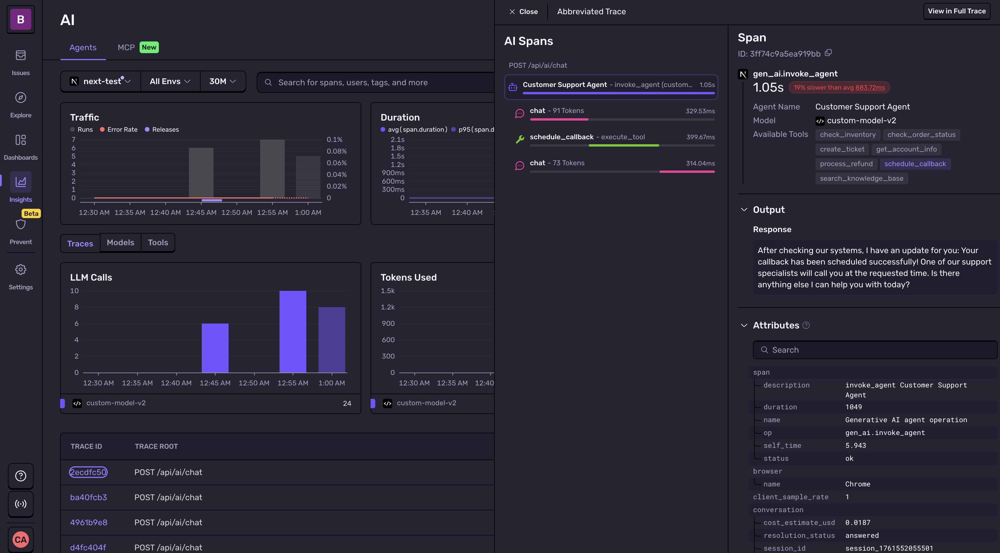

<Alert>

The sample code on this page is for demonstration purposes only. It isn’t production-ready and may not apply directly to your language or framework.

</Alert>

This guide provides practical examples of using span attributes and metrics to solve common monitoring and debugging challenges across your entire application stack. Each example demonstrates how to instrument both frontend and backend components, showing how they work together within a distributed trace to provide end-to-end visibility. You'll also find example repository code, walkthroughs, and attributes to explore.

## E-Commerce Checkout Flow (React + Backend)

<Arcade src="https://demo.arcade.software/tGYGb3qewR6i4xjRt2Tg?embed" />

Example Repository: [Crash Commerce](https://github.com/getsentry/crash-commerce-tracing-sample)

**The Challenge:** Capture end-to-end checkout flow, understand average cart size and value, diagnose performance of payment providers across the frontend and the server API.

**The Solution:** Start a client span on the checkout action and relevant spans on the backend for each step in the checkout flow. Attach attributes that represent critical metrics for the application, such as cart size, cart value, and the payment provider used in the transaction.

**Frontend (React) - instrument the Checkout click handler:**

```javascript
// In your Checkout button click handler
Sentry.startSpan(
  {
    name: 'Checkout',
    op: 'ui.action',
    attributes: {
      'cart.item_count': cartCount,
      'cart.value_minor': cartValueMinor,
      'cart.currency': 'USD',
      'payment.provider.ui_selected': paymentProvider,
    },
  },
  async (span) => {
    try {
      const response = await fetch(`${API_URL}/api/checkout`, {
        method: 'POST',
        headers: { 'Content-Type': 'application/json' },
        body: JSON.stringify({ items: cart, paymentProvider }),
      })
      if (!response.ok) {
        const errorData = await response.json().catch(() => ({ error: 'Payment failed' }))
        throw new Error(errorData.error || `HTTP ${response.status}`)
      }
      const data: { orderId: string; paymentProvider: string } = await response.json()
      span.setAttribute('order.id', data.orderId)
      span.setAttribute('payment.provider', data.paymentProvider)
      Sentry.logger.info(Sentry.logger.fmt`Order ${data.orderId} confirmed via ${data.paymentProvider}`)
      
      // Show order confirmation
      setOrderConfirmation({
        orderId: data.orderId,
        provider: data.paymentProvider,
        total: cartValueMinor
      })
      setCart([])
      setIsCartOpen(false)
    } catch (err) {
      span.setStatus({ code: 2, message: 'internal_error' })
      const errorMessage = err instanceof Error ? err.message : 'Checkout failed'
      setCheckoutError(errorMessage)
      Sentry.logger.error(Sentry.logger.fmt`${errorMessage}`)
    } finally {
      setIsCheckingOut(false)
    }
  }
)
```

Where to put this in your app:
- In the `onClick` for the checkout button, or inside the submit handler of your checkout form/container component.
- Auto-instrumentation will add client `fetch` spans; keep the explicit UI span for specific application context.

**Backend - Checkout API with an Order Processing span, and a Payment span:**

```javascript
// Example: Node/Express
app.post('/api/checkout', async (req: Request, res: Response) => {
  await Sentry.startSpan(
    {
      name: 'Order Processing',
      op: 'commerce.order.server',
    },
    async (span) => {
      try {
        const items = (req.body?.items as { productId: string; quantity: number }[]) || []
        const requestedProviderRaw = (req.body?.paymentProvider as string | undefined) ?? undefined
        const requestedProvider = PAYMENT_PROVIDERS.find((p) => p === requestedProviderRaw) ?? pickPaymentProvider()

        // Validate cart
        if (!Array.isArray(items) || items.length === 0) {
          span.setAttribute('payment.status', 'failed')
          span.setAttribute('inventory.reserved', false)
          res.status(400).json({ error: 'Cart is empty' })
          return
        }

        let totalMinor = 0
        for (const line of items) {
          const product = PRODUCTS.find((p) => p.id === line.productId)
          if (!product || line.quantity <= 0) {
            span.setAttribute('payment.status', 'failed')
            span.setAttribute('inventory.reserved', false)
            res.status(400).json({ error: 'Invalid cart item' })
            return
          }
          totalMinor += product.priceMinor * line.quantity
        }

        // Simulate reserving inventory (80% chance true)
        const reserved = Math.random() < 0.8

        // Simulate payment
        const charge = await Sentry.startSpan(
          {
            name: 'Charge Payment Provider',
            op: 'commerce.payment',
            attributes: {
              'payment.provider': requestedProvider,
            },
          },
          async (paymentSpan) => {
            const result = await fakeCharge(totalMinor, requestedProvider)
            paymentSpan.setAttribute('payment.status', result.status)
            return result
          }
        )

        if (charge.status === 'failed' || !reserved) {
          span.setAttribute('payment.provider', charge.provider)
          span.setAttribute('payment.status', 'failed')
          span.setAttribute('inventory.reserved', reserved)
          res.status(402).json({ error: 'Payment failed' })
          return
        }

        const orderId = randomId()
        ORDERS.push({ id: orderId, totalMinor, items })

        // Set attributes before returning
        span.setAttribute('order.id', orderId)
        span.setAttribute('payment.provider', charge.provider)
        span.setAttribute('payment.status', 'success')
        span.setAttribute('inventory.reserved', reserved)

        res.json({ orderId, paymentProvider: charge.provider })
      } catch (err) {
        Sentry.captureException(err)
        res.status(500).json({ error: 'Internal error' })
      }
    }
  )
})
```

**How the trace works together:**
- UI span starts when checkout is selected -> Server Backend starts a span to continue the track when the server `/checkout` API is called. As payment processes, a payment span is started.
- Attributes and Span metrics let you track more than just the latency of the request. You can also track the store's business performance through `cart.item_count` and other `cart` attributes, and store reliability by checking error performance on `payment.provider` properties.

**What to monitor with span metrics:**
- p95 span.duration of `op:ui.action` checkout by `cart.item_count` bucket.
- Error rate for `op:payment` by `payment.provider`.

## Media Upload with Background Processing (React + Express)

Example Repository: [SnapTrace](https://github.com/getsentry/snaptrace-tracing-example)

**The Challenge:** Track user-perceived upload time, server-side validation, and async media processing (optimization, thumbnail generation) while maintaining trace continuity across async boundaries.

**The Solution:** Start a client span for the entire upload experience, create a backend span for upload validation, and another span for async media processing. Use rich attributes instead of excessive spans to capture processing details.

**Frontend (React) - Instrument Upload Action**

```typescript
// In your UploadForm component's upload handler
const handleUpload = async () => {
  if (!selectedFile) return;

  // Start Sentry span for entire upload operation
  await Sentry.startSpan(
    {
      name: 'Upload media',
      op: 'file.upload',
      attributes: {
        'file.size_bytes': selectedFile.size,
        'file.mime_type': selectedFile.type,
      }
    },
    async (span) => {
      const uploadStartTime = Date.now();
      
      try {
        // Single API call to upload and start processing
        const uploadResponse = await fetch(`${API_BASE_URL}/api/upload`, {
          method: 'POST',
          headers: {
            'Content-Type': 'application/json',
          },
          body: JSON.stringify({
            fileName: selectedFile.name,
            fileType: selectedFile.type,
            fileSize: selectedFile.size
          })
        });

        if (!uploadResponse.ok) {
          throw new Error(`Upload failed: ${uploadResponse.statusText}`);
        }

        const uploadData = await uploadResponse.json();
        
        // Set success attributes
        span.setAttribute('upload.success', true);
        span.setAttribute('upload.duration_ms', Date.now() - uploadStartTime);
        span.setAttribute('job.id', uploadData.jobId);
        
        // Update UI to show processing status
        updateUploadStatus(uploadData.jobId, 'processing');
        
      } catch (error) {
        span.setStatus({ code: 2, message: 'error' });
        span.setAttribute('upload.success', false);
        span.setAttribute('upload.error', error instanceof Error ? error.message : 'Unknown error');
        setUploadStatus('error');
        Sentry.captureException(error);
      }
    }
  );
};
```

Where to put this in your app:
- In the upload button click handler or form submit handler
- In drag-and-drop onDrop callback
- Auto-instrumentation will capture fetch spans; the explicit span adds business context

**Backend - Upload Validation and Queue Job**

<Alert>

This example demonstrates proper queue instrumentation patterns. For more details on instrumenting queues, see the <PlatformLink to="/tracing/instrumentation/queues-module/" fallbackPlatform="node">Queues Module documentation</PlatformLink>.

</Alert>

```typescript
// Import Sentry instrumentation first (required for v10)
import './instrument';
import express from 'express';
import * as Sentry from '@sentry/node';

// POST /api/upload - Receive and validate upload, then enqueue for processing
app.post('/api/upload', async (req: Request<{}, {}, UploadRequest>, res: Response) => {
  const { fileName, fileType, fileSize } = req.body;

  // Validate the upload
  if (!fileName || !fileType || !fileSize) {
    return res.status(400).json({ error: 'Missing required fields' });
  }

  if (fileSize > 50 * 1024 * 1024) { // 50MB limit
    return res.status(400).json({ error: 'File too large (max 50MB)' });
  }

  // Create a job for processing
  const job = createJob(fileName, fileType, fileSize);

  // Producer span: Enqueue media processing job
  await Sentry.startSpan(
    {
      op: 'queue.publish',
      name: 'queue_producer',
      attributes: {
        'messaging.message.id': job.id,
        'messaging.destination.name': 'media-processing',
        'messaging.message.body.size': fileSize,
      }
    },
    async () => {
      // Get trace headers to pass to consumer
      const { 'sentry-trace': sentryTrace, baggage: sentryBaggage } = Sentry.getTraceData();
      
      // Store job with trace headers for async processing
      const enrichedJob = {
        ...job,
        sentryTrace,
        sentryBaggage,
        enqueuedAt: Date.now(),
      };
      await enqueueJob(enrichedJob);

      // Start async processing
      setImmediate(async () => {
        await processMedia(enrichedJob);
      });

      // Respond immediately with job ID
      res.json({
        jobId: job.id,
        status: 'accepted',
        message: 'Upload received and processing started'
      });
    }
  );
});
```

**Backend - Async Media Processing (Consumer)**

```typescript
// Async media processing (runs in background via setImmediate)
export async function processMedia(job: ProcessingJob): Promise<void> {
  // Continue trace from producer using stored trace headers
  await Sentry.continueTrace(
    { sentryTrace: job.sentryTrace, baggage: job.sentryBaggage },
    async () => {
      // Parent span for the consumer transaction
      await Sentry.startSpan(
        {
          name: 'media_processing_consumer',
        },
        async (parentSpan) => {
          // Consumer span: Process the queued job
          await Sentry.startSpan(
            {
              op: 'queue.process',
              name: 'queue_consumer',
              attributes: {
                'messaging.message.id': job.id,
                'messaging.destination.name': 'media-processing',
                'messaging.message.body.size': job.fileSize,
                'messaging.message.receive.latency': Date.now() - job.enqueuedAt,
                'messaging.message.retry.count': 0,
              }
            },
            async (span) => {
              try {
                const startTime = Date.now();
                const operations: string[] = [];
                
                // Add job-specific attributes
                span.setAttribute('media.size_bytes', job.fileSize);
                span.setAttribute('media.mime_type', job.fileType);
                span.setAttribute('media.size_bucket', getSizeBucket(job.fileSize));
                
                // Simulate image optimization and thumbnail generation
                if (job.fileType.startsWith('image/')) {
                  // Note: No separate spans for these operations - use attributes instead
                  await optimizeImage(); // Simulated delay
                  operations.push('optimize');
                  
                  await generateThumbnail(); // Simulated delay
                  operations.push('thumbnail');
                }
                
                // Calculate results
                const sizeSaved = Math.floor(job.fileSize * 0.3); // 30% reduction
                const thumbnailCreated = Math.random() > 0.05; // 95% success rate
                
                // Rich attributes instead of multiple spans
                span.setAttribute('processing.operations', JSON.stringify(operations));
                span.setAttribute('processing.optimization_level', 'high');
                span.setAttribute('processing.thumbnail_created', thumbnailCreated);
                span.setAttribute('processing.duration_ms', Date.now() - startTime);
                span.setAttribute('result.size_saved_bytes', sizeSaved);
                span.setAttribute('result.size_reduction_percent', 30);
                span.setAttribute('result.status', 'success');
                
                // Update job status
                job.status = 'completed';
                
                // Mark parent span as successful
                parentSpan.setStatus({ code: 1, message: 'ok' });
                
              } catch (error) {
                span.setAttribute('result.status', 'failed');
                span.setAttribute('error.message', error instanceof Error ? error.message : 'Unknown error');
                parentSpan.setStatus({ code: 2, message: 'error' });
                Sentry.captureException(error);
              }
            }
          );
        }
      );
    }
  );
}
```

**How the trace works together:**
- The frontend span (`file.upload`) captures the entire user experience from file selection to server response.
- The backend producer span (`queue.publish`) tracks job enqueueing with proper queue attributes.
- The consumer span (`queue.process`) continues the trace using `continueTrace()` with trace headers stored in the job.
- Async processing runs independently with its own trace connected via queue instrumentation.
- Rich attributes on the consumer span capture all processing details without creating excessive child spans.
- This pattern populates Sentry's Queues insights page for monitoring queue performance.

**What to monitor with span metrics:**
- p95 upload duration by `file.size_bucket`.
- Processing success rate by `media.mime_type`.
- Average storage saved via `result.size_saved_bytes` where `result.status = success`.
- Queue latency via `messaging.message.receive.latency` to track processing delays.
- Job throughput via `op:queue.publish` and `op:queue.process` span counts.

## Search Autocomplete (debounced, cancellable, performance monitoring)

Example Repository: [NullFlix](https://github.com/getsentry/nullflix-tracing-example)

**The Challenge:** Users type quickly in search; you need to debounce requests, cancel in-flight calls, handle errors gracefully, and monitor performance across different query types while keeping latency predictable.

**The Solution:** Start a client span for each debounced request, mark aborted requests, track search patterns, and on the server, and instrument search performance with meaningful attributes.

**Frontend (React + TypeScript) - instrument debounced search:**

```typescript
const searchResults = await Sentry.startSpan(
  {
    op: 'function',
    name: 'Search autocomplete request',
    attributes: {
      'query.length': searchQuery.length,
      'ui.debounce_ms': DEBOUNCE_MS,
    },
  },
  async (span) => {
    try {
      // SDK automatically instruments the fetch with op: 'http.client'
      const response = await fetch(
        `${API_URL}/api/search?${new URLSearchParams({ q: searchQuery })}`,
        {
          signal: controller.signal,
          headers: { 'Content-Type': 'application/json' },
        }
      );

      if (!response.ok) {
        const errorData = await response.json().catch(() => ({}));
        const errorMessage = errorData.error || `Search failed: ${response.status}`;
        throw new Error(errorMessage);
      }

      const data: SearchResponse = await response.json();
      
      span.setAttribute('results.count', data.results.length);
      span.setAttribute('results.has_results', data.results.length > 0);
      span.setAttribute('http.response_size', JSON.stringify(data).length);
      span.setStatus({ code: 1, message: 'ok' });
      
      return data;
    } catch (error) {
      if (error instanceof Error && error.name === 'AbortError') {
        span.setAttribute('ui.aborted', true);
        span.setStatus({ code: 2, message: 'cancelled' });
        // Don't re-throw AbortError to avoid sending it to Sentry
        return { results: [] };
      }
      
      span.setStatus({ code: 2, message: error instanceof Error ? error.message : 'unknown error' });
      throw error;
    }
  }
);
```

Where to put this in your app:
- In your search input component, triggered after a debounce timeout

**Backend (Node.js + Express) - instrument search with meaningful attributes:**

```typescript
app.get('/api/search', async (req: Request, res: Response) => {
  await Sentry.startSpan(
    {
      name: 'Search',
      op: 'search',
    },
    async (span) => {
      try {
        const query = String(req.query.q || '');
        const queryLength = query.length;
        
        // Check if request was aborted
        req.on('close', () => {
          if (!res.headersSent) {
            span.setStatus({ code: 2, message: 'cancelled' });
            span.setAttribute('request.aborted', true);
          }
        });
        
        if (!query) {
          span.setAttribute('results.count', 0);
          span.setAttribute('search.engine', 'elasticsearch');
          return res.json({ results: [] });
        }
        
        // Perform search
        const startSearch = Date.now();
        const results = await searchMovies(query);
        const searchDuration = Date.now() - startSearch;
        
        // Set span attributes
        span.setAttribute('search.engine', 'elasticsearch');
        span.setAttribute('search.mode', queryLength < 3 ? 'prefix' : 'fuzzy');
        span.setAttribute('results.count', results.length);
        span.setAttribute('query.length', queryLength);
        
        // Track slow searches
        if (searchDuration > 500) {
          span.setAttribute('performance.slow', true);
          span.setAttribute('search.duration_ms', searchDuration);
        }
        
        return res.json({ results });
      } catch (error: any) {
        span.setStatus({ code: 2, message: error?.message || 'error' });
        span.setAttribute('error.type', (error as any)?.constructor?.name || 'Error');
        
        Sentry.captureException(error);
        if (!res.headersSent) {
          return res.status(500).json({ error: 'Search failed' });
        }
      }
    }
  );
});
```

**How the trace works together:**
- The client span starts when the debounced search triggers, then tracks the full user-perceived latency.
- The aborted requests are marked with `ui.aborted=true` and short duration, showing wasted work.
- The server span shows search performance characteristics: mode (prefix vs fuzzy), results count, and slow queries.

**What to monitor with span metrics:**
- p95 duration of `op:search` grouped by `query.length`.
- Characteristics of slow searches via `op:search performance.slow:true`.
- Compare prefix vs fuzzy via `op:search` grouped by `search.mode`.
- Cancellation rate via `op:http.client ui.aborted:true`.
- Empty result rate via `op:http.client results.has_results:false`.
- Distribution of `http.response_size` for payload optimization.
- Error rate for `op:search` filtered by `status:error`.
- Backend abandonment via `op:search request.aborted:true`.

## Manual LLM Instrumentation (Custom AI Agent + Tool Calls)

Example Repository: [Customer Service Bot](https://github.com/getsentry/llm-manual-agent-monitoring-example)

**The Challenge:** You're building a custom AI agent that uses a proprietary LLM API (not OpenAI/Anthropic), performs multi-step reasoning with tool calls, and needs comprehensive monitoring to track token usage, tool performance, and agent effectiveness across the entire conversation flow.

**The Solution:** Manually instrument each component of the AI pipeline using Sentry's AI agent span conventions. Create spans for agent invocation, LLM calls, tool executions, and handoffs between agents, with rich attributes for monitoring costs, performance, and business metrics.

<Alert>

This example follows Sentry's AI Agents Module conventions. For detailed specifications on `gen_ai.*` span attributes and requirements, see the [AI Agents Module documentation](https://develop.sentry.dev/sdk/telemetry/traces/modules/ai-agents/).

</Alert>



**Frontend (React) - Instrument AI Chat Interface:**

```typescript
import { useState, useEffect } from 'react';
import { SEMANTIC_ATTRIBUTE_SENTRY_ORIGIN } from '@sentry/core';

// In your AI chat component
export default function CustomerSupportChat() {
  const [conversationHistory, setConversationHistory] = useState([]);
  const [sessionId, setSessionId] = useState('');
  
  // Generate sessionId on client-side only to avoid hydration mismatch
  useEffect(() => {
    setSessionId(`session_${Date.now()}`);
  }, []);

const handleSendMessage = async (userMessage: string) => {
  await Sentry.startSpan(
    {
      name: 'invoke_agent Customer Support Agent',
      op: 'gen_ai.invoke_agent',
      attributes: {
        'gen_ai.operation.name': 'invoke_agent',
        'gen_ai.agent.name': 'Customer Support Agent',
        'gen_ai.system': 'custom-llm',
        'gen_ai.request.model': 'custom-model-v2',
        'gen_ai.response.model': 'custom-model-v2',
        'gen_ai.request.messages': JSON.stringify([
          { role: 'system', content: 'You are a helpful customer support agent.' },
          ...conversationHistory,
          { role: 'user', content: userMessage }
        ]),
        [SEMANTIC_ATTRIBUTE_SENTRY_ORIGIN]: 'manual.ai.custom-llm',
        'conversation.turn': conversationHistory.length + 1,
        'conversation.session_id': sessionId,
      },
    },
    async (agentSpan) => {
      try {
        setIsLoading(true);
        
        // Call your backend AI agent endpoint
        const response = await fetch('/api/ai/chat', {
          method: 'POST',
          headers: { 'Content-Type': 'application/json' },
          body: JSON.stringify({
            message: userMessage,
            sessionId: sessionId,
            conversationHistory: conversationHistory
          })
        });

        if (!response.ok) {
          throw new Error(`AI request failed: ${response.status}`);
        }

        const aiResponse = await response.json();
        
        // Set response attributes
        agentSpan.setAttribute('gen_ai.response.text', aiResponse.message);
        agentSpan.setAttribute('gen_ai.response.id', aiResponse.responseId);
        agentSpan.setAttribute('gen_ai.response.model', 'custom-model-v2');
        agentSpan.setAttribute('gen_ai.usage.total_tokens', aiResponse.totalTokens);
        agentSpan.setAttribute('conversation.tools_used', aiResponse.toolsUsed?.length || 0);
        agentSpan.setAttribute('conversation.resolution_status', aiResponse.resolutionStatus);
        
        // Update UI with response
        setConversationHistory(prev => [
          ...prev,
          { role: 'user', content: userMessage },
          { role: 'assistant', content: aiResponse.message }
        ]);
        
        Sentry.logger.info(Sentry.logger.fmt`AI agent completed conversation turn ${conversationHistory.length + 1}`);
        
      } catch (error) {
        agentSpan.setStatus({ code: 2, message: 'internal_error' });
        agentSpan.setAttribute('error.type', error instanceof Error ? error.constructor.name : 'UnknownError');
        setError('Failed to get AI response. Please try again.');
        Sentry.logger.error(Sentry.logger.fmt`AI agent failed: ${error instanceof Error ? error.message : 'Unknown error'}`);
      } finally {
        setIsLoading(false);
      }
    }
  );
};
```

Where to put this in your app:
- In the API that controls the chat handler responses in your application


**Important:** Generate `sessionId` in `useEffect` to avoid hydration errors when using Server-Side Rendering (SSR). Using `Date.now()` or random values during component initialization will cause mismatches between server and client renders.

**Backend - Custom LLM Integration with Tool Calls:**

```typescript
import { SEMANTIC_ATTRIBUTE_SENTRY_ORIGIN } from '@sentry/core';

// Express API route for custom AI agent
app.post('/api/ai/chat', async (req: Request, res: Response) => {
  const { message, sessionId, conversationHistory } = req.body;

  // Main agent invocation span (matches frontend)
  await Sentry.startSpan(
    {
      name: 'invoke_agent Customer Support Agent',
      op: 'gen_ai.invoke_agent',
      attributes: {
        'gen_ai.operation.name': 'invoke_agent',
        'gen_ai.agent.name': 'Customer Support Agent',
        'gen_ai.system': 'custom-llm',
        'gen_ai.request.model': 'custom-model-v2',
        [SEMANTIC_ATTRIBUTE_SENTRY_ORIGIN]: 'manual.ai.custom-llm',
        'conversation.session_id': sessionId,
      },
    },
    async (agentSpan) => {
      try {
        const tools = [
          { name: 'search_knowledge_base', description: 'Search company knowledge base for answers' }
        ];
        
        agentSpan.setAttribute('gen_ai.request.available_tools', JSON.stringify(tools));
        
        let totalTokens = 0;
        let toolsUsed: string[] = [];
        let finalResponse = '';
        
        // Step 1: Call custom LLM for initial reasoning
        const llmResponse = await Sentry.startSpan(
          {
            name: 'chat custom-model-v2',
            op: 'gen_ai.chat',
            attributes: {
              'gen_ai.operation.name': 'chat',
              'gen_ai.system': 'custom-llm',
              'gen_ai.request.model': 'custom-model-v2',
              'gen_ai.request.messages': JSON.stringify([
                { role: 'system', content: 'You are a customer support agent. Use tools when needed.' },
                ...conversationHistory,
                { role: 'user', content: message }
              ]),
              'gen_ai.request.temperature': 0.7,
              'gen_ai.request.max_tokens': 500,
              [SEMANTIC_ATTRIBUTE_SENTRY_ORIGIN]: 'manual.ai.custom-llm',
            },
          },
          async (llmSpan) => {
            const llmData = await callCustomLLM(message, conversationHistory);
            
            // Set LLM response attributes
            llmSpan.setAttribute('gen_ai.response.text', llmData.choices[0].message.content || '');
            llmSpan.setAttribute('gen_ai.response.id', llmData.id);
            llmSpan.setAttribute('gen_ai.response.model', llmData.model);
            llmSpan.setAttribute('gen_ai.usage.input_tokens', llmData.usage.prompt_tokens);
            llmSpan.setAttribute('gen_ai.usage.output_tokens', llmData.usage.completion_tokens);
            llmSpan.setAttribute('gen_ai.usage.total_tokens', llmData.usage.total_tokens);
            
            if (llmData.choices[0].message.tool_calls) {
              llmSpan.setAttribute('gen_ai.response.tool_calls', JSON.stringify(llmData.choices[0].message.tool_calls));
            }
            
            totalTokens += llmData.usage.total_tokens;
            return llmData;
          }
        );
        
        // Step 2: Execute tool calls if present
        if (llmResponse.choices[0].message.tool_calls) {
          for (const toolCall of llmResponse.choices[0].message.tool_calls) {
            await Sentry.startSpan(
              {
                name: `execute_tool ${toolCall.function.name}`,
                op: 'gen_ai.execute_tool',
                attributes: {
                  'gen_ai.operation.name': 'execute_tool',
                  'gen_ai.tool.name': toolCall.function.name,
                  'gen_ai.tool.type': 'function',
                  'gen_ai.tool.input': toolCall.function.arguments,
                  [SEMANTIC_ATTRIBUTE_SENTRY_ORIGIN]: 'manual.ai.custom-llm',
                },
              },
              async (toolSpan) => {
                const toolOutput = await searchKnowledgeBase(JSON.parse(toolCall.function.arguments).query);
                
                toolSpan.setAttribute('gen_ai.tool.output', toolOutput);
                toolSpan.setAttribute('search.query', JSON.parse(toolCall.function.arguments).query);
                toolsUsed.push(toolCall.function.name);
              }
            );
          }
          
          // Step 3: Synthesize final response from tool results
          const synthesis = await synthesizeResponse(llmResponse, toolsUsed);
          finalResponse = synthesis.message;
          totalTokens += synthesis.usage.total_tokens;
        } else {
          // No tools used - use original message content
          finalResponse = llmResponse.choices[0].message.content;
        }
        
        // Set final agent attributes
        const resolutionStatus = toolsUsed.length > 0 ? 'resolved' : 'answered';
        
        agentSpan.setAttribute('gen_ai.response.text', finalResponse);
        agentSpan.setAttribute('gen_ai.response.id', llmResponse.id);
        agentSpan.setAttribute('gen_ai.usage.total_tokens', totalTokens);
        agentSpan.setAttribute('conversation.tools_used', JSON.stringify(toolsUsed));
        agentSpan.setAttribute('conversation.resolution_status', resolutionStatus);
        
        res.json({
          message: finalResponse,
          responseId: llmResponse.id,
          totalTokens,
          toolsUsed,
          resolutionStatus,
        });
        
      } catch (error) {
        agentSpan.setStatus({ code: 2, message: 'agent_invocation_failed' });
        agentSpan.setAttribute('error.type', error instanceof Error ? error.constructor.name : 'UnknownError');
        Sentry.captureException(error);
        res.status(500).json({ error: 'AI agent processing failed' });
      }
    }
  );
});

// Helper functions for tool execution
async function searchKnowledgeBase(query: string): Promise<string> {
  // Search company knowledge base - returns relevant policy info
  const results = [
    "Our return policy allows returns within 30 days of purchase.",
    "Refunds are processed within 5-7 business days after we receive the item.",
    "Items must be in original condition with tags attached.",
    "Free return shipping is provided for defective items."
  ];
  return results.join('\n');
}


async function synthesizeResponse(llmResponse: any, toolsUsed: string[]): Promise<any> {
  // Make final LLM call to synthesize tool results into response
  return {
    message: "Based on the information I found, here's your answer...",
    usage: { total_tokens: 150 }
  };
}
```

**How the trace works together:**
- The frontend span (`gen_ai.invoke_agent`) captures the entire user interaction from message to response.
- The backend agent span continues the trace with the same operation and agent name for correlation.
- The LLM spans (`gen_ai.chat`) track individual model calls with token usage and performance.
- The tool execution spans (`gen_ai.execute_tool`) monitor each tool call with input/output and timing.
- Rich attributes enable monitoring of conversation quality, cost, and business outcomes.

**What to monitor with span metrics:**
- p95 duration of `op:gen_ai.invoke_agent` grouped by `conversation.resolution_status`.
- Token usage trends via `gen_ai.usage.total_tokens` by `gen_ai.request.model`.
- Tool usage patterns via `op:gen_ai.execute_tool` grouped by `gen_ai.tool.name`.
- Cost analysis via `conversation.cost_estimate_usd` aggregated by time period.
- Agent effectiveness via `conversation.resolution_status` distribution.
- Error rates for each component: `op:gen_ai.chat`, `op:gen_ai.execute_tool`, `op:gen_ai.invoke_agent`.
