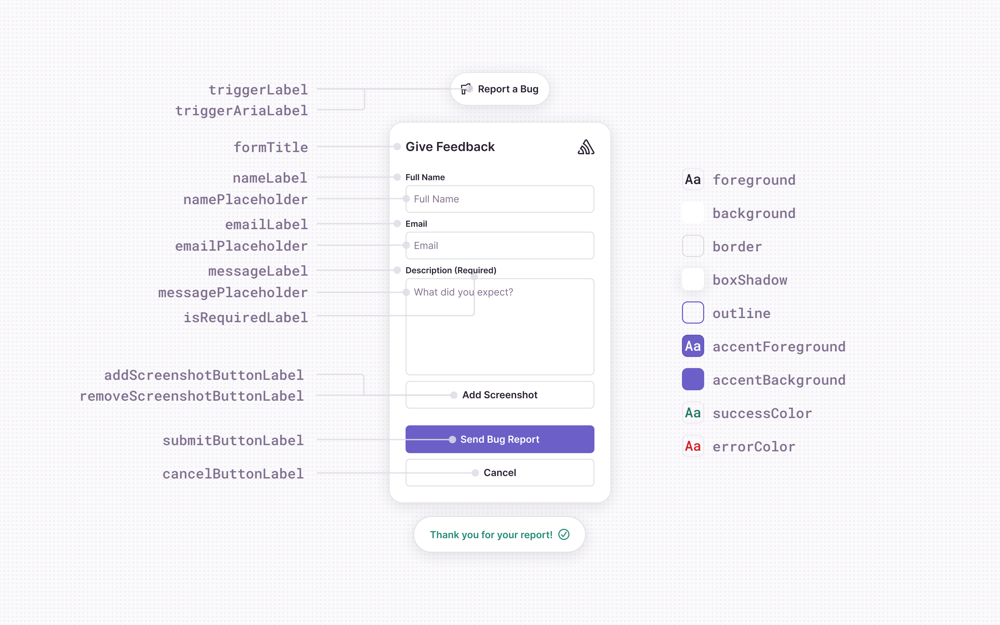

<PlatformSection notSupported={["javascript.node", "javascript.aws-lambda", "javascript.azure-functions", "javascript.connect", "javascript.express", "javascript.fastify", "javascript.gcp-functions", "javascript.koa"]}>

## User Feedback Widget

The User Feedback Widget offers many customization options, and if the available options are insufficient, you can [use your own UI](#bring-your-own-widget). The following image shows which elements are customizable. The configuration keys on the left side of the image correspond to [text customization](#text-customization) and the configuration keys on the right side of the image are for [theme customizations](#theme-customization).



### General

The following options can be configured for the integration in `feedbackIntegration({})`:

| key            | type                                       | default    | description                                                                                                                                                                                                                              |
| -------------- | ------------------------------------------ | ---------- | ---------------------------------------------------------------------------------------------------------------------------------------------------------------------------------------------------------------------------------------- |
| `autoInject`   | `boolean`                                  | `true`     | Injects the Feedback widget into the application when the integration is added. Set `autoInject: false` if you want to call `feedback.attachTo()` or `feedback.openDialog()` directly, or only want to show the widget on certain views. |
| `showBranding` | `boolean`                                  | `true`     | Displays the Sentry logo inside of the form                                                                                                                                                                                              |
| `colorScheme`  | <code>"system" \| "light" \| "dark"</code> | `"system"` | The color theme to use. `"system"` will follow your OS color scheme.                                                                                                                                                                     |

### User and Form

| key               | type                     | default                               | description                                                                                                                 |
| ----------------- | ------------------------ | ------------------------------------- | --------------------------------------------------------------------------------------------------------------------------- |
| `showName`        | `boolean`                | `true`                                | Displays the name field on the Feedback form, however will still capture the name (if available) from Sentry SDK context.   |
| `showEmail`       | `boolean`                | `true`                                | Displays the email field on the Feedback form, however will still capture the email (if available) from Sentry SDK context. |
| `isNameRequired`  | `boolean`                | `false`                               | Requires the name field on the Feedback form to be filled in.                                                               |
| `isEmailRequired` | `boolean`                | `false`                               | Requires the email field on the Feedback form to be filled in.                                                              |
| `useSentryUser`   | `Record<string, string>` | `{ email: 'email', name: 'username'}` | Map of the `email` and `name` fields to the corresponding Sentry SDK user fields that were called with `Sentry.setUser`.    |

By default, the Feedback integration will attempt to fill in the name/email fields if you have set a user context via [`Sentry.setUser`](https://docs.sentry.io/platforms/javascript/enriching-events/identify-user/). By default, it expects the email and name fields to be `email` and `username`. Below is an example configuration with non-default user fields.

```javascript
Sentry.setUser({
  email: "foo@example.com",
  fullName: "Jane Doe",
});

feedbackIntegration({
  useSentryUser: {
    email: "email",
    name: "fullName",
  },
});
```

### Text Customization

Most text that you see in the default Feedback widget can be customized.

| key                  | default                                | description                                                        |
| -------------------- | -------------------------------------- | ------------------------------------------------------------------ |
| `buttonLabel`        | `Report a Bug`                         | The label of the injected button.                                  |
| `submitButtonLabel`  | `Send Bug Report`                      | The label of the submit button used in the feedback form.          |
| `cancelButtonLabel`  | `Cancel`                               | The label of the cancel button used in the feedback form.          |
| `formTitle`          | `Report a Bug`                         | The title at the top of the feedback form.                         |
| `nameLabel`          | `Name`                                 | The label of the name input field.                                 |
| `namePlaceholder`    | `Your Name`                            | The placeholder for the name input field.                          |
| `emailLabel`         | `Email`                                | The label of the email input field.                                |
| `emailPlaceholder`   | `your.email@example.org`               | The placeholder for the email input field.                         |
| `messageLabel`       | `Description`                          | The label for the feedback description input field.                |
| `messagePlaceholder` | `What's the bug? What did you expect?` | The placeholder for the feedback description input field.          |
| `successMessageText` | `Thank you for your report!`           | The message to be displayed after a succesful feedback submission. |
| `isRequiredText`     | `(required)`                           | The text displayed next to a required field.       |

Example of customization:

```javascript
feedbackIntegration({
  buttonLabel: "Feedback",
  submitButtonLabel: "Send Feedback",
  formTitle: "Send Feedback",
});
```

### Theme Customization

Colors can be customized via the Feedback class constructor or by defining CSS variables on the injected button. If you use the default button it will have a property `id="sentry-feedback`, meaning you can use the `#sentry-feedback` selector to define CSS variables to override.

| key                       | css variable                   | light                                     | dark                                      | description                                                                                           |
| ------------------------- | ------------------------------ | ----------------------------------------- | ----------------------------------------- | ----------------------------------------------------------------------------------------------------- |
| `background`              | `--background`                 | `#ffffff`                                 | `#29232f`                                 | Background color of the widget (injected button and form)                                             |
| `backgroundHover`         | `--background-hover`           | `#f6f6f7`                                 | `#352f3b`                                 | Background color of the injected button when in a hover state                                         |
| `foreground`              | `--foreground`                 | `#2b2233`                                 | `#ebe6ef`                                 | Foreground color, e.g. text color                                                                     |
| `error`                   | `--error`                      | `#df3338`                                 | `#f55459`                                 | Color used for error related components (e.g. text color when there was an error submitting feedback) |
| `success`                 | `--success`                    | `#268d75`                                 | `#2da98c`                                 | Color used for success-related components (e.g. text color when feedback is submitted successfully)   |
| `border`                  | `--border`                     | `1.5px solid rgba(41, 35, 47, 0.13)`      | `1.5px solid rgba(235, 230, 239, 0.15)`   | The border style used for the widget (injected button and form)                                       |
| `borderRadius`            | `--border-radius`              | `12px`                                    | `12px`                                    | Border radius style used for the widget (injected button and success message)                         |
| `boxShadow`               | `--box-shadow`                 | `0px 4px 24px 0px rgba(43, 34, 51, 0.12)` | `0px 4px 24px 0px rgba(43, 34, 51, 0.12)` | The box shadow style used for the widget (injected button and form)                                   |
| `submitBackground`        | `--submit-background`          | `rgba(88, 74, 192, 1)`                    | `rgba(88, 74, 192, 1)`                    | Background color for the submit button                                                                |
| `submitBackgroundHover`   | `--submit-background-hover`    | `rgba(108, 95, 199, 1)`                   | `rgba(108, 95, 199, 1)`                   | Background color when hovering over the submit button                                                 |
| `submitBorder`            | `--submit-border`              | `rgba(108, 95, 199, 1)`                   | `rgba(108, 95, 199, 1)`                   | Border style for the submit button                                                                    |
| `submitOutlineFocus`      | `--submit-outline-focus`       | `rgba(108, 95, 199, 1)`                   | `rgba(108, 95, 199, 1)`                   | Outline color for the submit button, in the focused state                                             |
| `submitForeground`        | `--submit-foreground`          | `#ffffff`                                 | `#ffffff`                                 | Foreground color for the submit button                                                                |
| `submitForegroundHover`   | `--submit-foreground-hover`    | `#ffffff`                                 | `#ffffff`                                 | Foreground color for the submit button when hovering                                                  |
| `cancelBackground`        | `--cancel-background`          | `transparent`                             | `transparent`                             | Background color for the cancel button                                                                |
| `cancelBackgroundHover`   | `--cancel-background-hover`    | `var(--background-hover)`                 | `var(--background-hover)`                 | Background color when hovering over the cancel button                                                 |
| `cancelBorder`            | `--cancel-border`              | `var(--border)`                           | `var(--border)`                           | Border style for the cancel button                                                                    |
| `cancelOutlineFocus`      | `--cancel-outline-focus`       | `var(--input-outline-focus)`              | `var(--input-outline-focus)`              | Outline color for the cancel button, in the focused state                                             |
| `cancelForeground`        | `--cancel-foreground`          | `var(--foreground)`                       | `var(--foreground)`                       | Foreground color for the cancel button                                                                |
| `cancelForegroundHover`   | `--cancel-foreground-hover`    | `var(--foreground)`                       | `var(--foreground)`                       | Foreground color for the cancel button when hovering                                                  |
| `inputBackground`         | `--input-background`           | `inherit`                                 | `inherit`                                 | Background color for form inputs                                                                      |
| `inputForeground`         | `--input-foreground`           | `inherit`                                 | `inherit`                                 | Foreground color for form inputs                                                                      |
| `inputBorder`             | `--input-border`               | `var(--border)`                           | `var(--border)`                           | Border styles for form inputs                                                                         |
| `inputOutlineFocus`       | `--input-outline-focus`        | `rgba(108, 95, 199, 1)`                   | `rgba(108, 95, 199, 1)`                   | Outline color for form inputs when focused                                                            |
| `formBorderRadius`        | `--form-border-radius`         | `20px`                                    | `20px`                                    | Border radius style for the form                                                                      |
| `formContentBorderRadius` | `--form-content-border-radius` | `6px`                                     | `6px`                                     | Border radius style for form content (for example: inputs, buttons)                                   |

Here is an example of customizing only the background color for the light theme using the Feedback constructor configuration:

```javascript
feedbackIntegration({
  themeLight: {
    background: "#cccccc",
  },
});
```

Or the same example above, but using the CSS variables method:

```css
#sentry-feedback {
  --background: #cccccc;
}
```

### Additional UI Customization

Similar to theme customization above, these are additional CSS variables that can be overridden. These aren't supported in the constructor.

| Variable        | Default                                 | Description                                                                       |
| --------------- | --------------------------------------- | --------------------------------------------------------------------------------- |
| `--bottom`      | `1rem`                                  | By default the widget has a position of fixed, and is in the bottom right corner. |
| `--right`       | `1rem`                                  | By default the widget has a position of fixed, and is in the bottom right corner. |
| `--top`         | `auto`                                  | By default the widget has a position of fixed, and is in the bottom right corner. |
| `--left`        | `auto`                                  | By default the widget has a position of fixed, and is in the bottom right corner. |
| `--z-index`     | `100000`                                | The z-index of the widget                                                         |
| `--font-family` | `"'Helvetica Neue', Arial, sans-serif"` | Default font-family to use                                                        |
| `--font-size`   | `14px`                                  | Font size                                                                         |

### Event Callbacks

Sometimes it’s important to know when a user started interacting with the feedback form, so you can add custom logging, or start/stop background timers on the page until the user is done.

Pass these callbacks when you initialize the Feedback integration:

```javascript
feedbackIntegration({
  onFormOpen: () => {},
  onFormClose: () => {},
  onSubmitSuccess: () => {},
  onSubmitError: () => {},
});
```

### Bring Your Own Button

You can skip the default injected button and use your own button to trigger displaying the form. Call `feedback.attachTo()` to have the SDK attach a click listener to your own button. You can additionally supply the same customization options that the constructor accepts (like for text labels and colors).

```javascript
const feedback = feedbackIntegration({
  // Disable injecting the default widget
  autoInject: false,
});

feedback.attachTo(document.querySelector("#your-button"), {
  formTitle: "Report a Bug!",
});
```

Alternatively, you can call `feedback.openDialog()`:

```typescript
import { BrowserClient, Feedback, getClient } from "@sentry/react";

function MyFeedbackButton() {
  const client = getClient<BrowserClient>();
  const feedback = client?.getIntegration(Feedback);

  // Don't render custom feedback button if Feedback integration isn't installed
  if (!feedback) {
    return null;
  }

  return (
    <button type="button" onClick={() => feedback.openDialog()}>
      Give me feedback
    </button>
  );
}
```

### Bring Your Own Widget

You can also use your own UI components to gather feedback and pass the feedback data object to the `sendFeedback()` function. The `sendFeedback` function accepts two parameters:

- a JavaScript object with a required `message` property and additionally, optional `name` and `email` properties or a `FormData` instance with the same properties
- an optional "options" object

```javascript
Sentry.sendFeedback(
  {
    name: "Jane Doe", // optional
    email: "email@example.org", // optional
    message: "This is an example feedback", // required
  },
  {
    includeReplay: true, // optional
  }
);
```

Here is a simple example:

```html
<form id="my-feedback-form">
  <input name="name" />
  <input name="email" />
  <textarea name="message" placeholder="What's the issue?" />
</form>
```

```javascript
import { sendFeedback } from "@sentry/react";

document
  .getElementById("my-feedback-form")
  .addEventListener("submit", (event) => {
    const formData = new FormData(event.currentTarget);
    sendFeedback(formData);
    event.preventDefault();
  });
```

</PlatformSection>

## Crash-Report Modal

You can customize the Crash-Report modal to your organization's needs, for example, for localization purposes. All options can be passed through the `Sentry.showReportDialog` call.

| Param            | Default                                                                                           |
| ---------------- | ------------------------------------------------------------------------------------------------- |
| `eventId`        | Manually set the id of the event.                                                                 |
| `dsn`            | Manually set dsn to report to.                                                                    |
| `user`           | Manually set user data _[an object with keys listed below]_.                                      |
| `user.email`     | User's email address.                                                                             |
| `user.name`      | User's name.                                                                                      |
| `lang`           | _[automatic]_ – **override for Sentry’s language code**                                           |
| `title`          | It looks like we’re having issues.                                                                |
| `subtitle`       | Our team has been notified.                                                                       |
| `subtitle2`      | If you’d like to help, tell us what happened below. – **not visible on small screen resolutions** |
| `labelName`      | Name                                                                                              |
| `labelEmail`     | Email                                                                                             |
| `labelComments`  | What happened?                                                                                    |
| `labelClose`     | Close                                                                                             |
| `labelSubmit`    | Submit                                                                                            |
| `errorGeneric`   | An unknown error occurred while submitting your report. Please try again.                         |
| `errorFormEntry` | Some fields were invalid. Please correct the errors and try again.                                |
| `successMessage` | Your feedback has been sent. Thank you!                                                           |
| `onLoad`         | n/a - **an optional callback that will be invoked when the widget opens**                         |
| `onClose`        | n/a - **an optional callback that will be invoked when the widget closes**                        |

The optional callback `onLoad` will be called when users see the widget. You can use this to run custom logic, for example to log an analytics event:

<PlatformContent includePath="user-feedback/example-widget-onload/" />

The optional callback `onClose` will be called when users close the widget. You can use this to run custom logic, for example to reload the page:

<PlatformContent includePath="user-feedback/example-widget-onclose/" />
