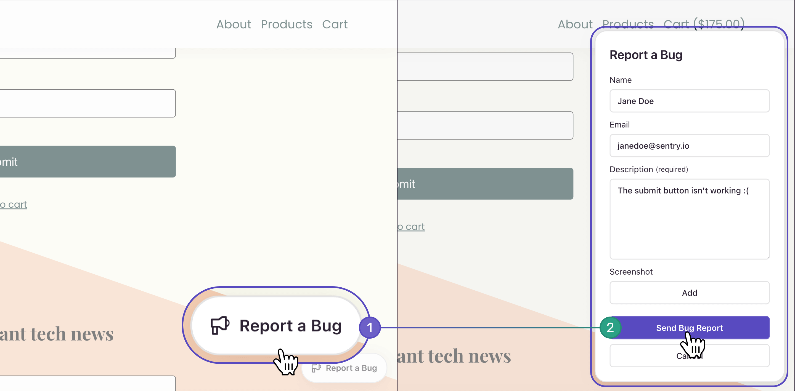

<Include name="feature-stage-beta-user-feedback.mdx" />

The User Feedback feature allows you to collect user feedback from anywhere inside your application, without requiring an error event to occur. This requires a minimum SDK version of [7.85.0](https://github.com/getsentry/sentry-javascript/releases/tag/7.85.0). The [Crash-Report Modal](#crash-report-modal) feature still exists to handle user feedback associated with an error event.

## User Feedback Widget

The embeddable JavaScript widget allows users to submit feedback from anywhere inside your application. The [Crash-Report Modal](#crash-report-modal) collects reactive feedback tied to an error event.

### Pre-requisites

<PlatformContent includePath="user-feedback/pre-requisites" />

### Installation

<PlatformContent includePath="user-feedback/install" />

### Set Up

To set up the integration, add the following to your Sentry initialization. There are many options you can pass to the integration constructor. See the [configuration documentation](/platforms/javascript/user-feedback/configuration/) for more details.

### Session Replay

The User Feedback Widget integrates easily with Session Replay. First, make sure that the <PlatformLink to="/session-replay/">Session Replay integration</PlatformLink> is configured correctly and that `replaysOnErrorSampleRate` is greater than 0. When this is done, the Replay SDK will buffer up to 30 seconds worth of events until the user *opens* the User Feedback Widget. If the user submits feedback, you will be able to view the Feedback (including the replay), inside of Sentry's web application.

<SignInNote />

<PlatformContent includePath="user-feedback/setup" />

By default, this will insert the widget into the bottom right corner of your website. You're free to customize nearly every aspect of the widget, including replacing it completely with your own UI.

## User Feedback API

The user feedback API allows you to collect user feedback while utilizing your own UI. You can use the same programming language you have in your app to send user feedback. In this case, the SDK creates the HTTP request so you don't have to deal with posting data via HTTP.

Sentry pairs the feedback with the original event, giving you additional insight into issues. Sentry needs the `eventId` to be able to associate the user feedback to the corresponding event. For example, to get the `eventId`, you can use <PlatformLink to="/configuration/options/#before-send"><PlatformIdentifier name="before-send" /></PlatformLink> or the return value of the method capturing an event.

<PlatformContent includePath="user-feedback/sdk-api-example/" />

Alternatively, you can use the [User Feedback API endpoint](/api/projects/submit-user-feedback/) directly.

## Crash-Report Modal

Our embeddable, JavaScript-based, Crash-Report modal is useful when you would typically render a plain error page (the classic `500.html`) on your website.

To collect feedback, the Crash-Report modal requests and collects the user's name, email address, and a description of what occurred. When feedback is provided, Sentry pairs the feedback with the original event, giving you additional insights into issues.

The screenshot below provides an example of the Crash-Report modal, though yours may differ depending on your customization:

<Include name="common-imgs/user_feedback_widget" />

### Integration

The modal authenticates with your public DSN, then passes in the Event ID that was generated on your backend.

<PlatformContent includePath="user-feedback/example-widget/" />
