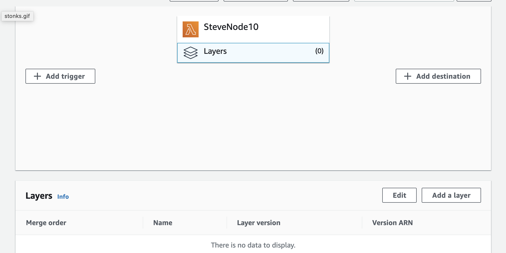
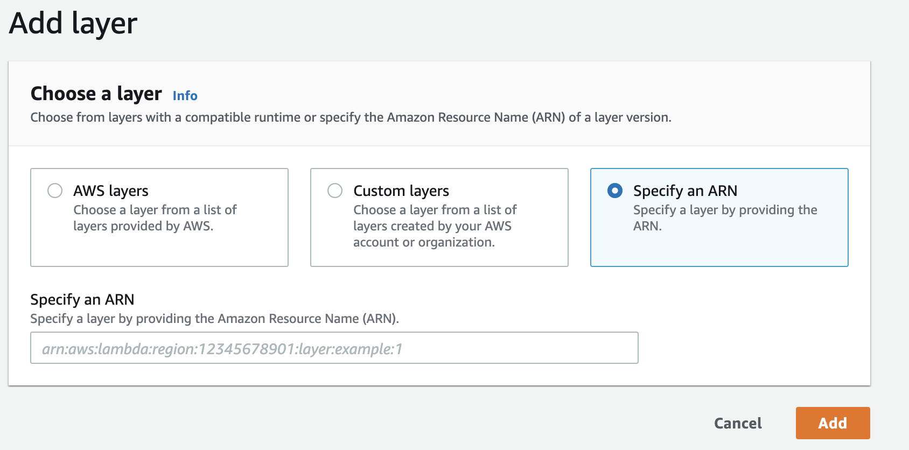
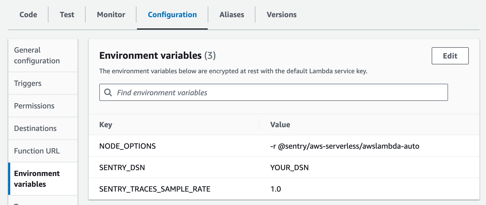

The easiest way to get started with Sentry is to use the Sentry [Lambda Layer](https://docs.aws.amazon.com/Lambda/latest/dg/configuration-layers.html) instead of adding `@sentry/aws-serverless` with `npm` or `yarn` [manually](../cjs-npm).
If you follow this guide, you don't have to worry about deploying Sentry dependencies alongside your function code.
To actually start the SDK, you can decide between setting up the SDK using environment variables or in your Lambda function code. We recommend using environment variables as it's the easiest way to get started. [Initializing the SDK in code](#alternative-initialize-the-sdk-in-code) instead of setting environment variables gives you more control over the SDK setup if you need it.

<Alert>

This installation method **does not** work with Lambda functions running in EcmaScript Modules (ESM) mode, using `import` syntax. If you're running your function in ESM, follow the [ESM guide](../esm-npm).

</Alert>

## 1. Prerequisites

Before you begin, make sure you have the following:

- You have a Lambda function that is running in CommonJS (CJS) mode, using `require` syntax.
- You know the AWS region that your function is deployed to.

## 2. Add the Sentry Lambda Layer

Add the Sentry Layer by navigating to your Lambda function. Select **Layers**, then **Add a Layer**.



**Specify an ARN** tab as illustrated:



Finally, set the region and copy the provided ARN value into the input.

<LambdaLayerDetail canonical="aws-layer:node" />

<br />

## 3. Initialize the SDK with Environment Variables

The easiest way to set up the SDK is to start and configure it using environment variables. This way, you don't have to modify your Lambda function code.

In addition to capturing errors, you can monitor interactions between multiple services or applications by [enabling tracing](/concepts/key-terms/tracing/).

Select which Sentry features you'd like to install in addition to Error Monitoring to get the corresponding installation and configuration instructions below.

<OnboardingOptionButtons options={["error-monitoring", "performance"]} />

Set the following environment variables in your Lambda function configuration:

```bash {"onboardingOptions": {"performance": "3"}}
NODE_OPTIONS="-r @sentry/aws-serverless/awslambda-auto"
SENTRY_DSN="___PUBLIC_DSN___"
SENTRY_TRACES_SAMPLE_RATE="1.0"
```

To set environment variables, navigate to your Lambda function, select **Configuration**, then **Environment variables**:



## Alternative: Initialize the SDK in Code

Instead of [Step 3, setting environment variables](#3-initialize-the-sdk-with-environment-variables), you can also manually initialize the SDK in your Lambda function code.
This way, you can customize the SDK setup further.
Note that you don't have to actually install an NPM package for this to work, as the package is already included in the Lambda Layer.

Make sure you completed [step 1](#1-prerequisites) and [step 2](#2-add-the-sentry-lambda-layer) before proceeding.

```javascript {filename:index.js} {"onboardingOptions": {"performance": "5-8"}}
const Sentry = require("@sentry/aws-serverless");

Sentry.init({
  dsn: "___PUBLIC_DSN___",
  // Add Tracing by setting tracesSampleRate and adding integration
  // Set tracesSampleRate to 1.0 to capture 100% of transactions
  // We recommend adjusting this value in production
  // Learn more at
  // https://docs.sentry.io/platforms/javascript/configuration/options/#traces-sample-rate
  tracesSampleRate: 1.0,
});

exports.handler = Sentry.wrapHandler(async (event, context) => {
  // Your handler code
});
```

It's important to add both, the `Sentry.init` call outside the handler function and the `Sentry.wrapHandler` wrapper around your function to automatically catch errors and performance data.

That's it - you're all set!

## Lambda layer for v7 SDK

The instructions above are written for SDK version 8 (the most recent version).
You can also install a v7 version of the Sentry Lambda layer in case you can't upgrade to v8.
The procedure is identical to the instructions above except for two differences:

### v7 layer ARN

The v7 Lambda layer has a different ARN:

```
arn:aws:Lambda:us-west-1:943013980633:layer:SentryNodeServerlessSDKv7:3
```

Modify and copy the ARN value for your region into the input, e.g. for region `:us-west-1` and the current v7 Lambda layer version `:3`:

### v7 package name

The `@sentry/aws-serverless` package was called `@sentry/serverless` prior to version 8. Therefore, for the v7 layer, adjust your `NODE_OPTIONS` environment variable:

```bash
NODE_OPTIONS="-r @sentry/serverless/dist/awslambda-auto"
```

The other environment variables remain the same as above.
