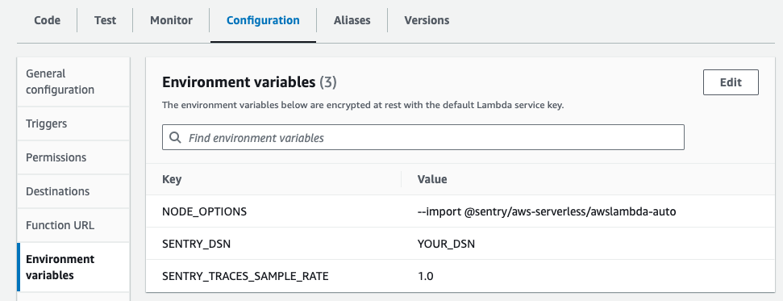
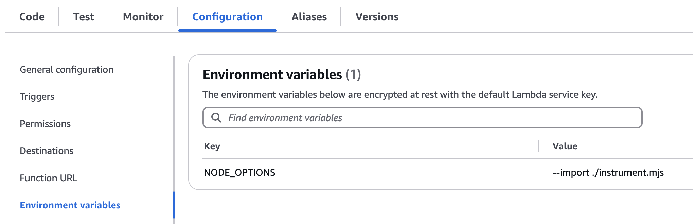

In this guide you will learn how to set up the `@sentry/aws-serverless` SDK for AWS Lambda functions running in EcmaScript Modules (ESM) mode.
We recommend starting the SDK automatically via environment variables so that you only have to make minimal code changes to your lambda function.
If you need more control over the SDK setup, you can also [initialize the SDK in in code](#alternative-initialize-the-sdk-in-code).

<Alert>

At this time, this guide shows the only way to use Sentry with ESM lambda functions. You cannot use the Sentry AWS Lambda Layer with ESM.
We're working on an ESM lambda layer to provide a simpler setup but need to solve several OpenTelemetry-related limitations first.

</Alert>

## 1. Prerequisites

Before you begin, make sure you have the following:

- You have a lambda function that is running in EcmaScript Modules (ESM) mode, using `import` syntax.
- You're able to deploy dependencies (i.e. `node_modules`) alongside your function code to AWS Lambda.

## 2. Install

In addition to capturing errors, you can monitor interactions between multiple services or applications by [enabling tracing](/concepts/key-terms/tracing/). You can also collect and analyze performance profiles from real users with [profiling](/product/explore/profiling/).

Select which Sentry features you'd like to install in addition to Error Monitoring to get the corresponding installation and configuration instructions below.

<OnboardingOptionButtons
  options={["error-monitoring", "performance", "profiling"]}
/>

Install the `@sentry/aws-serverless` SDK using a package manager of your choice:

<OnboardingOption optionId="profiling" hideForThisOption>

```bash {tabTitle:npm}
npm install @sentry/aws-serverless
```

```bash {tabTitle:yarn}
yarn add @sentry/aws-serverless
```

```bash {tabTitle:pnpm}
pnpm add @sentry/aws-serverless
```

</OnboardingOption>

<OnboardingOption optionId="profiling">

```bash {tabTitle:npm}
npm install @sentry/aws-serverless @sentry/profiling-node
```

```bash {tabTitle:yarn}
yarn add @sentry/aws-serverless @sentry/profiling-node
```

```bash {tabTitle:pnpm}
pnpm add @sentry/aws-serverless @sentry/profiling-node
```

</OnboardingOption>

## 3. Wrap your handler

Add the `Sentry.wrapHandler` wrapper around your function handler to automatically catch errors and performance data:

```javascript {filename:index.mjs}{1,3}
import * as Sentry from "@sentry/aws-serverless";

export const handler = Sentry.wrapHandler(async (event, context) => {
  // Your handler code
});
```

## 4. Set Environment Variables

To initialize and configure the SDK, you need to set the following environment variables in your AWS Lambda function configuration:

```bash {"onboardingOptions": {"performance": "3"}}
NODE_OPTIONS="--import @sentry/aws-serverless/awslambda-auto"
SENTRY_DSN="___PUBLIC_DSN___"
SENTRY_TRACES_SAMPLE_RATE="1.0"
```

To set environment variables, navigate to your Lambda function, select **Configuration**, then **Environment variables**:



That's it - make sure to re-deploy your function and you're all set!

## Alternative: Initialize the SDK in Code

To further customize the SDK setup, you can also manually initialize the SDK in your lambda function. Due to ESM limitations, you need to initialize the SDK in a separate file and load it before your function starts.
The benefit of this installation method is that you can fully customize your Sentry SDK setup in a `Sentry.init` call.

### 1. Install

Follow steps 1 and 2 above to [install the SDK NPM package](#2-install) in your project.

### 2. Initialize the SDK

Create a new file, for example `instrument.mjs` to initialize the SDK:

```javascript {filename:instrument.mjs} {"onboardingOptions": {"performance": "7-10", "profiling": "2,6,11-12"}}
import * as Sentry from "@sentry/aws-serverless";
import { nodeProfilingIntegration } from "@sentry/profiling-node";

Sentry.init({
  dsn: "___PUBLIC_DSN___",
  integrations: [nodeProfilingIntegration()],
  // Add Tracing by setting tracesSampleRate and adding integration
  // Set tracesSampleRate to 1.0 to capture 100% of transactions
  // We recommend adjusting this value in production
  // Learn more at
  // https://docs.sentry.io/platforms/javascript/configuration/options/#traces-sample-rate
  tracesSampleRate: 1.0,
  // Set sampling rate for profiling - this is relative to tracesSampleRate
  profilesSampleRate: 1.0,
});
```

### 3. Wrap your handler

Add the `Sentry.wrapHandler` wrapper around your function handler to automatically catch errors and performance data:

```javascript {filename:index.mjs}{1,3}
import * as Sentry from "@sentry/aws-serverless";

export const handler = Sentry.wrapHandler(async (event, context) => {
  // Your handler code
});
```

### 4. Load the SDK

To load the SDK before your function starts, you need to preload the `instrument.mjs` by setting the `NODE_OPTIONS` environment variable:

```bash
NODE_OPTIONS="--import instrument.mjs"
```

To set environment variables, navigate to your Lambda function, select **Configuration**, then **Environment variables**:



That's it - make sure to re-deploy your function and you're all set!

## Using the v7 SDK

The v7 `@sentry/serverless` SDK does not work correctly with ESM-based Lambda functions. Please upgrade to the v8 SDK and follow the instructions above.
