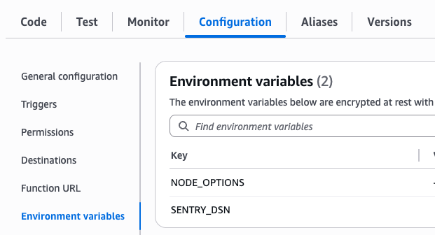

The easiest way to get started with Sentry is to use the Sentry [Lambda Layer](https://docs.aws.amazon.com/lambda/latest/dg/adding-layers.html) instead of installing `@sentry/aws-serverless` with a package manager manually.
If you follow this guide, you don't have to worry about deploying Sentry dependencies alongside your function code.

## Prerequisites

Before you begin, make sure you have the following:

- You have a Lambda function deployed in AWS.
- You know the AWS region that your function is deployed to.

## 1. Add the Sentry Lambda Layer

Add the Sentry Layer by navigating to your Lambda function. Select **Layers**, then **Add a Layer**.


**Specify an ARN** tab as illustrated:


Finally, set the region and copy the provided ARN value into the input.

<LambdaLayerDetail canonical="aws-layer:node" />

<br />

## 2. Setup Options

Choose your setup method based on your Lambda function type:

<Alert level="info" title="ESM vs. CommonJS">

The setup instructions you should follow depend on how your function **runs** at runtime, not how it's written in your source code.

- **Use CommonJS instructions** if your function runs with CommonJS modules (uses `require()` and `module.exports` at runtime)
- **Use ESM instructions** if your function runs with ES modules (uses `import`/`export` at runtime)

**Important:** Even if you write your code with `import`/`export` syntax, your function might still run as CommonJS if you're using TypeScript or a build tool that compiles to CommonJS. Check your build output or Lambda runtime configuration to determine which applies to your function.

</Alert>

### Option A: Automatic Setup

**CommonJS functions** support fully automatic setup using environment variables - both SDK initialization and handler wrapping are handled automatically.

**ESM functions** support automatic SDK initialization via environment variables, but require manual handler wrapping.

In addition to capturing errors, you can monitor interactions between multiple services or applications by [enabling tracing](/concepts/key-terms/tracing/).

Select which Sentry features you'd like to install in addition to Error Monitoring to get the corresponding installation and configuration instructions below.

<OnboardingOptionButtons options={["error-monitoring", "performance"]} />

Set the following environment variables in your Lambda function configuration:

```bash {tabTitle:CommonJS}
NODE_OPTIONS="--require @sentry/aws-serverless/awslambda-auto"
SENTRY_DSN="___PUBLIC_DSN___"
# ___PRODUCT_OPTION_START___ performance
SENTRY_TRACES_SAMPLE_RATE="1.0"
# ___PRODUCT_OPTION_END___ performance
```

```bash {tabTitle:ESM}
NODE_OPTIONS="--import @sentry/aws-serverless/awslambda-auto"
SENTRY_DSN="___PUBLIC_DSN___"
# ___PRODUCT_OPTION_START___ performance
SENTRY_TRACES_SAMPLE_RATE="1.0"
# ___PRODUCT_OPTION_END___ performance
```

To set environment variables, navigate to your Lambda function, select **Configuration**, then **Environment variables**:



<Alert level="info" title="For ESM Lambda Functions">

You'll also need to manually wrap your handler as shown below:

```javascript {filename:index.mjs}
import * as Sentry from "@sentry/aws-serverless";

export const handler = Sentry.wrapHandler(async (event, context) => {
  // Your handler code
});
```

</Alert>

### Option B: Manual Setup

Instead of using environment variables, you can manually initialize the SDK and wrap your handler in code. This approach works for both CommonJS and ESM functions and allows for further customization of the SDK setup.

Note that you don't have to actually install an NPM package for this to work, as the package is already included in the Lambda Layer.

#### For CommonJS Lambda Functions

```javascript {filename:index.js}
const Sentry = require("@sentry/aws-serverless");

Sentry.init({
  dsn: "___PUBLIC_DSN___",

  // Adds request headers and IP for users, for more info visit:
  // https://docs.sentry.io/platforms/javascript/guides/aws-lambda/configuration/options/#sendDefaultPii
  sendDefaultPii: true,
  // ___PRODUCT_OPTION_START___ performance

  // Add Tracing by setting tracesSampleRate and adding integration
  // Set tracesSampleRate to 1.0 to capture 100% of transactions
  // We recommend adjusting this value in production
  // Learn more at
  // https://docs.sentry.io/platforms/javascript/configuration/options/#traces-sample-rate
  tracesSampleRate: 1.0,
  // ___PRODUCT_OPTION_END___ performance
});

// Your package imports

exports.handler = Sentry.wrapHandler(async (event, context) => {
  // Your handler code
});
```

It's important to add both, the `Sentry.init` call outside the handler function and the `Sentry.wrapHandler` wrapper around your function to automatically catch errors and performance data. Make sure that the `Sentry.init` call and the import statement are at the very top of your file before any other imports.

#### For ESM Lambda Functions

First, wrap your handler:

```javascript {filename:index.mjs}{1,3}
import * as Sentry from "@sentry/aws-serverless";

export const handler = Sentry.wrapHandler(async (event, context) => {
  // Your handler code
});
```

Due to ESM limitations, you need to initialize the SDK in a separate file and load it before your function starts.

Create a new file, for example `instrument.mjs` to initialize the SDK:

```javascript {filename:instrument.mjs}
import * as Sentry from "@sentry/aws-serverless";

Sentry.init({
  dsn: "___PUBLIC_DSN___",

  // Adds request headers and IP for users, for more info visit:
  // https://docs.sentry.io/platforms/javascript/guides/aws-lambda/configuration/options/#sendDefaultPii
  sendDefaultPii: true,
  // ___PRODUCT_OPTION_START___ performance

  // Add Tracing by setting tracesSampleRate and adding integration
  // Set tracesSampleRate to 1.0 to capture 100% of transactions
  // We recommend adjusting this value in production
  // Learn more at
  // https://docs.sentry.io/platforms/javascript/configuration/options/#traces-sample-rate
  tracesSampleRate: 1.0,
  // ___PRODUCT_OPTION_END___ performance
});
```

##### Load the SDK

To load the SDK before your function starts, you need to preload the `instrument.mjs` by setting the `NODE_OPTIONS` environment variable:

```bash
NODE_OPTIONS="--import ./instrument.mjs"
```

That's it — make sure to re-deploy your function and you're all set!
