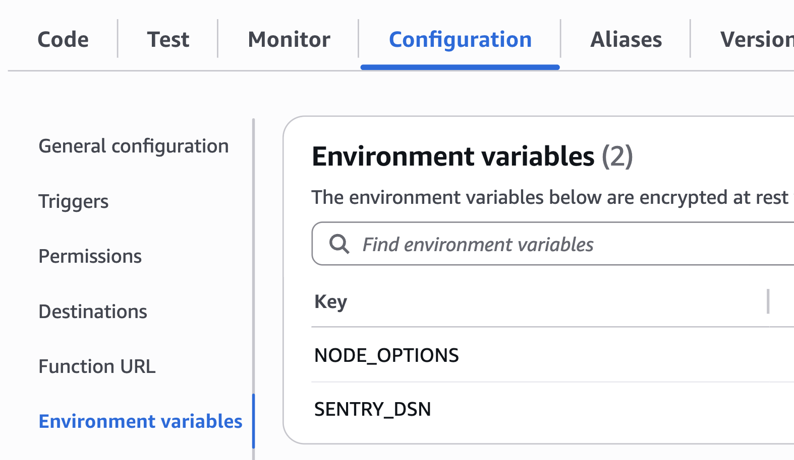

In this guide you will learn how to set up the `@sentry/aws-serverless` SDK for AWS Lambda functions using NPM.
We recommend starting the SDK automatically via environment variables so that you only have to make minimal code changes to your lambda function.
If you need more control over the SDK setup, you can also [initialize the SDK in code](#option-b-manual-setup).

However, you need to modify your code and deploy the Sentry dependencies alongside your function code. If you're looking for the most simple way to set up Sentry, use the [Lambda Layer](../layer) instead.

## 1. Prerequisites

Before you begin, make sure you have the following:

- You have a Lambda function deployed in AWS.
- You're able to deploy dependencies (i.e. `node_modules`) alongside your function code to AWS Lambda.

## 2. Install

In addition to capturing errors, you can monitor interactions between multiple services or applications by [enabling tracing](/concepts/key-terms/tracing/). You can also collect and analyze performance profiles from real users with [profiling](/product/explore/profiling/).

Select which Sentry features you'd like to install in addition to Error Monitoring to get the corresponding installation and configuration instructions below.

<OnboardingOptionButtons
  options={["error-monitoring", "performance", "profiling"]}
/>

Install the `@sentry/aws-serverless` SDK using a package manager of your choice:

<OnboardingOption optionId="profiling" hideForThisOption>

```bash {tabTitle:npm}
npm install @sentry/aws-serverless
```

```bash {tabTitle:yarn}
yarn add @sentry/aws-serverless
```

```bash {tabTitle:pnpm}
pnpm add @sentry/aws-serverless
```

</OnboardingOption>

<OnboardingOption optionId="profiling">

```bash {tabTitle:npm}
npm install @sentry/aws-serverless @sentry/profiling-node
```

```bash {tabTitle:yarn}
yarn add @sentry/aws-serverless @sentry/profiling-node
```

```bash {tabTitle:pnpm}
pnpm add @sentry/aws-serverless @sentry/profiling-node
```

</OnboardingOption>

## 3. Setup Options

### Option A: Automatic Setup (recommended)

Set the following environment variables in your Lambda function configuration:

```bash
NODE_OPTIONS="--import @sentry/aws-serverless/awslambda-auto"
SENTRY_DSN="___PUBLIC_DSN___"
# ___PRODUCT_OPTION_START___ performance
SENTRY_TRACES_SAMPLE_RATE="1.0"
# ___PRODUCT_OPTION_END___ performance
```

To set environment variables, navigate to your Lambda function, select **Configuration**, then **Environment variables**:



That's it - make sure to re-deploy your function and you're all set!

### Option B: Manual Setup

To further customize the SDK setup, you can also manually initialize the SDK in your lambda function. The benefit of this installation method is that you can fully customize your Sentry SDK setup in a `Sentry.init` call.

Create a new file, for example `instrument.js` to initialize the SDK:

```javascript {filename:instrument.js} {tabTitle:CommonJS}
const Sentry = require("@sentry/aws-serverless");
// ___PRODUCT_OPTION_START___ profiling
const { nodeProfilingIntegration } = require("@sentry/profiling-node");
// ___PRODUCT_OPTION_END___ profiling

Sentry.init({
  dsn: "___PUBLIC_DSN___",

  // Adds request headers and IP for users, for more info visit:
  // https://docs.sentry.io/platforms/javascript/guides/aws-lambda/configuration/options/#sendDefaultPii
  sendDefaultPii: true,
  // ___PRODUCT_OPTION_START___ profiling
  integrations: [nodeProfilingIntegration()],

  // ___PRODUCT_OPTION_END___ profiling
  // ___PRODUCT_OPTION_START___ performance
  // Add Tracing by setting tracesSampleRate and adding integration
  // Set tracesSampleRate to 1.0 to capture 100% of transactions
  // We recommend adjusting this value in production
  // Learn more at
  // https://docs.sentry.io/platforms/javascript/configuration/options/#traces-sample-rate
  tracesSampleRate: 1.0,
  // ___PRODUCT_OPTION_END___ performance
  // ___PRODUCT_OPTION_START___ profiling

  // Set sampling rate for profiling - this is relative to tracesSampleRate
  profilesSampleRate: 1.0,
  // ___PRODUCT_OPTION_END___ profiling
});
```

```javascript {filename:instrument.mjs} {tabTitle:ESM}
import * as Sentry from "@sentry/aws-serverless";
// ___PRODUCT_OPTION_START___ profiling
import { nodeProfilingIntegration } from "@sentry/profiling-node";
// ___PRODUCT_OPTION_END___ profiling

Sentry.init({
  dsn: "___PUBLIC_DSN___",

  // Adds request headers and IP for users, for more info visit:
  // https://docs.sentry.io/platforms/javascript/guides/aws-lambda/configuration/options/#sendDefaultPii
  sendDefaultPii: true,
  // ___PRODUCT_OPTION_START___ profiling
  integrations: [nodeProfilingIntegration()],

  // ___PRODUCT_OPTION_END___ profiling
  // ___PRODUCT_OPTION_START___ performance
  // Add Tracing by setting tracesSampleRate and adding integration
  // Set tracesSampleRate to 1.0 to capture 100% of transactions
  // We recommend adjusting this value in production
  // Learn more at
  // https://docs.sentry.io/platforms/javascript/configuration/options/#traces-sample-rate
  tracesSampleRate: 1.0,
  // ___PRODUCT_OPTION_END___ performance
  // ___PRODUCT_OPTION_START___ profiling

  // Set sampling rate for profiling - this is relative to tracesSampleRate
  profilesSampleRate: 1.0,
  // ___PRODUCT_OPTION_END___ profiling
});
```

##### Load the SDK

To load the SDK before your function starts, you need to preload the `instrument.js` by setting the `NODE_OPTIONS` environment variable:

```bash {tabTitle:CommonJS}
NODE_OPTIONS="--import ./instrument.js"
```

```bash {tabTitle:ESM}
NODE_OPTIONS="--import ./instrument.mjs"
```

To set environment variables, navigate to your Lambda function, select **Configuration**, then **Environment variables**.

That's it - make sure to re-deploy your function and you're all set!

## Using the v7 SDK

The instructions above are written for the latest SDK version.

**For CommonJS functions:** In SDK versions prior to version 8, the `@sentry/aws-serverless` package was called `@sentry/serverless`. If you are using an older version, you can follow this guide but replace the package with `@sentry/serverless`.

**For ESM functions:** The v7 `@sentry/serverless` SDK does not work correctly with ESM-based Lambda functions. Please upgrade to the latest SDK and follow the instructions above.
