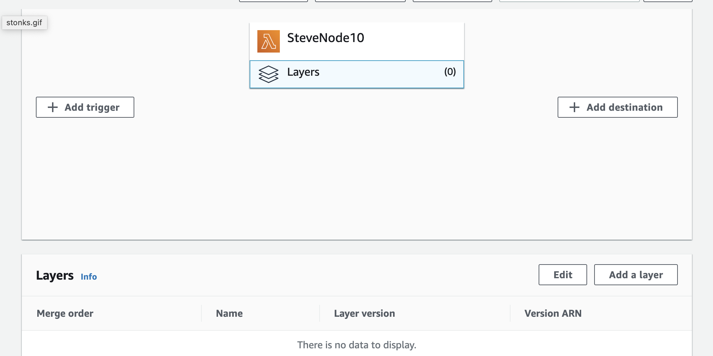

You can also install Sentry using a [Lambda Layer](https://docs.aws.amazon.com/lambda/latest/dg/configuration-layers.html) instead of adding `@sentry/aws-serverless` with `npm` or `yarn`. Import Sentry as usual:

```javascript
const Sentry = require("@sentry/aws-serverless");
```

<Note>

This installation method will not work if you are using webpack.

</Note>

Then add the Sentry Layer by navigating to your Lambda function. Select **Layers**, then **Add a Layer**.



**Specify an ARN** tab as illustrated:


Finally, set the region and copy the provided ARN value into the input.

<LambdaLayerDetail canonical="aws-layer:node" />

<br/>

## Lambda layer for v7

You can also install a v7 version of the Sentry Lambda layer in case you cannot upgrade to v8.
Modify and copy the provided ARN value for your region into the input, e.g. for region `us-west-1` and the current v7 Lambda layer version `1`:

```
arn:aws:lambda:us-west-1:943013980633:layer:SentryNodeServerlessSDKv7:1
```
