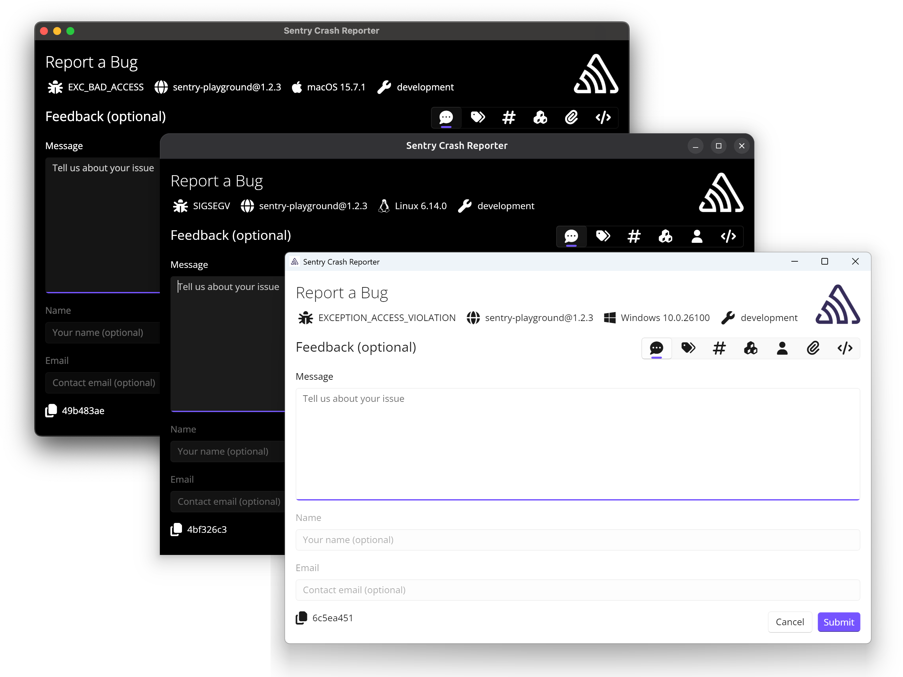

The Native SDK can be configured to work with an external crash reporter, which
can be used to display crash information to the user, collect user feedback, or
perform other actions when a crash occurs.

The external crash reporter is a user-defined executable, distinct from the
system crash reporter, that is launched by the Native SDK upon a crash. It
receives the path to the crash report as its only command-line argument and
is responsible for submitting the crash report to Sentry.

[Sentry Desktop Crash Reporter](https://github.com/getsentry/sentry-desktop-crash-reporter)
is a ready-made crash reporter reference implementation. It is a cross-platform
desktop application made with [.NET](https://dot.net) and [Uno Platform](https://platform.uno/).



To configure the Native SDK to use an external crash reporter, set the
`external_crash_reporter_path` option to the path of the external crash reporter
executable when initializing the SDK:

```c
sentry_options_t *options = sentry_options_new();
sentry_options_set_external_crash_reporter_path(options, "/path/to/external_crash_reporter");
/* ... */
sentry_init(options);
```
