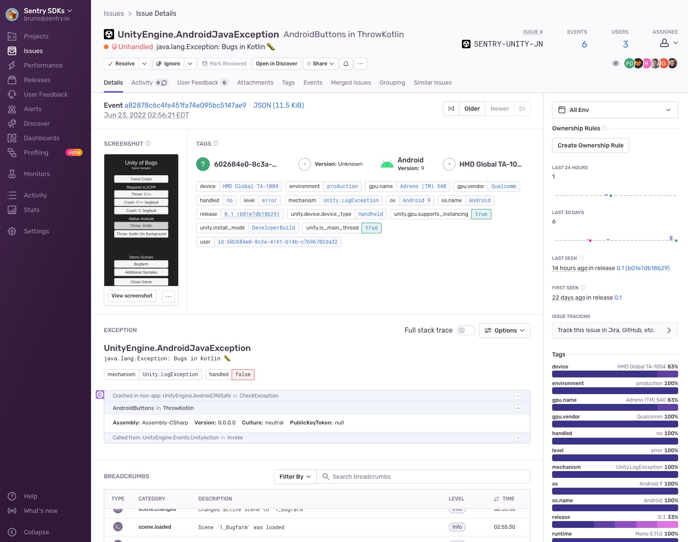

Sentry makes it possible to automatically take a screenshot and include it as an <PlatformLink to="/enriching-events/attachments/">attachment</PlatformLink> when a user experiences an error, an exception, or a crash.

This feature is currently only available on Windows and has a few limitations. For example, the `inproc` and `breakpad` backends use local exception handlers for capturing the screenshot and therefore rely on the exception handler being called. Only the `crashpad` backend with an external handler process is able to capture screenshots of fast-fail crashes that bypass Structured Exception Handling ([`SHE`](https://learn.microsoft.com/en-us/windows/win32/debug/structured-exception-handling)). Another example where a screenshot might not be available is when the event happens before the screen starts to load. So inherently, this feature is a best effort solution.

## Enabling Screenshots

Because screenshots may contain <PlatformLink to="/data-management/sensitive-data/">PII</PlatformLink>, they are an opt-in feature. You can enable screenshots as shown below:

<PlatformContent includePath="enriching-events/attach-screenshots" />

## Viewing Screenshots

If one is available, you'll see a thumbnail of the screenshot when you click on a specific issue from the [**Issues**](https://demo.sentry.io/issues/) page.

Once you've clicked on the event ID of a specific issue, you'll be able to see an overview of all the attachments as well as associated events in the "Attachments" tab.

