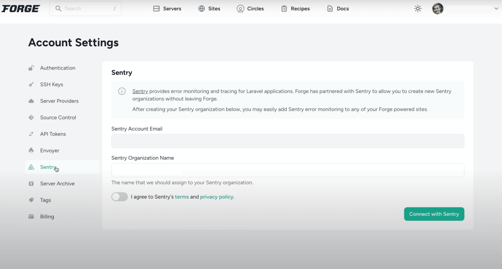

Laravel is supported using a native package: [sentry-laravel](https://github.com/getsentry/sentry-laravel).

This guide is for Laravel 11.x. We also provide instructions for [other versions](/platforms/php/guides/laravel/other-versions/) as well as [Lumen-specific instructions](/platforms/php/guides/laravel/other-versions/lumen/).

## Install

Install the `sentry/sentry-laravel` package:

```bash
composer require sentry/sentry-laravel
```

Enable capturing unhandled exception to report to Sentry by making the following change to your `bootstrap/app.php`:

```php {filename:bootstrap/app.php}
<?php

use Illuminate\Foundation\Application;
use Illuminate\Foundation\Configuration\Exceptions;
use Illuminate\Foundation\Configuration\Middleware;
use Sentry\Laravel\Integration;

return Application::configure(basePath: dirname(__DIR__))
    ->withRouting(
        web: __DIR__.'/../routes/web.php',
        commands: __DIR__.'/../routes/console.php',
        health: '/up',
    )
    ->withMiddleware(function (Middleware $middleware) {
        //
    })
    ->withExceptions(function (Exceptions $exceptions) {
        Integration::handles($exceptions);
    })->create();
```

<Note>

Alternatively, you can configure Sentry in your [Laravel Log Channel](usage/#log-channels), allowing you to log `info` and `debug` as well.

</Note>

## Configure

Configure the Sentry DSN with this command:

<SignInNote />

```shell
php artisan sentry:publish --dsn=___PUBLIC_DSN___
```

It creates the config file (`config/sentry.php`) and adds the `DSN` to your `.env` file.

<SignInNote />

```shell {filename:.env}
SENTRY_LARAVEL_DSN=___PUBLIC_DSN___
```

## Verify

### Verify With Artisan

You can test your configuration using the provided `sentry:test` artisan command:

```shell
php artisan sentry:test
```

### Verify With Code

You can verify that Sentry is capturing errors in your Laravel application by creating a route that will throw an exception:

```php {filename:routes/web.php}
Route::get('/debug-sentry', function () {
    throw new Exception('My first Sentry error!');
});
```

Visiting this route will trigger an exception that will be captured by Sentry.

## Performance Monitoring

Set `traces_sample_rate` in `config/sentry.php` or `SENTRY_TRACES_SAMPLE_RATE` in your `.env` to a value greater than `0.0`. Setting a value greater than `0.0` will enable Performance Monitoring, `null` (the default) will disable Performance Monitoring.

```shell {filename:.env}
# Be sure to lower this value in production otherwise you could burn through your quota quickly.
SENTRY_TRACES_SAMPLE_RATE=1.0
```

The example configuration above will transmit 100% of captured traces. Be sure to lower this value in production or you could use up your quota quickly.

You can also be more granular with the sample rate by using the `traces_sampler` option. Learn more in [Using Sampling to Filter Transaction Events](configuration/filtering/#using-sampling-to-filter-transaction-events).

Performance data is transmitted using a new event type called "transactions", which you can learn about in [Distributed Tracing](/product/sentry-basics/tracing/distributed-tracing/#traces-transactions-and-spans).

## Local Development and Testing

When Sentry is installed in your application, it will also be active when you are developing or running tests.

You most likely don't want errors to be sent to Sentry when you are developing or running tests. To avoid this, set the DSN value to `null` to disable sending errors to Sentry.

You can also do this by not defining `SENTRY_LARAVEL_DSN` in your `.env` or by defining it as `SENTRY_LARAVEL_DSN=null`.

If you do leave Sentry enabled when developing or running tests, it's possible for it to have a negative effect on the performance of your application or test suite.

## Set up Sentry through Forge

If you're using Laravel's Forge platform to provision and deploy your PHP application, you can create a Sentry organization through [Forge](https://forge.laravel.com/docs/integrations/sentry.html).


