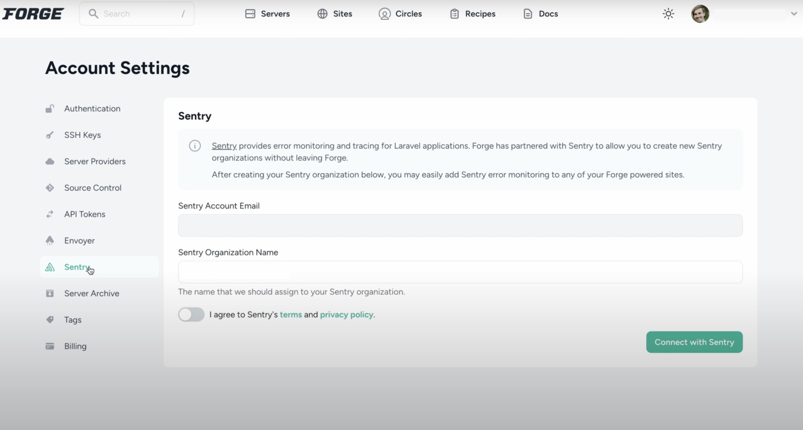

On this page, we get you up and running with Sentry's PHP SDK, automatically reporting errors and exceptions in your application. The SDK provides support for PHP 7.2 or later. If you're using a previous version of the PHP SDK, you can access the <Link rel="nofollow" to="/platforms/php/legacy-sdk/">legacy SDK documentation</Link>.

<Note>

If you don't already have an account and Sentry project established, head over to [sentry.io](https://sentry.io/signup/), then return to this page.

</Note>

<GuideGrid platform="php" />

Sentry captures data by using an SDK within your application’s runtime. Our SDKs are platform-specific and allow Sentry to have a deep understanding of how your application works.

## Install

<OnboardingOptionButtons
  options={[
    'error-monitoring',
    'performance',
    'profiling',
  ]}
/>

Install the SDK using [Composer](https://getcomposer.org/).

```bash
composer require sentry/sentry
```

<OnboardingOption optionId="profiling">

Install the Excimer extension via PECL:

```bash
pecl install excimer
```

The Excimer PHP extension supports PHP 7.2 and up. Excimer requires Linux or macOS and doesn't support Windows. For additional ways to install Excimer, [see docs](/platforms/php/profiling/#installation).

</OnboardingOption>

## Configure

To capture all errors, even the one during the startup of your application, you should initialize the Sentry PHP SDK as soon as possible.

<SignInNote />

```php {"onboardingOptions": {"performance": "3-4", "profiling": "5-6"}}
\Sentry\init([
  'dsn' => '___PUBLIC_DSN___' ,
  // Specify a fixed sample rate
  'traces_sample_rate' => 1.0,
  // Set a sampling rate for profiling - this is relative to traces_sample_rate
  'profiles_sample_rate' => 1.0,
]);
```

## Verify

In PHP you can either capture a caught exception or capture the last error with captureLastError.

```php
try {
  $this->functionFailsForSure();
} catch (\Throwable $exception) {
  \Sentry\captureException($exception);
}
```

## Set up Sentry through Forge

If you're using Laravel's Forge platform to provision and deploy your PHP application, you can create a Sentry organization through [Forge](https://forge.laravel.com/docs/integrations/sentry.html).


