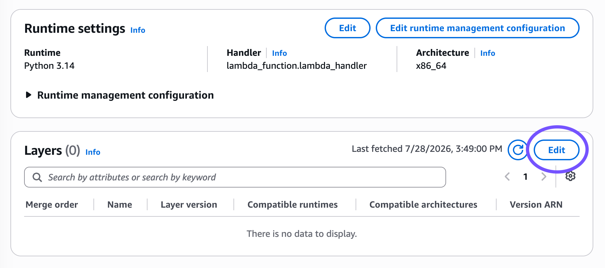
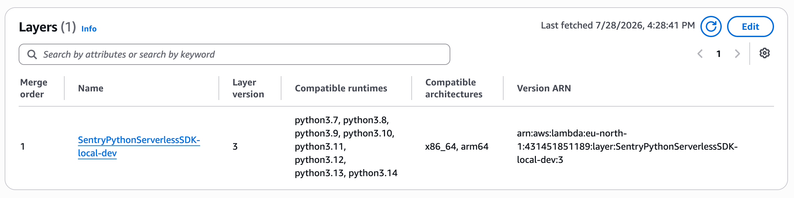
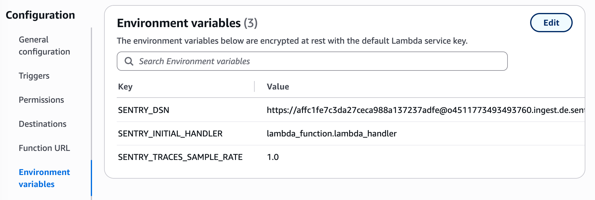

This guide walks you through how to add Sentry to your AWS Lambda function by adding the Sentry AWS Lambda layer. This method can be instrumented from the Sentry product by those who have access to the AWS infrastructure and doesn't require that you make any direct updates to the code.

You can also configure this function in one of the two ways described below:

- **Without touching your code:**
  This method can be instrumented from the Sentry product by those who have access to the AWS infrastructure and doesn't require that you make any direct updates to the code. See the [AWS Lambda guide](/integrations/cloud-monitoring/aws-lambda/).
- **By adding the Sentry Lambda Layer to your function manually:**
  While this is a quick way to add Sentry to your AWS Lambda function, it gives you limited configuration possibilities with environment vars. See <PlatformLink to="/integrations/aws-lambda/manual-layer/">AWS Lambda Layer</PlatformLink>.

## Install The Layer

Navigate to your Lambda function:

Scroll down to the **Layers** section and click **Edit**:

On the **Edit layers** page, click **Add a layer**:

Choose the **Specify an ARN** tab as illustrated:

First, set the region and copy the provided ARN value:

<LambdaLayerDetail canonical="aws-layer:python" />

Paste that ARN into the input box, then click **Verify** and **Save**.

After saving, confirm the layer is attached to your function:

## Configure the Sentry SDK

For Sentry to instrument your Lambda function, you need to change the handler of your function and set the Sentry DSN using environment variables.

### Set the Sentry Handler

The Sentry layer will wrap your function handler to initialise the Sentry SDK in your function.

In your Lambda function, scroll to **Runtime settings** and click **Edit**:

Note your current **Handler** and then change it in **Runtime Settings** to: `sentry_sdk.integrations.init_serverless_sdk.sentry_lambda_handler`

### Set Environment Variables

After saving, open the **Configuration** tab of your Lambda function and go to **Environment variables**:

Click **Edit** and add at least `SENTRY_DSN` and `SENTRY_INITIAL_HANDLER` (set `SENTRY_INITIAL_HANDLER` to the handler you noted before). You can also set `SENTRY_TRACES_SAMPLE_RATE`:

Save, then confirm the variables are set:

You can also set other SDK options via environment variables. See the [Common Options](/platforms/python/configuration/options/#common-options) to learn more.

## Verify

Add an error to your function and run it. If everything's working properly, it should be captured and sent to Sentry.io.

## Troubleshooting

- **Error:** `"Unable to import module 'lambda_function': urllib3 v2.0 only supports OpenSSL 1.1.1+, currently the 'ssl' module is compiled with 'OpenSSL 1.0.2k-fips  26 Jan 2017'. See: https://github.com/urllib3/urllib3/issues/2168"`

  This error means that you have `urllib3>=2.0` in you dependencies. The Python runtime used in AWS Lambda is not compatible with urllib3 version 2, because it still uses OpenSSL 1.0.

  **Solution:** There are two solutions for this error:

  - Either use a newer Python runtime for your Lambda function. `urllib3` version 2+ is supported in AWS Lambda from the Python 3.9 Lambda runtime and newer.
  - Or pin your dependency of urllib3 to `urllib3<1.27` to make it work with the Python runtime 3.7 and 3.8 used in AWS Lambda.

## Supported Versions

- Lambda Layer up to Version 63: Python 3.6, 3.7, 3.8, 3.9
- Lambda Layer Version 64+: Python 3.9, 3.10, 3.11
- Lambda Layer Version 77+: Python 3.7, 3.8, 3.9, 3.10, 3.11
