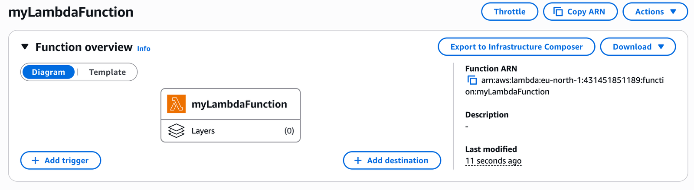
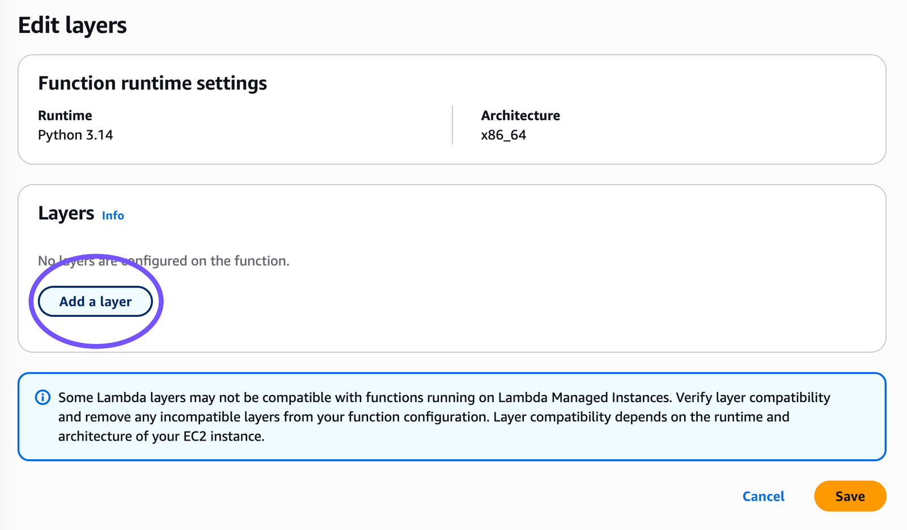
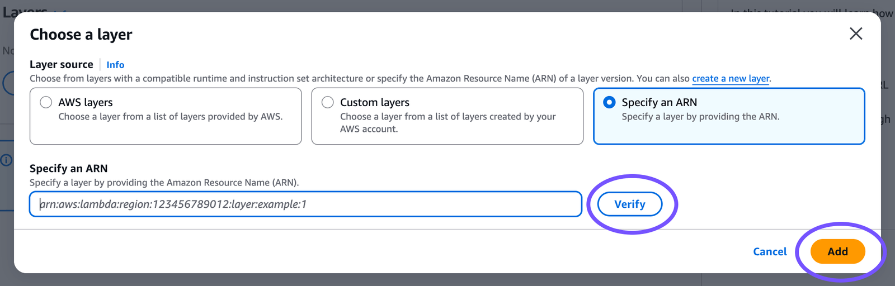
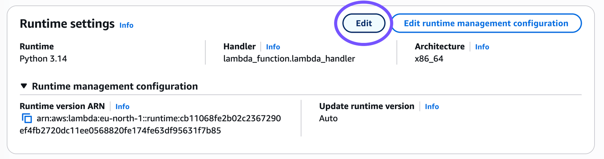
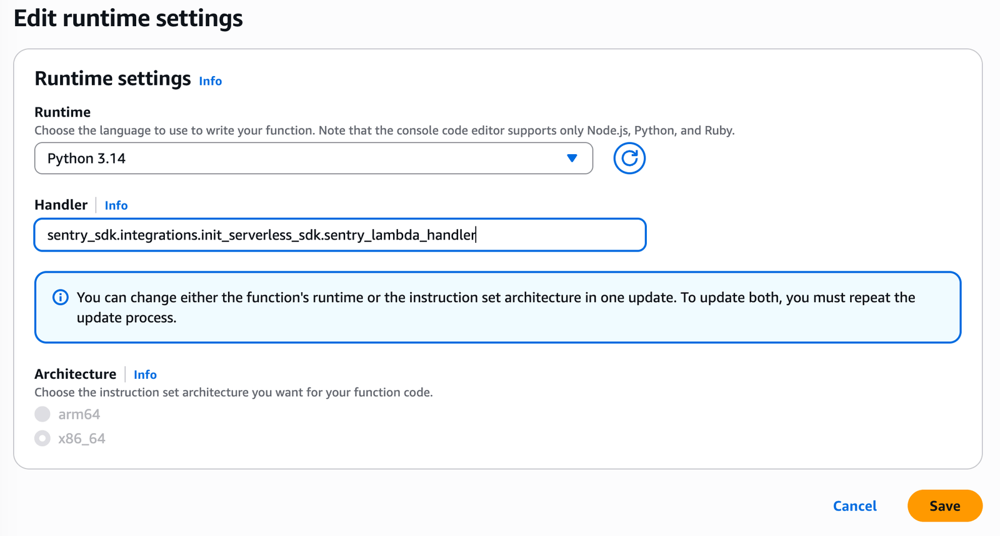
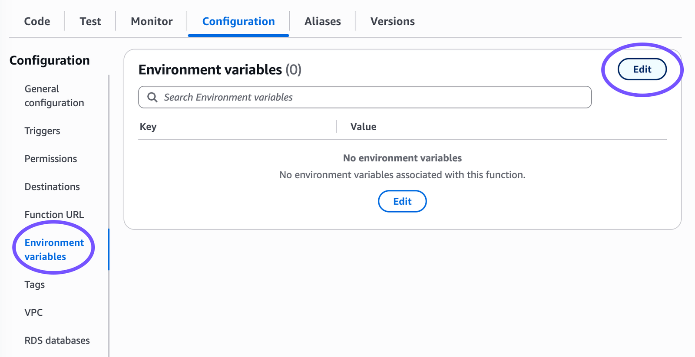
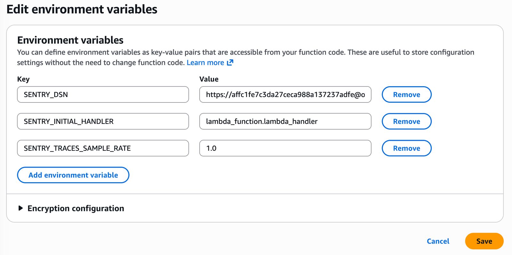

The easiest way to get started with Sentry is to use the Sentry [Lambda Layer](https://docs.aws.amazon.com/lambda/latest/dg/adding-layers.html) instead of installing `sentry-sdk` into your deployment package [manually](/platforms/python/integrations/aws-lambda/manual-instrumentation/).
If you follow this guide, you don't have to worry about deploying Sentry dependencies alongside your function code.

<Include name="python-stream-mode-general-callout.mdx" />

### Should I use the Lambda Layer or install the SDK package?

We generally recommend using the Lambda layer as it doesn't require you to deploy any Sentry dependency alongside your function.
With the layer, you configure Sentry through environment variables and a handler wrapper.

You might still want to [install the SDK package](/platforms/python/integrations/aws-lambda/manual-instrumentation/) instead if:

1. You need full control over `sentry_sdk.init()` (custom integrations, `before_send`, sampling logic, and so on).
2. You already package dependencies with your function and don't want to add a (or another) Lambda layer.
3. You're deploying a [container image](https://docs.aws.amazon.com/lambda/latest/dg/images-create.html) — layers can't be attached to image-based functions. Use [manual instrumentation](/platforms/python/integrations/aws-lambda/manual-instrumentation/) in that case.

You can also instrument Lambda functions [without touching your code](/integrations/cloud-monitoring/aws-lambda/) from the Sentry product if you have access to the AWS infrastructure.

## Prerequisites

Before you begin, make sure you have the following:

- You have a Lambda function deployed in AWS.
- You know the AWS region that your function is deployed to.
- Your function uses a Python runtime listed in the layer selector.

## 1. Add the Sentry Lambda Layer

Navigate to your Lambda function. Scroll to **Layers** and click **Add a layer**:





Choose the **Specify an ARN** tab:



Choose the region, runtime, and SDK version, then copy the provided ARN:

<LambdaLayerDetail canonical="aws-layer:python" />

Paste the ARN into the input, then click **Verify** and **Save**.

## 2. Set the Sentry Handler

The Sentry layer wraps your function handler so the SDK can initialize before your code runs.

In your Lambda function, scroll to **Runtime settings** and click **Edit**:



Note your current **Handler** value (you'll need it in the next step), then change it to:

```text
sentry_sdk.integrations.init_serverless_sdk.sentry_lambda_handler
```



## 3. Configure Environment Variables

Set the following environment variables in your Lambda function configuration:

```bash
SENTRY_INITIAL_HANDLER="<PATH_TO_FUNCTION_HANDLER>"
SENTRY_DSN="___PUBLIC_DSN___"
SENTRY_TRACES_SAMPLE_RATE="1.0"
```

Set `SENTRY_INITIAL_HANDLER` to the handler you noted in step 2 (for example, `lambda_function.lambda_handler`).

To set environment variables, open the **Configuration** tab of your Lambda function and go to **Environment variables**:



Click **Edit**, add the variables above, and save:



You can also set other SDK options via environment variables. See the [Common Options](/platforms/python/configuration/options/#common-options) to learn more.

## Verify

Add an error to your function and run it. If everything's working properly, it should be captured and sent to Sentry.io.

## Troubleshooting

- **Error:** `"Unable to import module 'lambda_function': urllib3 v2.0 only supports OpenSSL 1.1.1+, currently the 'ssl' module is compiled with 'OpenSSL 1.0.2k-fips  26 Jan 2017'. See: https://github.com/urllib3/urllib3/issues/2168"`

  This error means that you have `urllib3>=2.0` in your dependencies. The Python runtime used in AWS Lambda is not compatible with urllib3 version 2, because it still uses OpenSSL 1.0.

  **Solution:** There are two solutions for this error:
  - Either use a newer Python runtime for your Lambda function. `urllib3` version 2+ is supported in AWS Lambda from the Python 3.9 Lambda runtime and newer.
  - Or pin your dependency of urllib3 to `urllib3<1.27` to make it work with the Python runtime 3.7 and 3.8 used in AWS Lambda.
