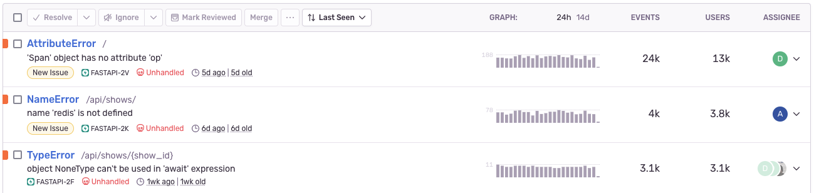
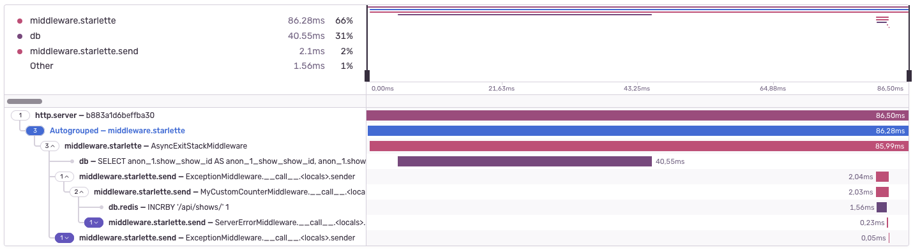

The FastAPI integration adds support for the FastAPI framework.

<PlatformContent includePath="llm-steering" />

<PlatformContent includePath="getting-started-prerequisites" />

## Features

In addition to capturing errors, you can monitor interactions between multiple services or applications by [enabling tracing](/concepts/key-terms/tracing/). 

Send <PlatformLink to="/platforms/python/logs/">structured logs</PlatformLink> to Sentry and correlate them with errors and traces.

FastAPI-specific behavior and performance coverage:

- By default, all exceptions leading to an Internal Server Error are captured and reported. You can configure which status codes are reported via the `failed_request_status_codes` option.
- Request data (URL, HTTP method, headers, form data, JSON payloads) is attached to issues. Raw bodies and multipart file uploads are excluded.
- PII (like user IDs, usernames, cookies, auth headers, IPs) is excluded unless you set `send_default_pii=True`.
- Performance spans cover middleware (including `send`/`receive`), database queries, and Redis commands.





Select which Sentry features you'd like to configure to get the corresponding setup instructions below.

<OnboardingOptionButtons
  options={[
    {id: "error-monitoring", checked: true, disabled: true},
    {id: "performance", checked: true},
    {id: "logs", checked: true},
  ]}
/>

## Install

Install the Sentry SDK using the FastAPI extra:

```bash {tabTitle:pip}
pip install "sentry-sdk[fastapi]"
```
```bash {tabTitle:uv}
uv add "sentry-sdk[fastapi]"
```

## Configure

Configuration should happen as early as possible in your application's lifecycle. If `fastapi` is in your dependencies, the FastAPI integration is enabled automatically when you initialize the SDK.

```python {filename:main.py}
import sentry_sdk

sentry_sdk.init(
    dsn="___PUBLIC_DSN___",

    # Adds request headers and IP for users, for more info visit:
    # https://docs.sentry.io/platforms/python/data-management/data-collected/
    send_default_pii=True,

    # ___PRODUCT_OPTION_START___ logs
    # Enable logs to be sent to Sentry
    _experiments={"enable_logs": True},
    # ___PRODUCT_OPTION_END___ logs

    # ___PRODUCT_OPTION_START___ performance
    # Set traces_sample_rate to 1.0 to capture 100%
    # of transactions for tracing.
    # We recommend adjusting this value in production
    # Learn more at
    # https://docs.sentry.io/platforms/python/configuration/options/#traces-sample-rate
    traces_sample_rate=1.0,
    # ___PRODUCT_OPTION_END___ performance
)
```

<Alert>

To record performance data, set [traces_sample_rate](/platforms/python/configuration/options/#traces-sample-rate) when initializing the SDK.

</Alert>

## Step 3: Capture Python Errors

The Sentry SDK automatically captures unhandled exceptions. You can also manually capture errors and add context:

### Automatic Error Capture

```python
# This will be automatically captured by Sentry
division_by_zero = 1 / 0
```

### Manual Error Capture

```python
import sentry_sdk

try:
    risky_operation()
except Exception as e:
    # Capture the exception with additional context
    sentry_sdk.capture_exception(e)
```

<Alert>

Learn more about manually capturing errors in our <PlatformLink to="/usage/">Usage documentation</PlatformLink>.

</Alert>

### Adding User Context

```python
import sentry_sdk

# Set user context for all future events
sentry_sdk.set_user({
    "id": "123",
    "username": "jane.doe",
    "email": "jane.doe@example.com"
})

# Add custom tags
sentry_sdk.set_tag("page_locale", "en-us")

# Add custom context
sentry_sdk.set_context("character", {
    "name": "Mighty Fighter",
    "age": 19,
    "attack_type": "melee"
})
```

<OnboardingOption optionId="performance">

<OnboardingOption optionId="logs">

## Step 4: Sending Logs

Now let's add structured logging to capture application insights. Logs are enabled in your configuration above.

Use Python's logging module to capture structured logs with meaningful attributes that help you debug issues and understand user behavior.

```python
import logging

# Configure Python logging
logger = logging.getLogger(__name__)

# Send structured logs with attributes
logger.info(
    "User completed checkout",
    extra={
        "user_id": 123,
        "order_id": "order_456",
        "amount": 99.99
    }
)

logger.error(
    "Payment processing failed",
    extra={
        "error_code": "CARD_DECLINED",
        "user_id": 123,
        "attempt_count": 3
    }
)

# Log with exception information
try:
    process_payment()
except PaymentError as e:
    logger.exception(
        "Payment failed with exception",
        extra={"transaction_id": "txn_789"}
    )
```

</OnboardingOption>

## Step 5: Custom Traces with Attributes

Create custom spans to measure specific operations and add meaningful attributes. This helps you understand performance bottlenecks and debug issues with detailed context.

```python
import sentry_sdk

# Create custom spans to measure specific operations
def process_user_data(user_id):
    with sentry_sdk.start_span(
        op="function",
        description="Process User Data",
        data={
            "user_id": user_id,
            "operation": "data_processing",
            "version": "2.1"
        }
    ) as span:
        # Your business logic here
        user_data = fetch_user_data(user_id)

        # Nested span for specific operations
        with sentry_sdk.start_span(
            op="transform",
            description="Transform Data",
            data={
                "record_count": len(user_data),
                "transform_type": "normalize"
            }
        ) as inner_span:
            result = transform_user_data(user_data)

        return result

# Add attributes to existing spans
span = sentry_sdk.get_current_span()
if span:
    span.set_data("cache_hit", True)
    span.set_data("region", "us-west-2")
    span.set_data("performance_score", 0.95)
```

</OnboardingOption>

## Verify Your Setup

Let's test your setup and confirm that Sentry is working correctly and sending data to your Sentry project.

### Test Error Capturing

```python
from fastapi import FastAPI

app = FastAPI()

@app.get("/sentry-debug")
async def trigger_error():
    division_by_zero = 1 / 0
```

Run your application and visit http://localhost:8000/sentry-debug to send an error and transaction to Sentry.

<PlatformContent includePath="getting-started-browser-sandbox-warning" />

### View Captured Data in Sentry

Now, head over to your project on [Sentry.io](https://sentry.io) to view the collected data (it takes a couple of moments for the data to appear).

<PlatformContent includePath="getting-started-verify-locate-data" />

## Options

If you want to customize behavior, you can explicitly add FastAPI/Starlette integrations and set options:

```python
from sentry_sdk.integrations.starlette import StarletteIntegration
from sentry_sdk.integrations.fastapi import FastApiIntegration

sentry_sdk.init(
    # ... keep your existing options here ...
    integrations=[
        StarletteIntegration(
            transaction_style="endpoint",
            failed_request_status_codes={403, *range(500, 599)},
            http_methods_to_capture=("GET",),
        ),
        FastApiIntegration(
            transaction_style="endpoint",
            failed_request_status_codes={403, *range(500, 599)},
            http_methods_to_capture=("GET",),
        ),
    ]
)
```

You can pass the following keyword arguments to `StarletteIntegration()` and `FastApiIntegration()`:

- `transaction_style`: Controls how transactions are named in Sentry. For example, with a route like `@app.get("/catalog/product/{product_id}")`, the transaction will be `"/catalog/product/{product_id}"` when set to `"url"` and `"product_detail"` when set to `"endpoint"`. Default is `"url"`.
- `failed_request_status_codes`: A set of status codes that should be reported to Sentry for handled HTTP exceptions. Unhandled exceptions without `status_code` are always reported. Defaults to all 5xx.
- `http_methods_to_capture`: Which HTTP methods create transactions. Default is `("CONNECT", "DELETE", "GET", "PATCH", "POST", "PUT", "TRACE",)`.

<Alert title="Added in 2.15.0">
  The `http_methods_to_capture` option.
</Alert>

## Next Steps

- Continue to <PlatformLink to="/configuration">customize your configuration</PlatformLink>
- Learn more about <PlatformLink to="/platforms/python/integrations/">instrumenting frameworks</PlatformLink>
- Learn how to <PlatformLink to="/usage">manually capture errors</PlatformLink>
- Set up <PlatformLink to="/configuration/releases/">release tracking</PlatformLink>

## Supported Versions

- FastAPI: 0.79.0+
- Python: 3.7+
