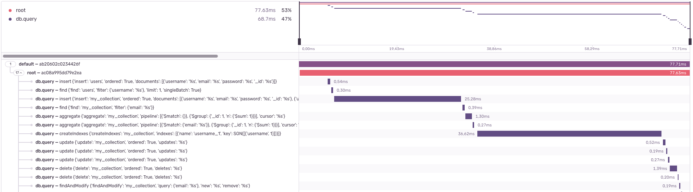

The PyMongo integration adds support for [PyMongo](https://www.mongodb.com/docs/drivers/pymongo/), the official MongoDB driver.

## Install

Install `sentry-sdk` from PyPI with the `pymongo` extra:

```bash
pip install --upgrade 'sentry-sdk[pymongo]'
```

## Configure

If you have the `pymongo` package in your dependencies, the PyMongo integration will be enabled automatically when you initialize the Sentry SDK.

<PlatformContent includePath="getting-started-config" />

## Verify

```python
import pymongo

def main():
    sentry_sdk.init(...)  # same as above
    client = pymongo.MongoClient(DATABASE_HOST, DATABASE_PORT)

    db = client["sentry_test_db"]
    collection = db["sentry_test"]

    with sentry_sdk.start_transaction(name="testing_sentry"):
        collection.insert_one({"test": "sentry"})
        collection.find_one({"test": "sentry"})

main()
```

This will create a transaction called `testing_sentry` in the Performance section of [sentry.io](https://sentry.io), and create spans for the database operations.

It takes a couple of moments for the data to appear in [sentry.io](https://sentry.io).

## Behavior

The following information about your MongoDB queries will be available to you on Sentry.io:

- Performance traces for all MongoDB queries
- Breadcrumbs for all MongoDB queries
- Personal identifiable information (PII) will be stripped from all MongoDB queries if `send_default_pii` is disabled in the SDK. (This was tested for PyMongo 4.2 and below, but "should" also be future proof)



### Other MongoDB libraries

PyMongo is an official synchronous driver for MongoDB. It means that many other Python libraries interacting with
MongoDB use it under the hood, like, for example `mongoengine` (always) or `umongo` (if selected from multiple available
drivers). Official async MongoDB driver called `Motor` uses PyMongo under the hood as well.
Queries generated by those libraries will also be monitored.

If you use a different driver (for example, `TxMongo`), this integration won't work.

### Mongomock

While `mongomock` can be used to replace `PyMongo` in tests, it doesn't implement all features available in the official
driver. This integration will not generate any breadcrumbs or spans from `mongomock`'s clients.

## Supported Versions

- PyMongo: 3.1+
- Python: Python 3.6+

<Include name="python-use-older-sdk-for-legacy-support.mdx" />
