The Sentry SDK for Python does a very good job of auto instrumenting your application. If you use one of the popular frameworks, we've got you covered because well-known operations like HTTP calls and database queries will be instrumented out of the box. The Sentry SDK will also check your installed Python packages and auto-enable the matching SDK integrations. If you want to enable tracing in a piece of code that performs some other operations, add the `@sentry_sdk.trace` decorator.

## Add a Transaction

Adding transactions will allow you to instrument and capture certain regions of your code.

<Alert>

If you're using one of Sentry's SDK integrations, transactions will be created for you automatically.

</Alert>

The following example creates a transaction for an expensive operation (in this case, `eat_pizza`), and then sends the result to Sentry:

```python
import sentry_sdk

def eat_slice(slice):
    ...

def eat_pizza(pizza):
    with sentry_sdk.start_transaction(op="task", name="Eat Pizza"):
        while pizza.slices > 0:
            eat_slice(pizza.slices.pop())
```

The [API reference](https://getsentry.github.io/sentry-python/api.html#sentry_sdk.api.start_transaction) documents `start_transaction` and all its parameters.

<Alert>

Note that `sentry_sdk.start_transaction()` is meant be used as a context manager. This ensures that the transaction will be properly set as active and any spans created within will be attached to it.

</Alert>

## Add Spans to a Transaction

If you want to have more fine-grained performance monitoring, you can add child spans to your transaction, which can be done by either:

- Using a context manager
- Using a decorator (this works on sync and async functions)
- Manually starting and finishing a span

Calling `sentry_sdk.start_span()` will find the current active transaction and attach the span to it.

### Using a Context Manager

```python
import sentry_sdk

def eat_slice(slice):
    ...

def eat_pizza(pizza):
    with sentry_sdk.start_transaction(op="task", name="Eat Pizza"):
        while pizza.slices > 0:
            with sentry_sdk.start_span(name="Eat Slice"):
                eat_slice(pizza.slices.pop())
```

<Alert title="Changed in 2.15.0">

The parameter `name` in `start_span()` used to be called `description`. In version 2.15.0 `description` was deprecated and from 2.15.0 on, only `name` should be used. `description` will be removed in `3.0.0`.

</Alert>

### Using a Decorator

```python
import sentry_sdk

@sentry_sdk.trace
def eat_slice(slice):
    ...

def eat_pizza(pizza):
    with sentry_sdk.start_transaction(op="task", name="Eat Pizza"):
        while pizza.slices > 0:
            eat_slice(pizza.slices.pop())
```

<Alert title="Static & Class Methods">

When tracing a static or class method, you **must** add the `@sentry_sdk.trace` decorator **after** the `@staticmethod` or `@classmethod` decorator (i.e., **closer** to the function definition). Otherwise, your function will break!

</Alert>

### Manually Starting and Finishing a Span

```python
import sentry_sdk

def eat_slice(slice):
    ...

def eat_pizza(pizza):
    with sentry_sdk.start_transaction(op="task", name="Eat Pizza"):
        while pizza.slices > 0:
            span = sentry_sdk.start_span(name="Eat Slice")
            eat_slice(pizza.slices.pop())
            span.finish()
```

<Alert title="Changed in 2.15.0">

The parameter `name` in `start_span()` used to be called `description`. In version 2.15.0 `description` was deprecated and from 2.15.0 on, only `name` should be used. `description` will be removed in `3.0.0`.

</Alert>

When you create your span manually, make sure to call `span.finish()` after the block of code you want to wrap in a span to finish the span. If you do not finish the span it will not be sent to Sentry.

## Nested Spans

Spans can be nested to form a span tree. If you'd like to learn more, read our [distributed tracing](/product/sentry-basics/tracing/distributed-tracing/) documentation.

### Using a Context Manager

```python
import sentry_sdk

def chew():
    ...

def eat_slice(slice):
    with sentry_sdk.start_span(name="Eat Slice"):
        with sentry_sdk.start_span(name="Chew"):
            chew()
```

<Alert title="Changed in 2.15.0">

The parameter `name` in `start_span()` used to be called `description`. In version 2.15.0 `description` was deprecated and from 2.15.0 on, only `name` should be used. `description` will be removed in `3.0.0`.

</Alert>

### Using a Decorator

```python
import sentry_sdk

@sentry_sdk.trace
def chew():
    ...

@sentry_sdk.trace
def eat_slice(slice):
    chew()
```

### Manually

```python
import sentry_sdk

def chew():
    ...

def eat_slice(slice):
    parent_span = sentry_sdk.start_span(name="Eat Slice")

    child_span = parent_span.start_child(name="Chew")
    chew()
    child_span.finish()

    parent_span.finish()
```

<Alert title="Changed in 2.15.0">

The parameter `name` in `start_span()` used to be called `description`. In version 2.15.0 `description` was deprecated and from 2.15.0 on, only `name` should be used. `description` will be removed in `3.0.0`.

</Alert>

The parameters of `start_span()` and `start_child()` are the same. See the [API reference](https://getsentry.github.io/sentry-python/api.html#sentry_sdk.api.start_span) for more details.

When you create your span manually, make sure to call `span.finish()` after the block of code you want to wrap in a span to finish the span. If you do not finish the span it will not be sent to Sentry.


## @sentry_sdk.trace decorator

The `@sentry_sdk.trace` decorator can do more than shown in the example above.

You can set `op`, `name` and `attributes` parameters in the `@sentry_sdk.trace` decorator to customize your spans. The `attributes` will be saved in the spans `data` object. (The `data` object will be renamed to `attributes` in the future.)
<Alert title="Static & Class Methods">

When tracing a static or class method, you **must** add the `@sentry_sdk.trace` decorator **after** the `@staticmethod` or `@classmethod` decorator (i.e., **closer** to the function definition). Otherwise, your function will break!

</Alert>

```python {diff}
 import sentry_sdk

+@sentry_sdk.trace(op="my_op", name="Paul", attributes={"x": True})
 def my_function(i):
     ...

 @sentry_sdk.trace
 def root_function():
     for i in range(3):
         my_function(i)

 root_function()
```

The code above will customize the `my_function` spans like this:


### Span Templates

In the `@sentry_sdk.trace` decorator you can also specify a `template`. This helps create spans that follow a certain template. Currently this is available for spans that are created for the [AI Agents instrumentation](/platforms/python/tracing/instrumentation/custom-instrumentation/ai-agents-module/#spans) of Sentry.

Available templates are `AI_AGENT`, `AI_TOOL`, and `AI_CHAT`.

```python {diff}
 import sentry_sdk
 from sentry_sdk.consts import SPANTEMPLATE

+@sentry_sdk.trace(template=SPANTEMPLATE.AI_AGENT)
 def my_function(i):
     ...

 @sentry_sdk.trace
 def root_function():
     for i in range(3):
         my_function(i)

 root_function()
```

This will treat `my_function` as an AI agent and will create the following span tree that is compatible with the [OpenTelemetry Semantic Conventions](https://opentelemetry.io/docs/specs/semconv/gen-ai/gen-ai-agent-spans/) and the Sentry conventions for [AI Agents instrumentation](/platforms/python/tracing/instrumentation/custom-instrumentation/ai-agents-module/#spans). There will also be a couple of attributes set, but those are omitted in the graph below for readability reasons:


```mermaid
gantt
    dateFormat DD
    todayMarker off
    axisFormat %
    SPAN(op=function, name=root_function)   :a1, 01, 7d
    SPAN(op=gen_ai.invoke_agent, name="invoke_agent my_function")    :a2, 02, 2d
    SPAN(op=gen_ai.invoke_agent, name="invoke_agent my_function")    :a3, 04, 2d
    SPAN(op=gen_ai.invoke_agent, name="invoke_agent my_function")    :a4, 06, 2d
```

For the span attributes that are set for the different available templates, see the AI Agents instrumentation documentation:
- `SPANTEMPLATE.AI_AGENT` -> [Invoke Agent Span](/platforms/python/tracing/instrumentation/custom-instrumentation/ai-agents-module/#invoke-agent-span)
- `SPANTEMPLATE.AI_CHAT` -> [AI Client Span](/platforms/python/tracing/instrumentation/custom-instrumentation/ai-agents-module/#ai-client-span)
- `SPANTEMPLATE.AI_TOOL` -> [Execute Tool Span](/platforms/python/tracing/instrumentation/custom-instrumentation/ai-agents-module/#execute-tool-span)

Currently it is not possible to define custom span templates.

## Define Span Creation in a Central Place

To avoid having custom performance instrumentation code scattered all over your code base, pass a parameter <PlatformIdentifier name="functions-to-trace" /> to your `sentry_sdk.init()` call.

```python
import sentry_sdk

functions_to_trace = [
    {"qualified_name": "myrootmodule.eat_slice"},
    {"qualified_name": "myrootmodule.swallow"},
    {"qualified_name": "myrootmodule.chew"},
    {"qualified_name": "myrootmodule.someothermodule.another.some_function"},
    {"qualified_name": "myrootmodule.SomePizzaClass.some_method"},
]

sentry_sdk.init(
    dsn="___PUBLIC_DSN___",
    functions_to_trace=functions_to_trace,
)
```

Now, whenever a function specified in `functions_to_trace` will be executed, a span will be created and attached as a child to the currently running span.

<Alert title="Important">

To enable performance monitoring for the functions specified in `functions_to_trace`, the SDK needs to load the function modules. Be aware, there may be code being executed in modules during module loading. To avoid this, use the method described above to trace your functions.

</Alert>

## Accessing the Current Transaction

The `sentry_sdk.get_current_scope().transaction` property returns the active transaction or `None` if no transaction is active. You can use this property to modify data on the transaction.

```python
import sentry_sdk

def eat_pizza(pizza):
    transaction = sentry_sdk.get_current_scope().transaction

    if transaction is not None:
        transaction.set_tag("num_of_slices", len(pizza.slices))

    while pizza.slices > 0:
        eat_slice(pizza.slices.pop())
```

## Accessing the Current Span

To change data in the current span, use ` sentry_sdk.get_current_span()`. This function will return a span if there's one running, otherwise it will return `None`.

In this example, we'll set a tag in the span created by the `@sentry_sdk.trace` decorator.

```python
import sentry_sdk

@sentry_sdk.trace
def eat_slice(slice):
    span = sentry_sdk.get_current_span()

    if span is not None:
        span.set_tag("slice_id", slice.id)
```

## Improving Data on Transactions and Spans

You can add data attributes to your transactions. This data is visible in the trace explorer in Sentry. Data attributes can be of type `string`, `number` or `boolean`, as well as (non-mixed) arrays of these types:

```python
with sentry_sdk.start_transaction(name="my-transaction") as transaction:
    transaction.set_data("my-data-attribute-1", "value1")
    transaction.set_data("my-data-attribute-2", 42)
    transaction.set_data("my-data-attribute-3", True)

    transaction.set_data("my-data-attribute-4", ["value1", "value2", "value3"])
    transaction.set_data("my-data-attribute-5", [42, 43, 44])
    transaction.set_data("my-data-attribute-6", [True, False, True])
```

You can add data attributes to your spans the same way, with the same type restrictions as described above.

```python
with sentry_sdk.start_span(name="my-span") as span:
    span.set_data("my-data-attribute-1", "value1")
    span.set_data("my-data-attribute-2", 42)
    span.set_data("my-data-attribute-3", True)

    span.set_data("my-data-attribute-4", ["value1", "value2", "value3"])
    span.set_data("my-data-attribute-5", [42, 43, 44])
    span.set_data("my-data-attribute-6", [True, False, True])
```

To attach data attributes to the transaction and all its spans, you can use <PlatformLink to="/configuration/filtering/#using-before-send-transaction">`before_send_transaction`</PlatformLink>:

```python
import sentry_sdk
from sentry_sdk.types import Event, Hint

def before_send_transaction(event: Event, hint: Hint) -> Event | None:
    # Set the data attribute "foo" to "bar" on every span belonging to this
    # transaction event
    for span in event["spans"]:
        span["data"]["foo"] = "bar"

    # Set the data on the transaction itself, too
    event["contexts"]["trace"]["data"]["foo"] = "bar"

    return event

sentry_sdk.init(
    traces_sample_rate=1.0,
    before_send_transaction=before_send_transaction,
)
```

## Update Current Span Shortcut

You can update the data of the currently running span using the `sentry_sdk.update_current_span()` function:
```python {diff}
 import sentry_sdk

 @sentry_sdk.trace(op="my_op", name="Paul", attributes={"x": True})
 def my_function(i):
+    sentry_sdk.update_current_span(
+        op="myOp",
+        name=f"Paul{i}",
+        attributes={"y": i},
+    )
     ...

 @sentry_sdk.trace
 def root_function():
     for i in range(3):
         my_function(i)

 root_function()
```

The code above will update the `my_function` (now `my_op`) spans with custom data like this:

```mermaid
gantt
    dateFormat DD
    todayMarker off
    axisFormat %
    SPAN(op=function, name=root_function)   :a1, 01, 7d
    SPAN(op=myOp, name=Paul0, x=True, y=0)    :a2, 02, 2d
    SPAN(op=myOp, name=Paul1, x=True, y=1)    :a3, 04, 2d
    SPAN(op=myOp, name=Paul2, x=True, y=2)    :a4, 06, 2d
```

