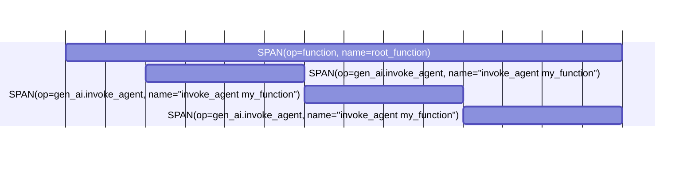
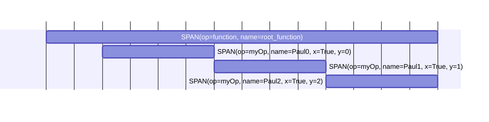

The Sentry SDK for Python does a very good job of auto instrumenting your application. If you use one of the popular frameworks, we've got you covered because well-known operations like HTTP calls and database queries will be instrumented out of the box. The Sentry SDK will also check your installed Python packages and auto-enable the matching SDK integrations. If you want to enable tracing in a piece of code that performs some other operations, add the `@sentry_sdk.trace` decorator.

<Alert>

This page covers both transaction mode (default) and stream mode. See <PlatformLink to="/tracing/streamed-spans/">Streamed Spans</PlatformLink> to learn more.

</Alert>

<Alert title="Changed in 2.15.0">

The parameter `name` in `start_span()` used to be called `description`. In version 2.15.0 `description` was deprecated and from 2.15.0 on, only `name` should be used. `description` will be removed in `3.0.0`.

</Alert>

## Add a Transaction/Service Span

Adding transactions or service spans (in stream mode) will allow you to instrument and capture certain regions of your code.

<Alert>

If you're using one of Sentry's SDK integrations, transactions/service spans will be created for you automatically.

</Alert>

The following example creates a transaction/service span for an expensive operation (in this case, `eat_pizza`), and then sends the result to Sentry:

```python {tabTitle:Transaction Mode (Default)}
import sentry_sdk

def eat_slice(slice):
    ...

def eat_pizza(pizza):
    with sentry_sdk.start_transaction(op="task", name="Eat Pizza"):
        while pizza.slices > 0:
            eat_slice(pizza.slices.pop())
```

```python {tabTitle:Stream Mode}
import sentry_sdk

def eat_slice(slice):
    ...

def eat_pizza(pizza):
    with sentry_sdk.traces.start_span(
        name="Eat Pizza",
        attributes={"sentry.op": "task"},
        # set parent span to None to create service span
        parent_span=None,
    ):
        while pizza.slices > 0:
            span = sentry_sdk.traces.start_span(name="Eat Slice")
            eat_slice(pizza.slices.pop())
            span.end()
```

The [API reference](https://getsentry.github.io/sentry-python/api.html#performance-monitoring) documents `start_transaction` and `start_span`, along with their parameters.

<Alert>

Note that `sentry_sdk.start_transaction()` (transaction mode) is meant be used as a context manager. This ensures that the transaction/service span will be properly set as active and any spans created within will be attached to it.

In stream mode, `sentry_sdk.traces.start_span()` can, but doesn't have to be, used as a context manager. If you don't use it as a context manager, make sure to call `span.end()` to finish the span.

</Alert>

## Add Spans to a Transaction/Service Span

If you want to have more fine-grained performance monitoring, you can add child spans to your transaction/service span, which can be done by either:

- Using a context manager
- Using a decorator (this works on sync and async functions)
- Manually starting and finishing a span

Calling `sentry_sdk.start_span()` in transaction mode or `sentry_sdk.traces.start_span()` in stream mode will find the current active transaction/span and attach the new span to it.

### Using a Context Manager

```python {tabTitle:Transaction Mode (Default)}
import sentry_sdk

def eat_slice(slice):
    ...

def eat_pizza(pizza):
    with sentry_sdk.start_transaction(op="task", name="Eat Pizza"):
        while pizza.slices > 0:
            with sentry_sdk.start_span(name="Eat Slice"):
                eat_slice(pizza.slices.pop())
```

```python {tabTitle:Stream Mode}
import sentry_sdk

def eat_slice(slice):
    ...

def eat_pizza(pizza):
    with sentry_sdk.traces.start_span(
        name="Eat Pizza",
        attributes={"sentry.op": "task"},
        parent_span=None,
    ):
        while pizza.slices > 0:
            with sentry_sdk.traces.start_span(name="Eat Slice"):
                eat_slice(pizza.slices.pop())
```

### Using a Decorator

```python {tabTitle:Transaction Mode (Default)}
import sentry_sdk

@sentry_sdk.trace
def eat_slice(slice):
    ...

def eat_pizza(pizza):
    with sentry_sdk.start_transaction(op="task", name="Eat Pizza"):
        while pizza.slices > 0:
            eat_slice(pizza.slices.pop())
```

```python {tabTitle:Stream Mode}
import sentry_sdk

@sentry_sdk.traces.trace
def eat_slice(slice):
    ...

def eat_pizza(pizza):
    with sentry_sdk.traces.start_span(
        name="Eat Pizza",
        attributes={"sentry.op": "task"},
        parent_span=None,
    ):
        while pizza.slices > 0:
            eat_slice(pizza.slices.pop())
```

See the [@sentry_sdk.trace decoration section](#sentry_sdktrace-decorator) below for more details.

<Alert level="warning" title="Static & class methods">

When tracing a static or class method, you **must** add the `@sentry_sdk.trace` (transaction mode)/`@sentry.sdk.traces.trace` (stream mode) decorator **after** the `@staticmethod` or `@classmethod` decorator (i.e., **closer** to the function definition). Otherwise, your function will break! This applies in both transaction mode and stream mode.

</Alert>

### Manually Starting and Finishing a Span

```python {tabTitle:Transaction Mode (Default)}
import sentry_sdk

def eat_slice(slice):
    ...

def eat_pizza(pizza):
    with sentry_sdk.start_transaction(op="task", name="Eat Pizza"):
        while pizza.slices > 0:
            span = sentry_sdk.start_span(name="Eat Slice")
            eat_slice(pizza.slices.pop())
            span.finish()
```

```python {tabTitle:Stream Mode}
import sentry_sdk

def eat_slice(slice):
    ...

def eat_pizza(pizza):
    with sentry_sdk.traces.start_span(
        name="Eat Pizza",
        attributes={"sentry.op": "task"},
        parent_span=None,
    ):
        while pizza.slices > 0:
            span = sentry_sdk.traces.start_span(name="Eat Slice")
            eat_slice(pizza.slices.pop())
            span.finish()
```

When you create your span manually, make sure to call `span.finish()` (transaction mode) or `span.end()` (stream mode) after the block of code you want to wrap in a span to finish the span. If you do not finish the span it will not be sent to Sentry.

## Nested Spans

Spans can be nested to form a span tree. If you'd like to learn more, read our [distributed tracing](/concepts/key-terms/tracing/distributed-tracing/) documentation.

### Using a Context Manager

```python {tabTitle:Transaction Mode (Default)}
import sentry_sdk

def chew():
    ...

def eat_slice(slice):
    with sentry_sdk.start_span(name="Eat Slice"):
        with sentry_sdk.start_span(name="Chew"):
            chew()
```

```python {tabTitle:Stream Mode}
import sentry_sdk

def chew():
    ...

def eat_slice(slice):
    with sentry_sdk.traces.start_span(name="Eat Slice"):
        with sentry_sdk.traces.start_span(name="Chew"):
            chew()
```

### Using a Decorator

```python {tabTitle:Transaction Mode (Default)}
import sentry_sdk

@sentry_sdk.trace
def chew():
    ...

@sentry_sdk.trace
def eat_slice(slice):
    chew()
```

```python {tabTitle:Stream Mode}
import sentry_sdk

@sentry_sdk.traces.trace
def chew():
    ...

@sentry_sdk.traces.trace
def eat_slice(slice):
    chew()
```

See the [@sentry_sdk.trace decoration section](#sentry_sdktrace-decorator) below for more details.

### Manually Starting and Finishing

```python {tabTitle:Transaction Mode (Default)}
import sentry_sdk

def chew():
    ...

def eat_slice(slice):
    parent_span = sentry_sdk.start_span(name="Eat Slice")

    child_span = parent_span.start_child(name="Chew")
    chew()
    child_span.finish()

    parent_span.finish()
```

```python {tabTitle:Stream Mode}
import sentry_sdk

def chew():
    ...

def eat_slice(slice):
    parent_span = sentry_sdk.traces.start_span(name="Eat Slice")

    # pass the parent span via `parent_span` to create a child span
    child_span = sentry_sdk.traces.start_span(name="Chew", parent_span=parent_span)
    chew()
    child_span.end()

    parent_span.end()
```

In transaction mode, the parameters of `start_span()` and `start_child()` are the same. See the [API reference](https://getsentry.github.io/sentry-python/api.html#sentry_sdk.api.start_span) for more details.
In stream mode, however, there's no separate `start_child()` method. Instead, the span will become the child of the currently active span. Alternatively, you can pass the parent span explicitly via `parent_span` when starting the child (as shown in the example above).

When you create your span manually, make sure to call `span.finish()` (transaction mode) or `span.end()` (stream mode) after the block of code you want to wrap in a span to finish the span. If you do not finish the span it will not be sent to Sentry.

### Sibling Spans

<Alert>

Only available in stream mode.

</Alert>

In stream mode, a span normally attaches to whatever span is currently active. To control parentage explicitly, for example to make a span a sibling instead of a child, pass `parent_span` directly:

```python
import sentry_sdk

def eat_slice(slice):
    ...

def chew():
    ...

def eat_pizza(pizza):
    with sentry_sdk.traces.start_span(name="Eat Pizza") as pizza_span:
        with sentry_sdk.traces.start_span(name="Eat Slice"):
            with sentry_sdk.traces.start_span(name="Chew", parent_span=pizza_span):
                # "Chew" is a sibling of "Eat Slice", not its child
                chew()
            eat_slice(pizza.slices.pop())
```

## @sentry_sdk.trace decorator

In transaction mode, you can set `op`, `name` and `attributes` parameters in the `@sentry_sdk.trace` decorator to customize your spans. Attribute values can only be primitive types (like `int`, `float`, `bool`, `str`) or a list of those types without mixing types.

In stream mode, the decorator is `@sentry_sdk.traces.trace` and accepts `name`, `attributes`, and `active`. Note that there's no `op` parameter; set the operation as the `sentry.op` key in `attributes` instead. Attribute values can only be primitive types (like `int`, `float`, `bool`, `str`) or a list of those types without mixing types.

<Alert level="warning" title="Static & class methods">

When tracing a static or class method, you **must** add the decorator **after** the `@staticmethod` or `@classmethod` decorator (i.e., **closer** to the function definition). Otherwise, your function will break.

</Alert>

```python {tabTitle:Transaction Mode (Default)}
import sentry_sdk

@sentry_sdk.trace(op="my_op", name="Paul", attributes={"x": True})
def my_function(i):
    ...

@sentry_sdk.trace
def root_function():
    for i in range(3):
        my_function(i)

root_function()
```

```python {tabTitle:Stream Mode}
import sentry_sdk

@sentry_sdk.traces.trace(name="Paul", attributes={"sentry.op": "my_op", "x": True})
def my_function(i):
    ...

@sentry_sdk.traces.trace
def root_function():
    for i in range(3):
        my_function(i)

root_function()
```

The code above will customize the `my_function` spans like this:


```mermaid
gantt
    dateFormat DD
    todayMarker off
    axisFormat %
    SPAN(op=function, name=root_function)   :a1, 01, 7d
    SPAN(op=my_op, name=Paul, x=True)    :a2, 02, 2d
    SPAN(op=my_op, name=Paul, x=True)    :a3, 04, 2d
    SPAN(op=my_op, name=Paul, x=True)    :a4, 06, 2d
```

### Span Templates

<Alert>

The `template` parameter is only available in transaction mode.

</Alert>

In the `@sentry_sdk.trace` decorator you can also specify a `template`. This helps create spans that follow a certain template. Currently this is only available for spans that are created for the [AI Agents instrumentation](/platforms/python/tracing/instrumentation/custom-instrumentation/ai-agents-module/#spans) of Sentry.

Available templates are `AI_AGENT`, `AI_TOOL`, and `AI_CHAT`.

```python {diff}
 import sentry_sdk
 from sentry_sdk.consts import SPANTEMPLATE

+@sentry_sdk.trace(template=SPANTEMPLATE.AI_AGENT)
 def my_function(i):
     ...

 @sentry_sdk.trace
 def root_function():
     for i in range(3):
         my_function(i)

 root_function()
```

This will treat `my_function` as an AI agent and will create the following span tree that is compatible with the [OpenTelemetry Semantic Conventions](https://opentelemetry.io/docs/specs/semconv/gen-ai/gen-ai-agent-spans/) and the Sentry conventions for [AI Agents instrumentation](/platforms/python/tracing/instrumentation/custom-instrumentation/ai-agents-module/#spans). Depending on the template, there will also be a couple of attributes set by default, but those are omitted in the graph below for readability reasons:


```mermaid
gantt
    dateFormat DD
    todayMarker off
    axisFormat %
    SPAN(op=function, name=root_function)   :a1, 01, 7d
    SPAN(op=gen_ai.invoke_agent, name="invoke_agent my_function")    :a2, 02, 2d
    SPAN(op=gen_ai.invoke_agent, name="invoke_agent my_function")    :a3, 04, 2d
    SPAN(op=gen_ai.invoke_agent, name="invoke_agent my_function")    :a4, 06, 2d
```

For the span attributes that are set for the different available templates, see the AI Agents instrumentation documentation:

- `SPANTEMPLATE.AI_AGENT` -> [Invoke Agent Span](/platforms/python/tracing/instrumentation/custom-instrumentation/ai-agents-module/#invoke-agent-span)
- `SPANTEMPLATE.AI_CHAT` -> [AI Request span](/platforms/python/tracing/instrumentation/custom-instrumentation/ai-agents-module/#ai-client-span)
- `SPANTEMPLATE.AI_TOOL` -> [Execute Tool Span](/platforms/python/tracing/instrumentation/custom-instrumentation/ai-agents-module/#execute-tool-span)

Currently it is not possible to define custom span templates.

## Define Span Creation in a Central Place

To avoid having custom performance instrumentation code scattered all over your code base, pass a parameter <PlatformIdentifier name="functions-to-trace" /> to your `sentry_sdk.init()` call.

```python
import sentry_sdk

functions_to_trace = [
    {"qualified_name": "myrootmodule.eat_slice"},
    {"qualified_name": "myrootmodule.swallow"},
    {"qualified_name": "myrootmodule.chew"},
    {"qualified_name": "myrootmodule.someothermodule.another.some_function"},
    {"qualified_name": "myrootmodule.SomePizzaClass.some_method"},
]

sentry_sdk.init(
    dsn="___PUBLIC_DSN___",
    functions_to_trace=functions_to_trace,
)
```

Now, whenever a function specified in `functions_to_trace` will be executed, a span will be created and attached as a child to the currently running span.

<Alert title="Important">

To enable performance monitoring for the functions specified in `functions_to_trace`, the SDK needs to load the function modules. Be aware, there may be code being executed in modules during module loading. To avoid this, use the method described above to trace your functions.

</Alert>

## Accessing the Current Transaction

<Alert>

Only available in transaction mode.

</Alert>

The `sentry_sdk.get_current_scope().transaction` property returns the active transaction or `None` if no transaction is active. You can use this property to modify data on the transaction.

```python {tabTitle:Transaction Mode (Default)}
import sentry_sdk

def eat_pizza(pizza):
    transaction = sentry_sdk.get_current_scope().transaction

    if transaction is not None:
        transaction.set_tag("num_of_slices", len(pizza.slices))

    while pizza.slices > 0:
        eat_slice(pizza.slices.pop())
```

## Accessing the Current Span

To change data in the current span, use ` sentry_sdk.get_current_span()` (transaction mode) or `sentry_sdk.traces.get_current_span()` (stream mode). This function will return a span if there's one running, otherwise it will return `None`.

In this example, we'll set custom data in the span created by the `@sentry_sdk.trace` decorator.

```python {tabTitle:Transaction Mode (Default)}
import sentry_sdk

@sentry_sdk.trace
def eat_slice(slice):
    span = sentry_sdk.get_current_span()

    if span is not None:
        span.set_tag("slice_id", slice.id)
```

```python {tabTitle:Stream Mode}
import sentry_sdk

@sentry_sdk.traces.trace
def eat_slice(slice):
    span = sentry_sdk.traces.get_current_span()

    if span is not None:
        span.set_attribute("slice_id", slice.id)
```

## Improving Data on Transactions and Spans

In transaction mode, you can add data attributes to your transactions. This data is visible in the trace explorer in Sentry. Data attributes can be of type `string`, `number` or `boolean`, as well as (non-mixed) arrays of these types:

```python {tabTitle:Transaction Mode (Default)}
with sentry_sdk.start_transaction(name="my-transaction") as transaction:
    transaction.set_data("my-data-attribute-1", "value1")
    transaction.set_data("my-data-attribute-2", 42)
    transaction.set_data("my-data-attribute-3", True)

    transaction.set_data("my-data-attribute-4", ["value1", "value2", "value3"])
    transaction.set_data("my-data-attribute-5", [42, 43, 44])
    transaction.set_data("my-data-attribute-6", [True, False, True])
```

You can add data attributes to any span the same way, with the same type restrictions as described above.

```python {tabTitle:Transaction Mode (Default)}
with sentry_sdk.start_span(name="my-span") as span:
    span.set_data("my-data-attribute-1", "value1")
    span.set_data("my-data-attribute-2", 42)
    span.set_data("my-data-attribute-3", True)

    span.set_data("my-data-attribute-4", ["value1", "value2", "value3"])
    span.set_data("my-data-attribute-5", [42, 43, 44])
    span.set_data("my-data-attribute-6", [True, False, True])
```

```python {tabTitle:Stream Mode}
with sentry_sdk.traces.start_span(name="my-span") as span:
    span.set_attribute("my-data-attribute-1", "value1")
    span.set_attribute("my-data-attribute-2", 42)
    span.set_attribute("my-data-attribute-3", True)

    # or use set_attributes to set multiple attributes at once
    span.set_attributes({
        "my-data-attribute-4": ["value1", "value2", "value3"],
        "my-data-attribute-5": [42, 43, 44],
        "my-data-attribute-6": [True, False, True]
    })
```

<PlatformContent includePath="tracing/span-metrics/add-all-spans" />

<Alert>

`before_send_span` can only modify span data and you cannot use it to drop spans. See [Dropping Spans](#dropping-spans) below.

</Alert>

## Dropping Spans

<PlatformContent includePath="performance/dropping-spans" />

## Update Current Span Shortcut

<Alert>

`sentry_sdk.update_current_span()` isn't available in stream mode. Retrieve the current span with `sentry_sdk.traces.get_current_span()` and update its attributes using `set_attribute()` or `set_attributes()`.

</Alert>

In transaction mode, you can update the data of the currently running span using the `sentry_sdk.update_current_span()` function. You can set `op`, `name` and `attributes` to update your span. Attribute values can only be primitive types (like `int`, `float`, `bool`, `str`) or a list of those types without mixing types.

```python {diff}
 import sentry_sdk

 @sentry_sdk.trace(op="my_op", name="Paul", attributes={"x": True})
 def my_function(i):
+    sentry_sdk.update_current_span(
+        op="myOp",
+        name=f"Paul{i}",
+        attributes={"y": i},
+    )
     ...

 @sentry_sdk.trace
 def root_function():
     for i in range(3):
         my_function(i)

 root_function()
```

The code above will update the `my_function` (now `my_op`) spans with custom data like this:


```mermaid
gantt
    dateFormat DD
    todayMarker off
    axisFormat %
    SPAN(op=function, name=root_function)   :a1, 01, 7d
    SPAN(op=myOp, name=Paul0, x=True, y=0)    :a2, 02, 2d
    SPAN(op=myOp, name=Paul1, x=True, y=1)    :a3, 04, 2d
    SPAN(op=myOp, name=Paul2, x=True, y=2)    :a4, 06, 2d
```
