The Sentry SDK offers a powerful `@sentry_sdk.trace()` decorator for adding tracing to your project.

Tracing in Sentry creates spans. Spans have a `name`, an operation (called `op`), a start- and end-timestamp, and can have arbitrary custom attributes. A span represents the execution of one part of your code.


## Basic Behavior

Adding the `@sentry_sdk.trace()` to a function will create a [span](http://localhost:3000/concepts/key-terms/tracing/distributed-tracing/#traces-transactions-and-spans) for each execution of this function. The `name` of the span will be the functions fully qualified name and `op` will be set to `"function"`.

Spans created with the decorator will be nested under the current active span and will also become the new current active span.

```python
import sentry_sdk

@sentry_sdk.trace
def my_function(i):
    ...

@sentry_sdk.trace
def root_function():
    for i in range(3):
        my_function(i)

root_function()
```

The code above will create a span tree like this:


## Customizing Spans

You can set `op`, `name` and `attributes` parameters in the `@sentry_sdk.trace()` decorator to customize your spans:
```python {diff}
 import sentry_sdk

+@sentry_sdk.trace(op="my_op", name="Paul", attributes={"x": True})
 def my_function(i):
     ...

 @sentry_sdk.trace
 def root_function():
     for i in range(3):
         my_function(i)

 root_function()
```

The code above will customize the `my_function` spans like this:

```mermaid
gantt
    dateFormat DD
    todayMarker off
    axisFormat %
    SPAN(op=function, name=root_function)   :a1, 01, 7d
    SPAN(op=my_op, name=Paul, x=True)    :a2, 02, 2d
    SPAN(op=my_op, name=Paul, x=True)    :a3, 04, 2d
    SPAN(op=my_op, name=Paul, x=True)    :a4, 06, 2d
```


## Updating Spans

You can update the data of the currently running span (that's the one you just created with the `@sentry_sdk.trace()` decorator) using the `sentry_sdk.update_current_span()` function:
```python {diff}
 import sentry_sdk

 @sentry_sdk.trace(op="my_op", name="Paul", attributes={"x": True})
 def my_function(i):
+    sentry_sdk.update_current_span(
+        op="myOp",
+        name=f"Paul{i}",
+        attributes={"y": 0},
+    )
     ...

 @sentry_sdk.trace
 def root_function():
     for i in range(3):
         my_function(i)

 root_function()
```

The code above will update the `my_function` (now `my_op`) spans with custom data like this:


## Span Templates

In the `@sentry_sdk.trace()` decorator you can also specify a `template`. This helps creating spans that follow a certain template. Currently this is available for spans that are created for the AI Agents Module of Sentry.

Available templates are `AI_AGENT`, `AI_TOOL`, and `AI_CHAT`.

```python {diff}
 import sentry_sdk
 from sentry_sdk.consts import SPANTEMPLATE

+@sentry_sdk.trace(template=SPANTEMPLATE.AI_AGENT)
 def my_function(i):
     ...

 @sentry_sdk.trace
 def root_function():
     for i in range(3):
         my_function(i)

 root_function()
```

This will tread `my_function` as an AI agent and will create the following span tree that is compatible to the [OpenTelemetry Semantic Conventions](https://opentelemetry.io/docs/specs/semconv/gen-ai/gen-ai-agent-spans/) and the Sentry conventions for [AI Agents instrumentation](http://localhost:3000/platforms/python/tracing/instrumentation/custom-instrumentation/ai-agents-module/#spans). There will be also a couple of attributes set, but those are omitted in the graph below for readability reasons:

```mermaid
gantt
    dateFormat DD
    todayMarker off
    axisFormat %
    SPAN(op=function, name=root_function)   :a1, 01, 7d
    SPAN(op=gen_ai.invoke_agent, name="invoke_agent my_function")    :a2, 02, 2d
    SPAN(op=gen_ai.invoke_agent, name="invoke_agent my_function")    :a3, 04, 2d
    SPAN(op=gen_ai.invoke_agent, name="invoke_agent my_function")    :a4, 06, 2d
```

