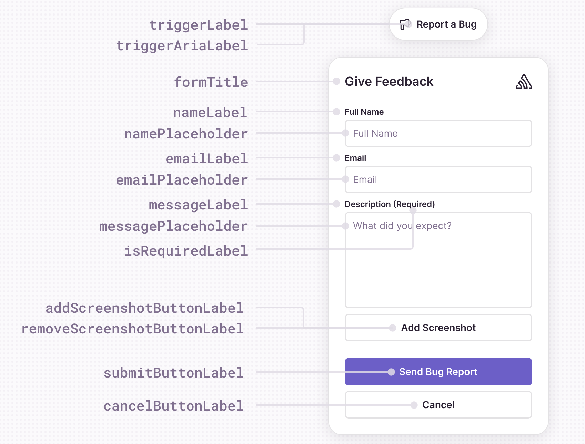

The User Feedback Form offers many customization options, and if the available options are insufficient, you can [use your own UI](/platforms/react-native/user-feedback/#user-feedback-api).


To collect user feedback from inside your application, use the `showFeedbackForm` method to present the form.

```JavaScript
import * as Sentry from "@sentry/react-native";

Sentry.wrap(RootComponent);

Sentry.showFeedbackForm();
```

Note that [the root application component must be wrapped with `Sentry.wrap`](/platforms/react-native/#wrap-your-app) for this to work.

## General

The following options can be configured for the integration in `feedbackIntegration({})` or passed in the `FeedbackForm` component props:


| Key                    | Type                     | Default                               | Description                                                                                                                |
| ---------------------- | ------------------------ | ------------------------------------- | -------------------------------------------------------------------------------------------------------------------------- |
| `showBranding`         | `boolean`                | `true`                                | Displays the Sentry logo.                                                                                                  |
| `showName`             | `boolean`                | `true`                                | Displays the name field on the feedback form.                                                                              |
| `showEmail`            | `boolean`                | `true`                                | Displays the email field on the feedback form.                                                                             |
| `enableShakeToReport`  | `boolean`                | `false`                               | Opens the Feedback Form when the user shakes the device.                                                                   |
| `enableScreenshot`     | `boolean`                | `false`                               | Allows the user to send a screenshot attachment with their feedback.                                                       |
| `enableTakeScreenshot` | `boolean`                | `false`                               | Determines whether the "Take Screenshot" button is displayed.                                                            |
| `isNameRequired`       | `boolean`                | `false`                               | Requires the name field on the feedback form to be filled in.                                                              |
| `isEmailRequired`      | `boolean`                | `false`                               | Requires the email field on the feedback form to be filled in.                                                             |
| `shouldValidateEmail`  | `boolean`                | `true`                                | If set the email is validated with the following regular expression `"/^[a-zA-Z0-9._%+-]+@[a-zA-Z0-9.-]+\.[a-zA-Z]{2,}$/"` |
| `useSentryUser`        | `Record<string, string>` | `{ email: 'email', name: 'username'}` | Sets the default values for the `email` and `name` fields.                                                                 |


## Text Customization

All the text that you see in the Feedback Form can be customized.

The following options can be configured for the integration in `feedbackIntegration({})` or passed in the `FeedbackForm` component props:

| Key                            | Default                                                 | Description                                                         |
| ------------------------------ | ------------------------------------------------------- | ------------------------------------------------------------------- |
| `formTitle`                    | `"Report a Bug"`                                        | The title at the top of the feedback form.                          |
| `submitButtonLabel`            | `"Send Bug Report"`                                     | The label of the submit button used in the feedback form.           |
| `cancelButtonLabel`            | `"Cancel"`                                              | The label of cancel buttons used in the feedback form.              |
| `addScreenshotButtonLabel`     | `"Add a screenshot"`                                    | The label of the button to add a screenshot to the form.            |
| `removeScreenshotButtonLabel`  | `"Remove screenshot"`                                   | The label of the button to remove the screenshot.                   |
| `captureScreenshotButtonLabel` | `"Take a screenshot"`                                   | The label for the button that triggers the capture screenshot flow. |
| `nameLabel`                    | `"Name"`                                                | The label of the name input field.                                  |
| `namePlaceholder`              | `"Your Name"`                                           | The placeholder for the name input field.                           |
| `emailLabel`                   | `"Email"`                                               | The label of the email input field.                                 |
| `emailPlaceholder`             | `"your.email@example.org"`                              | The placeholder for the email input field.                          |
| `isRequiredLabel`              | `"(required)"`                                          | The label shown next to an input field that is required.            |
| `messageLabel`                 | `"Description"`                                         | The label for the feedback description input field.                 |
| `messagePlaceholder`           | `"What's the bug? What did you expect?"`                | The placeholder for the feedback description input field.           |
| `successMessageText`           | `"Thank you for your report!"`                          | The message displayed after a successful feedback submission.       |
| `errorTitle`                   | `"Error"`                                               | The title of the error message dialog.                              |
| `formError`                    | `"Please fill out all required fields."`                | Form validation error message.                                      |
| `emailError`                   | `"Please enter a valid email address."`                 | Email validation error message.                                      |
| `genericError`                 | `"Unable to send feedback due to an unexpected error."` | The generic error message.                                          |

Example of customization:

```javascript
feedbackIntegration({
  nameLabel: "Full Name",
  submitButtonLabel: "Send",
  formTitle: "Give Feedback",
});
```

## Style Customization

You can customize placement of the feedback components on the form, as well as the fonts and colors.

The example below shows how to customize the submit button background color and border radius with the `feedbackIntegration`.

```javascript
import * as Sentry from "@sentry/react-native";

Sentry.feedbackIntegration({
    styles:{
        submitButton: {
            backgroundColor: '#6a1b9a',
            borderRadius: 5,
        },
    },
});

Sentry.showFeedbackForm();
```

The same can be achieved by passing the `styles` prop to the `FeedbackForm` component:

```javascript
import { FeedbackForm } from "@sentry/react-native";

<FeedbackForm
  styles={{
    submitButton: {
      backgroundColor: '#6a1b9a',
      borderRadius: 5,
    },
  }}
/>
```

The following styles are available for customisation.

| Style                 | Type         | Description                                     |
| --------------------- | ------------ | ----------------------------------------------- |
| `container`           | `ViewStyle`  | The form container style.                       |
| `title`               | `TextStyle`  | The title text style.                           |
| `label`               | `TextStyle`  | The label text style (name, email).             |
| `input`               | `TextStyle`  | The input field text style (name, email).       |
| `textArea`            | `TextStyle`  | The message text style.                         |
| `submitButton`        | `ViewStyle`  | The submit button style.                        |
| `submitText`          | `TextStyle`  | The submit button text style.                   |
| `cancelButton`        | `ViewStyle`  | The cancel button style.                        |
| `cancelText`          | `TextStyle`  | The cancel button text style.                   |
| `screenshotButton`    | `ViewStyle`  | The screenshot button style.                    |
| `screenshotText`      | `TextStyle`  | The screenshot button text style.               |
| `screenshotContainer` | `TextStyle`  | The screenshot thumbnail container style.       |
| `screenshotThumbnail` | `ImageStyle` | The screenshot thumbnail image style.           |
| `titleContainer`      | `ViewStyle`  | The title container style.                      |

## Event Callbacks

The following callbacks can be configured for the integration in `feedbackIntegration({})` or passed in the `FeedbackForm` component props:

| Callback          | Parameters                                                 | Default behavior        | Description                                                                                                   |
| ----------------- | ---------------------------------------------------------- | ----------------------- | ------------------------------------------------------------------------------------------------------------- |
| `onFormOpen`      |                                                            |                         | Callback when form is opened.                                                                                 |
| `onFormClose`     |                                                            | The form is unmounted.  | Callback when form is closed and not submitted.                                                               |
| `onSubmitSuccess` | `data: FeedbackFormData`                                   |                         | Callback when feedback is successfully submitted.                                                             |
| `onSubmitError`   | `error: Error`                                             |                         | Callback when feedback is unsuccessfully submitted.                                                           |
| `onFormSubmitted` |                                                            | The form is unmounted.  | Callback when the feedback form is submitted successfully, and the SuccessMessage is complete, or dismissed.  |
| `onAddScreenshot` | `addScreenshot: (uri: string) => void`                     |                         | Callback when a screenshot is added.                                                                          |

## Screenshots

The screenshot functionality is disabled by default. To enable it, pass an `imagePicker` integration library or set the `enableScreenshot` option to `true` and implement the `onAddScreenshot` callback.

### Integrating with an Image Picker Library

Currently the supported libraries are:
- [expo-image-picker](https://docs.expo.dev/versions/latest/sdk/imagepicker/) (tested with version `16.0`)
- [react-native-image-picker](https://github.com/react-native-image-picker/react-native-image-picker) (tested with version `7.2` and `8.0`)

You just need to import the library and pass it to the `feedbackIntegration` method.

```javascript
import * as ImagePicker from 'expo-image-picker';
```

Or `react-native-image-picker`:

```javascript
import * as ImagePicker from 'react-native-image-picker';
```

And then pass it to `feedbackIntegration`:

```javascript
Sentry.init({
  integrations: [
    Sentry.feedbackIntegration({
      imagePicker: ImagePicker,
    }),
  ],
});
```

The `imagePicker` integration is used when launching the feedback form with `showFeedbackForm`. In order to use it with a custom `FeedbackForm` component, you need to pass the `imagePicker` prop to the component as shown below:

```javascript
<FeedbackForm
  imagePicker={ImagePicker}
/>
```

### Implementing the `onAddScreenshot` Callback

If the above libraries do not cover your use case you can manually integrate screenshots by implementing the `onAddScreenshot` callback. The callback receives the `uri` of the image like in the example below.

```javascript
import * as Sentry from '@sentry/react-native';
import { getImage } from 'custom-image-picker';

const handleChooseImage = (addScreenshot: (uri: string) => void): void => {
  const { uri, error, canceled } = getImage();
  if (canceled) {
  	console.log('User canceled image choice.');
  } else if (error) {
    console.log('Error during image loading', error);
  } else {
    addScreenshot(uri);
  }
};

Sentry.feedbackIntegration({
    onAddScreenshot={handleChooseImage}
});
```

### Screenshot Button

You can show a button that allows the user to take a screenshot in the Feedback Form. The button is shown when `enableTakeScreenshot` is set to `true` in the `feedbackIntegration` method like in the example below.

```javascript
import * as Sentry from "@sentry/react-native";

Sentry.init({
  integrations: [
    Sentry.feedbackIntegration({
      enableTakeScreenshot: true,
      screenshotButtonOptions: {
        triggerLabel: 'Take Screenshot',
        styles: {
          triggerButton: {
            marginBottom: 75,
          },
        },
      },
    }),
  ],
});
```

You can customize the Feedback Form screenshot button text with the following options.

| Key                | Default             | Description                               |
| ------------------ | ------------------- | ----------------------------------------- |
| `triggerLabel`     | `"Take Screenshot"` | The label for the Screenshot button.      |
| `triggerAriaLabel` | -                   | The aria label for the Screenshot button. |

The capture screenshot button can be customized too. The following styles are available.

| Style           | Type         | Description                       |
| --------------- | ------------ | --------------------------------- |
| `triggerButton` | `ViewStyle`  | The screenshot button style.      |
| `triggerText`   | `TextStyle`  | The screenshot button text style. |
| `triggerIcon`   | `ImageStyle` | The screenshot button icon style. |

<Alert>

Note that the screenshot button is currently not supported on the web.

</Alert>

## Theming

You can also customize the Feedback Form colors to match your app's theme. The example below shows how to customize the form background and foreground for the light and dark system themes with the `feedbackIntegration`.

```javascript
import * as Sentry from "@sentry/react-native";

Sentry.init({
  integrations: [
    Sentry.feedbackIntegration({
      colorScheme: 'system',
      themeLight: {
        foreground: '#ff0000',
        background: '#00ff00',
      },
      themeDark: {
        foreground: '#00ff00',
        background: '#ff0000',
      },
    }),
  ],
});
```

The available theme options are:

| Key           | Type                        | Default    | Description                                              |
| ------------- | ----------------------------| ---------- | -------------------------------------------------------- |
| `colorScheme` | `"system", "light", "dark"` | `"system"` | The color theme. "system" will use your OS color scheme. |
| `themeLight`  | Feedback Form Theme         | -          | The light color scheme.                                  |
| `themeDark`   | Feedback Form Theme         | -          | The dark color scheme.                                   |

For each theme you can set the following colors:

| Key                | Description                             |
| ------------------ | ----------------------------------------|
| `background`       | Background color for surfaces.          |
| `foreground`       | Foreground color (i.e. text color).     |
| `accentForeground` | Foreground color for accented elements. |
| `accentBackground` | Background color for accented elements. |
| `border`           | Border color.                           |
| `feedbackIcon`     | Color for feedback icon.                |
