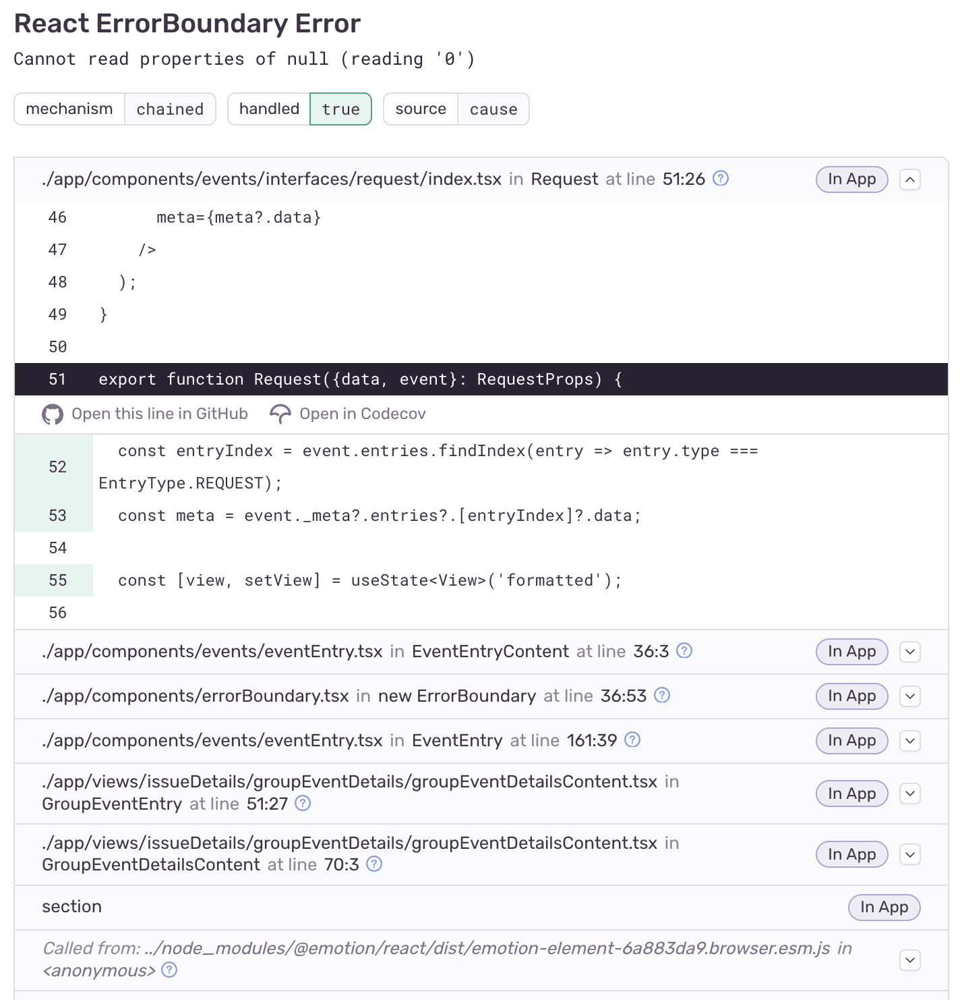

The React Native SDK exports an error boundary component that uses [React component APIs](https://react.dev/reference/react/Component#catching-rendering-errors-with-an-error-boundary) to automatically catch and send JavaScript errors from inside a React component tree to Sentry, and render a fallback UI.

<Alert level="warning" title="Render errors only">

React error boundaries **only catch errors during rendering, in lifecycle methods, and in constructors**. They do **not** catch errors in event handlers, asynchronous code (`setTimeout`, `Promise`), or native errors. See [Handling Non-Render Errors](#handling-non-render-errors) for how to handle those.

</Alert>

<Alert level="info" title="Recommended on Android">

On Android, some render-time errors (such as `TypeError` from calling a non-function) can bypass the global error handler entirely. Wrapping your app or error-prone components with `ErrorBoundary` ensures these errors are reliably captured and reported to Sentry.

</Alert>

## Prerequisites

To use the Error Boundary component, you need to have the React Native SDK [installed and configured for error monitoring](/platforms/react-native/).

## Use `Sentry.ErrorBoundary`

```javascript
import React from "react";
import { Text } from "react-native";
import * as Sentry from "@sentry/react-native";

<Sentry.ErrorBoundary fallback={<Text>An error has occurred</Text>}>
  <Example />
</Sentry.ErrorBoundary>;
```

The Sentry Error Boundary is also available as a higher-order component.

```javascript
import React from "react";
import { Text } from "react-native";
import * as Sentry from "@sentry/react-native";

Sentry.withErrorBoundary(Example, {
  fallback: <Text>An error has occurred</Text>,
});
```

<Alert level="warning" title="Note">

In development mode, React will rethrow errors caught within an error boundary to the global error handler. This will result in Sentry only reporting an error from the global error handler, but not from the error boundary itself. We recommend testing the error boundary with a production build of React.

</Alert>

In the example below, when the `<Example />` component hits an error, the `<Sentry.ErrorBoundary>` component will send data about that error and the component tree to Sentry, open a user feedback dialog, and render a fallback UI.

```javascript
import React from "react";
import { Text } from "react-native";
import * as Sentry from "@sentry/react-native";

import { Example } from "../example";

function FallbackComponent() {
  return <Text>An error has occurred</Text>;
}

const myFallback = <FallbackComponent />;
// Alternatively:
// const myFallback = () => <FallbackComponent />;

class App extends React.Component {
  render() {
    return (
      <Sentry.ErrorBoundary fallback={myFallback} showDialog>
        <Example />
      </Sentry.ErrorBoundary>
    );
  }
}

export default App;
```

<Alert level="warning" title="Note">

By default, React [logs all errors to the console](https://github.com/facebook/react/blob/493f72b0a7111b601c16b8ad8bc2649d82c184a0/packages/react-reconciler/src/ReactFiberErrorLogger.js#L85), even if you're using a React error boundary. If you're using the `CaptureConsole` integration, Sentry will capture the error there and not through the error boundary.

</Alert>

## Linked Errors

In [React v17 and above](https://reactjs.org/blog/2020/08/10/react-v17-rc.html#native-component-stacks), the SDK will automatically parse the [error boundary](https://react.dev/reference/react/Component#componentdidcatch-parameters) `componentStack` and attach the full stacktrace to the event via `error.cause`. This requires the `nativeLinkedErrorsIntegration` to be enabled. (It's enabled by default.) To get the full source context, we recommend setting up [source maps](/platforms/react-native/sourcemaps/) for your project.



## Handling Non-Render Errors

Errors in event handlers, `async` functions, `setTimeout`, and other non-render code won't be caught by `ErrorBoundary`. This is a [React limitation](https://react.dev/reference/react/Component#catching-rendering-errors-with-an-error-boundary), not specific to Sentry.

Sentry's [`reactNativeErrorHandlersIntegration`](/platforms/react-native/integrations/default/#reactnativeerrorhandlersintegration) (enabled by default) **automatically reports** these errors to Sentry — you don't need to do anything extra for error reporting. However, it won't display a fallback UI.

### Component-Level Error Handling

For errors in event handlers or async code within a specific component, use `try`/`catch` with local state:

```javascript
import React, { useState } from "react";
import { Button, Text } from "react-native";
import * as Sentry from "@sentry/react-native";

function MyComponent() {
  const [error, setError] = useState(null);

  const handlePress = async () => {
    try {
      await riskyOperation();
    } catch (e) {
      Sentry.captureException(e);
      setError(e);
    }
  };

  if (error) {
    return (
      <>
        <Text>Something went wrong.</Text>
        <Button onPress={() => setError(null)} title="Retry" />
      </>
    );
  }

  return <Button onPress={handlePress} title="Do thing" />;
}
```

### Global Error Handling With Fallback UI

To show a fallback UI for **any** unhandled JavaScript error (not just render errors), you can create a provider that listens to React Native's global error handler and combines it with `ErrorBoundary`:

```javascript
import React, { useState, useEffect } from "react";
import { Button, DeviceEventEmitter, Text, View } from "react-native";
import * as Sentry from "@sentry/react-native";

// Set up the global error listener before Sentry.init()
const globalHandler = global.ErrorUtils?.getGlobalHandler();
global.ErrorUtils?.setGlobalHandler((error, isFatal) => {
  DeviceEventEmitter.emit("GLOBAL_UNHANDLED_ERROR", error);

  // Call the default handler in development for the React Native red box.
  // In production, we skip the default handler to prevent the app from
  // crashing so the fallback UI can be shown instead.
  if (__DEV__ && globalHandler) {
    globalHandler(error, isFatal);
  }
});

Sentry.init({
  dsn: "___PUBLIC_DSN___",
});

function GlobalFallback({ onReset }) {
  return (
    <View>
      <Text>Something went wrong.</Text>
      <Button onPress={onReset} title="Restart" />
    </View>
  );
}

function AppErrorProvider({ children }) {
  const [globalError, setGlobalError] = useState(null);

  useEffect(() => {
    const subscription = DeviceEventEmitter.addListener(
      "GLOBAL_UNHANDLED_ERROR",
      (error) => setGlobalError(error)
    );
    return () => subscription.remove();
  }, []);

  if (globalError) {
    return <GlobalFallback onReset={() => setGlobalError(null)} />;
  }

  return (
    <Sentry.ErrorBoundary
      fallback={({ resetError }) => (
        <GlobalFallback onReset={resetError} />
      )}
    >
      {children}
    </Sentry.ErrorBoundary>
  );
}
```

<Alert level="info" title="Note">

When intercepting the global error handler, unhandled errors will still be reported to Sentry by the `reactNativeErrorHandlersIntegration`. You do **not** need to call `Sentry.captureException` manually in the global handler.

</Alert>

## Options

The ErrorBoundary component exposes a variety of props that can be passed in for extra configuration. There aren't any required options, but we highly recommend setting a fallback component.

`fallback` (React.ReactNode or Function)

A React element to render when the error boundary catches an error. This can be an actual React element (for example, `<Fallback />`), or a function that returns a React element. If you provide a function, Sentry will call it with additional info and helpers (see example below).

`onError` (Function)

A function that gets called when the Error Boundary encounters an error. `onError` is useful if you want to propagate the error into a state management library like Redux, or if you want to check any side effects that could have occurred due to the error.

`onMount` (Function)

A function that gets called on ErrorBoundary `componentDidMount()`.

`onUnmount` (Function)

A function that gets called on ErrorBoundary `componentWillUnmount()`.

`beforeCapture` (Function)

A function that gets called before an error is sent to Sentry, allowing for extra tags or context to be added to the error.

## Examples

### Setting a Fallback Function (Render Props)

Below, is an example where a fallback prop, using the [render props approach](https://react.dev/reference/react/cloneElement#passing-data-with-a-render-prop), is used to display a fallback UI on error. The fallback UI returns to a standard component state when reset using the `resetError()` API, provided by the component through render props.

```javascript
import React from "react";
import { Button, Text } from "react-native"
import * as Sentry from "@sentry/react-native";

class MyComponent extends React.Component {
  constructor(props) {
    super(props);
    this.state = {
      message: "This is my app",
    };
  }

  render() {
    return (
      <Sentry.ErrorBoundary
        fallback={({ error, componentStack, resetError }) => (
          <React.Fragment>
            <Text>You have encountered an error</Text>
            <Text>{error.toString()}</Text>
            <Text>{componentStack}</Text>
            <Button
              title="Click here to reset!"
              onPress={() => {
                this.setState({ message: "This is my app" });
                // When resetError() is called it will
                // remove the Fallback component and render
                // the Sentry ErrorBoundary's children
                // in their initial state
                resetError();
              }}
            />
          </React.Fragment>
        )}
      >
        <Text>{this.state.message}</Text>
        {/* on click, this button sets an Object */}
        {/* as a message, not a string. Which will cause */}
        {/* an error to occur in the component tree */}
        <Button
          title="Click here to change message!"
          onPress={() => this.setState({ message: { text: "Hello World" } })}
        />
      </Sentry.ErrorBoundary>
    );
  }
}

export default MyComponent;
```

### Using multiple error boundaries

When using multiple error boundaries, we recommend using `beforeCapture` to set tags/context so that you can tell which error boundary the error occurred from. In the example below, we attach tags to errors based on what route they rendered in:

```javascript
import React from "react";
import { View, Text } from "react-native"
import * as Sentry from "@sentry/react-native";

function MyComponent({ props }) {
  return (
    <React.Fragment>
      <Sentry.ErrorBoundary
        beforeCapture={(scope) => {
          scope.setTag("location", "first");
          scope.setTag("anotherTag", "anotherValue");
        }}
      >
        <View><Text>First</Text></View>
      </Sentry.ErrorBoundary>
      <Sentry.ErrorBoundary
        beforeCapture={(scope) => {
          scope.setTag("location", "second");
        }}
      >
        <View><Text>Second</Text></View>
      </Sentry.ErrorBoundary>
    </React.Fragment>
  );
}

export default MyComponent;
```

## Troubleshooting

### Fallback Not Rendering

If your `ErrorBoundary` fallback isn't appearing, make sure the error is happening **during rendering**. Errors thrown in event handlers (like `onPress`), `setTimeout`, `async` functions, or Promises won't trigger the fallback. See [Handling Non-Render Errors](#handling-non-render-errors).

To verify your ErrorBoundary is working, trigger a render error via component state:

```javascript
const [crash, setCrash] = useState(false);

if (crash) {
  throw new Error("Test render error");
}

return <Button onPress={() => setCrash(true)} title="Test ErrorBoundary" />;
```

### Screenshots Capture the Fallback Instead of the Error

When using `attachScreenshot: true` with `ErrorBoundary`, the captured screenshot may show the fallback component instead of the screen at the time of the error. This happens because the screenshot is taken shortly after the error is captured, by which time React has already rendered the fallback UI. This is a known limitation.
