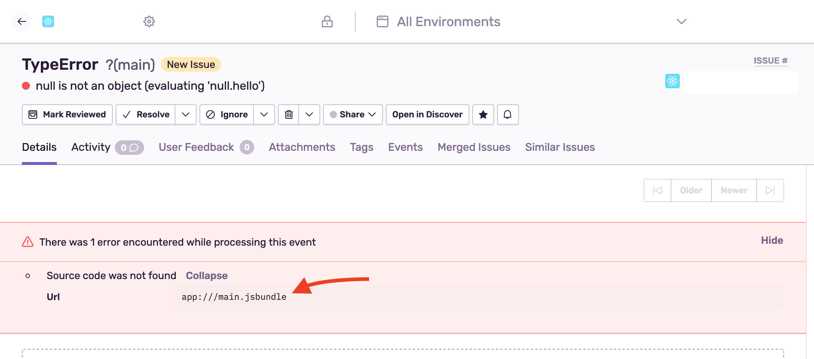

If source maps are not recognized, check for warnings similar to:

The bundle filename needs to match the filename on the event (and shown on the warning) to correctly apply the source maps.

Find more troubleshooting cases in our [Troubleshooting documentation](/platforms/react-native/troubleshooting/#source-maps).

<PageGrid />
