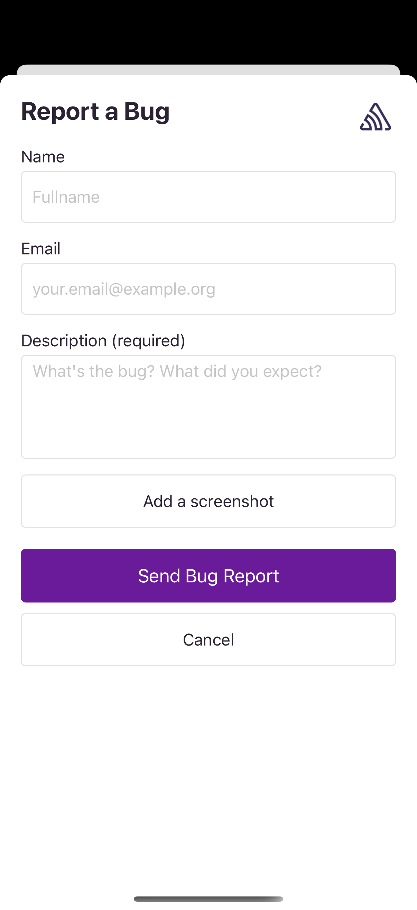
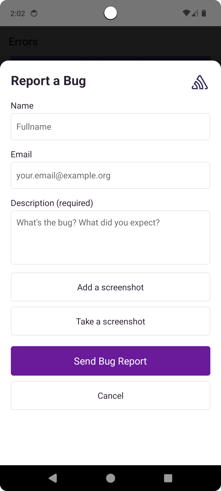

The User Feedback feature allows you to collect user feedback from anywhere inside your application at any time, without needing an error event to occur first.

Note that if you're using a self-hosted Sentry instance, you'll need to be on version 24.4.2 or higher in order to use the full functionality of the User Feedback feature. Lower versions may have limited functionality.

|User Feedback iOS              |User Feedback Android                     |
|:-----------------------------:|:---------------------------------------: |
|  | |

## User Feedback Widget

The user feedback widget allows users to submit feedback from anywhere inside your application.

To collect user feedback from inside your application use the `showFeedbackWidget` method.

```javascript
import * as Sentry from "@sentry/react-native";

Sentry.wrap(RootComponent);

Sentry.showFeedbackWidget();
```

You may also use the `showFeedbackButton` and `hideFeedbackButton` to show and hide a button that opens the Feedback Widget.

```javascript
import * as Sentry from "@sentry/react-native";

Sentry.wrap(RootComponent);

Sentry.showFeedbackWidget();
Sentry.hideFeedbackButton();
```

Note that [the root application component must be wrapped with `Sentry.wrap`](/platforms/react-native/#wrap-your-app) for the `showFeedbackWidget` and `showFeedbackButton` methods to work. The methods depend on the React Native `Modal` implementation. It is supported fully in the legacy architecture. For the new architecture (Fabric renderer) it requires React Native `0.71` and up.

To configure the widget or the button you can use the `Sentry.feedbackIntegration({})` or add it to your Sentry initialization.

```javascript
import * as Sentry from "@sentry/react-native";

Sentry.init({
  dsn: "___PUBLIC_DSN___",

  integrations: [
    Sentry.feedbackIntegration({
        // Additional SDK configuration goes in here, for example:
        styles:{
            submitButton: {
                backgroundColor: '#6a1b9a',
            },
        },
        namePlaceholder: 'Fullname',
    }),
  ],
});
```

There are many options you can pass to the integration constructor. See the [configuration documentation](/platforms/react-native/user-feedback/configuration/) for more details.

### Feedback Widget Component

You can also integrate the `FeedbackWidget` component manually in your app.

```javascript
import { FeedbackWidget } from "@sentry/react-native";

<FeedbackWidget/>
```

For the full set of options you can pass to the `FeedbackWidget` component see the [configuration documentation](/platforms/react-native/user-feedback/configuration/).

<Alert>

Note that when the device is offline, the feedback will be stored locally and sent when the device is back online.

</Alert>

## User Feedback API

The user feedback API allows you to collect user feedback while utilizing your own UI. You can use the same programming language you have in your app to send user feedback. In this case, the SDK creates the HTTP request so you don't have to deal with posting data via HTTP.

Sentry pairs the feedback with the original event, giving you additional insight into issues. Sentry needs the `eventId` to be able to associate the user feedback to the corresponding event. For example, to get the `eventId`, you can use <PlatformLink to="/configuration/options/#before-send"><PlatformIdentifier name="before-send" /></PlatformLink> or the return value of the method capturing an event.

<PlatformContent includePath="user-feedback/sdk-api-example/" />
