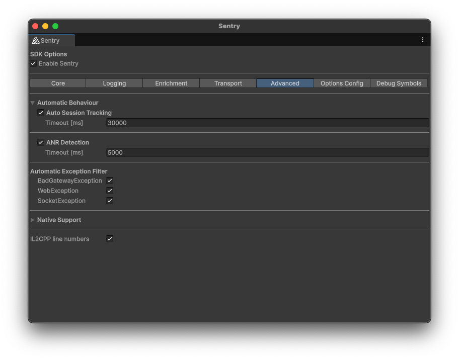

Application Not Responding (ANR) errors are triggered when the Unity thread of the game is blocked for more than five seconds. The Unity SDK reports ANR errors as Sentry events.

## ANR Implementation Details

The ANR detection in the Unity SDK works differently depending on whether multithreading is available on the target platform:

### Platforms with Multi-Threading Support

On platforms that support multithreading, the ANR detection works in two parts:
1. A coroutine periodically resets a counter
2. A background thread increments and monitors this counter. It reports an ANR event when the threshold defined on `options.AnrTimeout` is exceeded

### Platforms without Multi-Threading Support - WebGL

On platforms without multi-threading support like WebGL, the ANR detection uses a slightly different approach:
- A single coroutine using a `Stopwatch` to measure elapsed time
- When the coroutine detects that more time has passed than the ANR timeout, it reports the ANR event

The drawback here is that the ANR detection relies on the game recovering from the not-responding state to report the event.

Both implementations are sensitive to the app losing and regaining focus and get paused accordingly. They also use `WaitForSecondsRealtime` so pausing your game by modifying the `Time.timeScale` will not trigger false ANR reports.

### Stack Trace Support

Since the ANR integration creates an exception on a background thread, based on a coroutine not resetting in time, the stack trace will not show the main thread's stack trace.

### Line Number Support

Since the Unity SDKs [line number support](/platforms/unity/configuration/il2cpp) is limited to actually thrown exceptions, the integration does not provide you with line numbers in the captured ANR issues.

## Configuration

ANR detection is enabled by default in Sentry, but you can opt-out through the editor window by going to `Tools -> Sentry -> Advanced -> ANR Detection`. You can also set the ANR timeout there.



You can also opt out by disabling the integration.

```csharp
options.DisableAnrIntegration();
```

To set the timeout use the following snippet.

```csharp
options.AnrTimeout = TimeSpan.FromSeconds(5);
```
