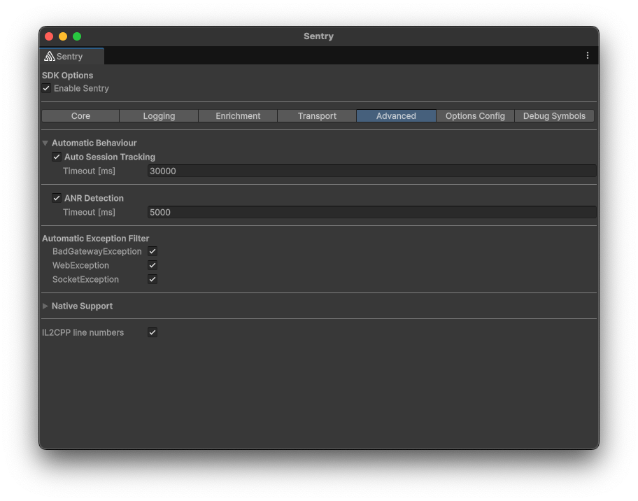

Application Not Responding (ANR) errors are triggered when the Unity thread of the game is blocked for more than five seconds. The Unity SDK reports ANR errors as Sentry events.

On Android, you can enable experimental native app hang detection to capture the Unity main thread's native stack trace. See [Native App Hang Detection on Android](#native-app-hang-detection-on-android).

## ANR Implementation Details

The ANR detection in the Unity SDK works differently depending on whether multithreading is available on the target platform:

### Platforms with Multi-Threading Support

On platforms that support multithreading, the ANR detection works in two parts:
1. A coroutine periodically resets a counter
2. A background thread increments and monitors this counter. It reports an ANR event when the threshold defined on `options.AnrTimeout` is exceeded

### Platforms without Multi-Threading Support - WebGL

On platforms without multi-threading support like WebGL, the ANR detection uses a slightly different approach:
- A single coroutine using a `Stopwatch` to measure elapsed time
- When the coroutine detects that more time has passed than the ANR timeout, it reports the ANR event

The drawback here is that the ANR detection relies on the game recovering from the not-responding state to report the event.

Both implementations are sensitive to the app losing and regaining focus and get paused accordingly. They also use `WaitForSecondsRealtime` so pausing your game by modifying the `Time.timeScale` will not trigger false ANR reports.

### Stack Trace Support

Since the ANR integration creates an exception on a background thread, based on a coroutine not resetting in time, the stack trace will not show the main thread's stack trace.

### Line Number Support

Since the Unity SDKs [line number support](/platforms/unity/configuration/il2cpp) is limited to actually thrown exceptions, the integration does not provide you with line numbers in the captured ANR issues.

### Native Android ANR Detection

On Android, `AndroidNativeAnrEnabled` controls ANR detection through the Android SDK and defaults to `true`. It monitors the Android UI thread independently of the Unity managed watchdog, which monitors the Unity main thread. A freeze that blocks both threads can produce two events.

### ANR Mechanism for Event Filtering

Unity ANR events are reported with `MainThreadWatchdog` as the mechanism. You can use this to filter or categorize events in Sentry.

## Configuration

ANR detection is enabled by default in Sentry, but you can opt-out through the editor window by going to `Tools -> Sentry -> Advanced -> ANR Detection`. You can also set the ANR timeout there.



You can also opt out by disabling the integration.

```csharp
options.DisableAnrIntegration();
```

To set the timeout use the following snippet.

```csharp
options.AnrTimeout = TimeSpan.FromSeconds(5);
```

## Native App Hang Detection on Android

Native app hang detection uses the NDK integration to watch the Unity main thread. The SDK sends a heartbeat after each frame; when the thread misses heartbeats for longer than `AppHangTimeout`, Sentry captures an app hang event with its native stack trace.

<Alert title="Experimental">

This feature is experimental and available on Android only.

</Alert>

Enable it in your options configuration:

```csharp
options.Experimental.EnableNativeAppHangTracking = true;
options.AppHangTimeout = TimeSpan.FromSeconds(5);
```

Native app hang detection requires an Android IL2CPP build with both `AndroidNativeSupportEnabled` and `NdkIntegrationEnabled` enabled. Both options default to `true`.

When native app hang detection is enabled, the Unity SDK disables its managed ANR watchdog to avoid duplicate events. Android's native ANR detection remains separate because it monitors the Android UI thread. A freeze that blocks both threads can produce an ANR and an app hang event.

For runtime Android initialization, configure these options in your options callback. With build-time Android initialization, set them in the Sentry configuration window so they are written to the generated `AndroidManifest.xml`. See <PlatformLink to="/native-support/#initialization-of-the-native-sdks">Native SDK initialization</PlatformLink> for the difference between these modes.
