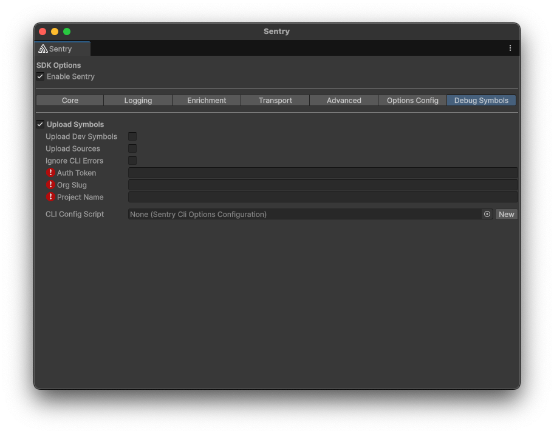

The Unity SDK includes [Sentry CLI](/product/cli/) as a tool to upload debug symbols to Sentry. These debug symbols are used in processing events sent to Sentry to provide stacktraces and linenumbers. This page describes the options available to configure the Sentry CLI.

## Programmatic Configuration

Similar to the [programmatic configuration](/platforms/unity/configuration/options/programmatic-configuration/) of the SDK itself, the debug symbol upload via Sentry CLI also supports programmatic configuration.

The `Configure` callback gets invoked during the build process and allows you to modify the options used by Sentry CLI.

## Sentry CLI Options

<SdkOption name="UploadSymbols" type="bool" categorySupported={["desktop"]}>

Whether the SDK should automatically upload debug symbols to Sentry. This requires a valid auth token, organization, and project.

</SdkOption>

<SdkOption name="UploadDevelopmentSymbols" type="bool" categorySupported={["desktop"]}>

Whether the SDK should automatically upload debug symbols to Sentry for development builds.

</SdkOption>

<SdkOption name="UploadSources" type="bool" categorySupported={["desktop"]}>

Whether the SDK should automatically upload sources to Sentry; this enables Sentry to provide source-context on events.

</SdkOption>

<SdkOption name="UrlOverride" type="string" categorySupported={["desktop"]}>

This option allows you to override the default Sentry URL in case you are using a self-hosted Sentry instance or a custom domain.

</SdkOption>

<SdkOption name="Auth" type="string" categorySupported={["desktop"]}>

The auth token to use when uploading symbols to Sentry.

</SdkOption>

<SdkOption name="Organization" type="string" categorySupported={["desktop"]}>

The organization to use when uploading symbols to Sentry.

</SdkOption>

<SdkOption name="Project" type="string" categorySupported={["desktop"]}>

The project to use when uploading symbols to Sentry.

</SdkOption>

<SdkOption name="IgnoreCliErrors" type="bool" categorySupported={["desktop"]}>

If set to true, the Sentry CLI will not exit with an error code if it encounters an error. **BE AWARE** you might have unminified/unsymbolicated crashes in production if the debug symbol upload fails. When using this flag, you should store built sourcemaps and debug files, to re-run the upload symbols command at a later point.

</SdkOption>
