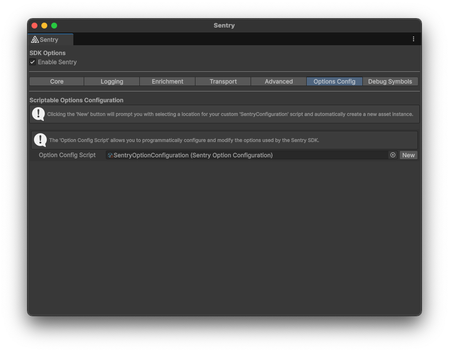
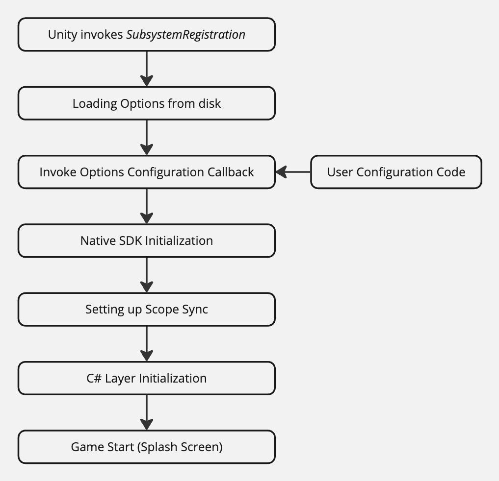

We've added `Sentry Options Configuration` to the `Options Config` tab in the Sentry editor window to provide a way to modify options programmatically.



## Programmatic Configuration

The Sentry SDK for Unity includes [platform-specific (that is, Native)](/platforms/unity/native-support/) SDKs, such as [Android](/platforms/android/), [Apple](/platforms/apple/guides/ios/), and [Native](/platforms/native/) to provide native crash suppport. These SDKs share the options with which they get initialized.

The C# layer self-initializes through the use of the [SubsystemRegistration RuntimeInitializeOnLoadMethodAttribute](https://docs.unity3d.com/ScriptReference/RuntimeInitializeLoadType.SubsystemRegistration.html).



If provided, the `Option Configuration Script` is executed on each app startup. The options are first used to initialize the native SDKs, then the managed (C#) SDK. This means that the options you set in your `Configure` callback will also apply on the native layer. For example:

```csharp
public override void Configure(SentryUnityOptions options)
{
    // BeforeSend is currently limited to C# code. Native errors - such as crashes in C/C++ code - are getting
    // captured by the native SDKs, but the native SDKs won't invoke this callback.
    options.SetBeforeSend((sentryEvent, _) =>
    {
        if (sentryEvent.Tags.ContainsKey("SomeTag"))
        {
            // Don't send events with a tag "SomeTag" to Sentry
            return null;
        }

        return sentryEvent;
    });

    // Native SDK initialization timing options:
    // Build-time initialization:
    //   + Can capture Unity engine errors
    //   - Options are fixed at build time
    // Runtime initialization:
    //   + Allows dynamic configuration
    //   - May miss some early errors
#if UNITY_ANDROID
    options.AndroidNativeInitializationType = NativeInitializationType.Runtime;
#elif UNITY_IOS
    options.IosNativeInitializationType = NativeInitializationType.Runtime;
#endif
}
```

### Initialize Native SDKs first when targeting iOS or Android

On mobile, the Unity SDK automatically modifies the generated Xcode and Gradle project to also contain the Cocoa and Java SDK respectively. These SDKs are capable of self-initializing before the Unity engine itself is started. This allows us to capture bugs/crashes happening within the engine itself.
There are two initialization types:

- `NativeInitializationType.Runtime`: Native SDKs initialize during runtime alongside the C# SDK
- `NativeInitializationType.BuildTime`: Native SDKs initialize before Unity engine starts

### Runtime Initialization (Default)
With runtime initialization, the native SDKs are initialized at runtime alongside the C# SDK. This allows all options to be dynamically configured through C# code during execution.

### Build Time Initialization
When using build time initialization, the native SDKs are configured during build time and initialize before the Unity engine starts. This means the options are baked into the outputted projects and cannot be modified at runtime via C# code. Changes to properties like `Release` and `Environment` will not apply to events generated by the native SDKs.
