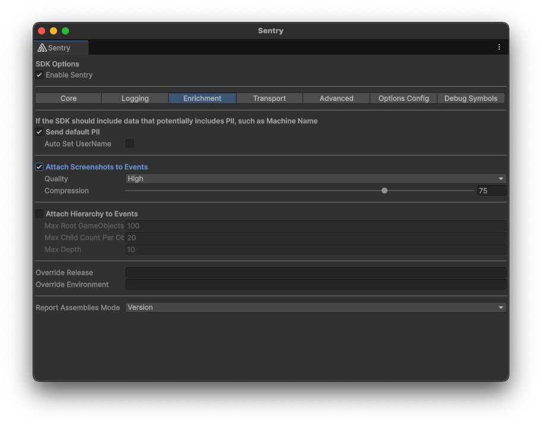

Sentry makes it possible to automatically take a screenshot and include it as an <PlatformLink to="/enriching-events/attachments/">attachment</PlatformLink> when a user experiences an error, an exception or a crash.

This feature is only available for SDKs with a user interface, like the ones for mobile and desktop applications. It's also limited by whether taking a screenshot is possible or not. For example, in some environments, like native iOS, taking a screenshot requires the UI thread, which often isn't available in the event of a crash. Another example where a screenshot might not be available is when the event happens before the screen starts to load. So inherently, this feature is a best effort solution.

## Enabling Screenshots

Because screenshots may contain <PlatformLink to="/data-management/sensitive-data/">PII</PlatformLink>, they are an opt-in feature. You can enable screenshots as shown below through **Tools > Sentry**:



Or, like so, if you're [configuring things programatically](/platforms/unity/configuration/options/):

```csharp {tabTitle:ScriptableOptionsConfiguration}
options.AttachScreenshot = true;
```

## Screenshot capture mechanism

Since the Unity SDK internally consists of multiple SDKs, the mechanism with which a screenshot gets captured depends on where the error originates.

- C# errors from within your game will be captured through Unity's built-in [ScreenCapture](https://docs.unity3d.com/ScriptReference/ScreenCapture.html). This means that screenshots only contain things visible within your game. Overlays on top of your game will not be visible.
- Native errors get captured by their respective SDK. If you're using a native plugin to display an overlay and an error occurs then that SDK will try to capture a screenshot that contains the overlay.

<Alert>

Screenshots might contain PII of your app. For example, if your game has a registration form and an error happens while the form is being displayed.

</Alert>

## Viewing Screenshots

If one is available, you'll see a thumbnail of the screenshot when you click on a specific issue from the [**Issues**](https://demo.sentry.io/issues/) page.


Once you've clicked on the event ID of a specific issue, you'll be able to see an overview of all the attachments as well as associated events in the "Attachments" tab.


