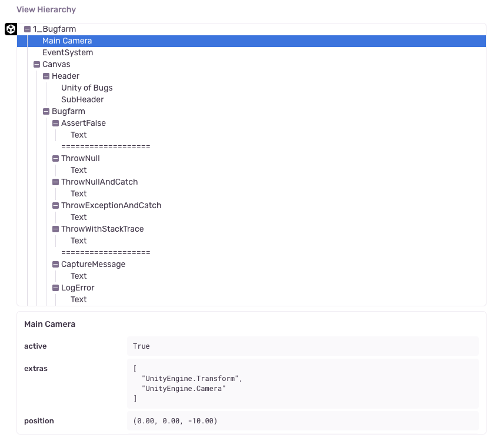

Sentry makes it possible to render a JSON representation of the scene of an error and includes it as an <PlatformLink to="/enriching-events/attachments/">attachment</PlatformLink>.

This feature only applies to SDKs with a user interface, such as the ones for mobile and desktop applications. Capturing the scene and creating the view hierarchy requires the UI thread and in the event of a crash, that might not be available. Another example where the view hierarchy might not be available is when the event happens before the screen starts to load. So inherently, this feature is a best effort solution.

## Enabling View Hierarchy Attachments

View hierarchy debugging is an opt-in feature. You can enable it via the configuration editor `Enrichment -> Attach Hierarchy` or programmatically:

```csharp
options.AttachViewHierarchy = true;
```

### Customize View Hierarchy Capturing

Because capturing view hierarchy can be a resource-intensive operation as the SDK traverses the scene at the time of an error, there are several controls available to you.

<ConfigKey name="MaxViewHierarchyRootObjects">

Allows you to limit the amount of gameobjects to be traversed and included in the view hierarchy.

</ConfigKey>

<ConfigKey name="MaxViewHierarchyDepth">

Allows you to limit the maximum depth of child-gameobject the SDK will attempt to traverse to include in the view hierarchy.

</ConfigKey>

<ConfigKey name="MaxViewHierarchyObjectChildCount">

Allows you to limit the maximum count of child-gameobjects per individual gameobject the SDK will attempt to include in the view hierarchy.

</ConfigKey>

These are also available for programmatic configuration on the options object:

```csharp
options.MaxViewHierarchyDepth = 10;
options.MaxViewHierarchyRootObjects = 100;
options.MaxViewHierarchyObjectChildCount = 20;
```

## Viewing View Hierarchy Attachments

View hierarchies appear in the "Attachments" tab, where you can view all attachments, as well as associated events. Click the event ID to open the [Issue Details](/product/issues/issue-details) page of that specific event.

<Include name="common-imgs/viewhierarchy-list-example" />

On the **Issue Details** page, you can interact with the view hierarchy attachment in a section called "View Hierarchy". This section represents the state of your scene at the time of an error event. There are two displays: a tree view, and detailed view for a selected node. You can select nodes in the tree to view the properties collected by the SDK. The SDK will report on the following keys for each node in the view:

- `Tag` The gameobject's tag
- `Position` The gameobject's position
- `Rotation` The gameobject's rotation in euler angles
- `Scale` The gameobject's scale
- `Active` Whether the gameobject was active
- `Extra` A list of names of all the attached MonoBehaviours on that gameobject

This feature can be used as an exploratory tool to debug reference issues, or gain a better understanding of the relationship between gameobjects.


