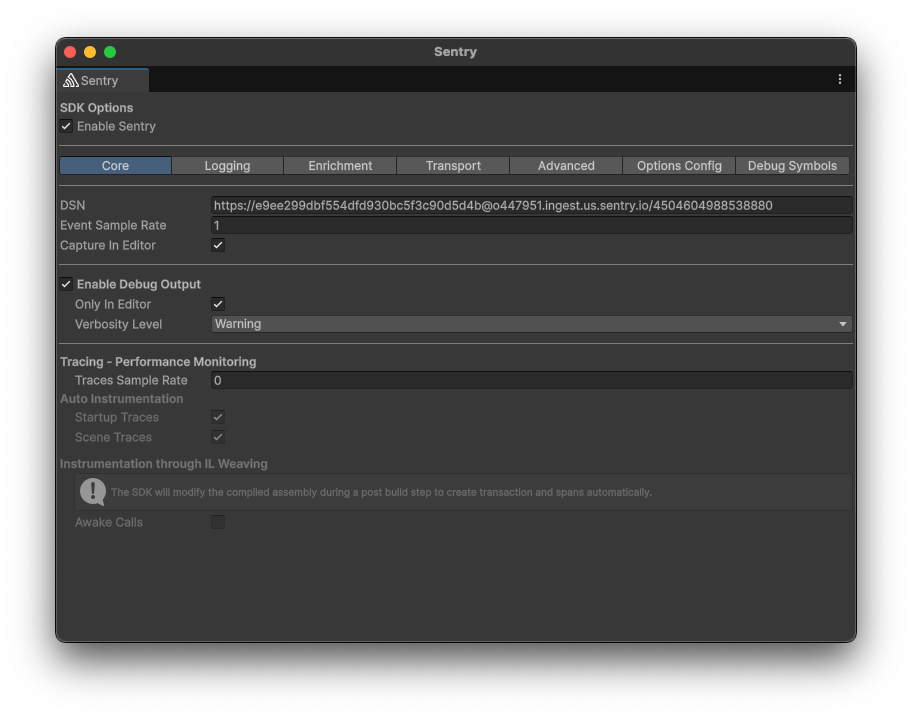
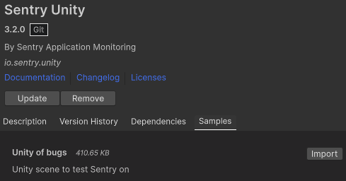

Our Unity SDK builds on top of the [.NET SDK](/platforms/dotnet/) and extends it with Unity-specific features. It gives you helpful hints for where and why an error or performance issue might have occurred.

**Features:**

- [Automatically captures C# errors](/platforms/unity/usage/automatic-error-capture/) on multiple platforms, including: Android, iOS, macOS, Linux, Windows, and WebGL
- Line numbers for C# [exceptions in IL2CPP builds](/platforms/unity/configuration/il2cpp/)
- [Native support](/platforms/unity/native-support/) for automatic crash error tracking for:
  - Android by using the [Android SDK](/platforms/android/) to support Java, Kotlin, C and C++
  - iOS by using the [iOS SDK](/platforms/apple/guides/ios/) to support Objective-C, Swift, C and C++
  - Windows and Linux by using the [Native SDK](/platforms/native/) to support C and C++ with minidumps
  - macOS by using the [macOS SDK](/platforms/apple/guides/macos/) to support Objective-C, Swift, C and C++
- [Screenshot attachments](/platforms/unity/enriching-events/screenshots/) for errors
- [ViewHierarchy attachments](/platforms/unity/enriching-events/view-hierarchy/) for errors
- [Offline Caching](/platforms/unity/configuration/options/#cache-directory-path) stores event data to disk in case the device is not online
- [Release Health](/platforms/unity/configuration/releases/) to keep track of crash-free users and sessions
- [Automatically adding breadcrumbs](/platforms/unity/enriching-events/breadcrumbs/#automatic-breadcrumbs) for
  - Unity's `Debug.Log` and `Debug.LogWarning`
  - Scene load, unload, active change
- [Event debouncing](/platforms/unity/configuration/event-debouncing/) to handle high amounts of log output i.e. during `Update`


On this page, we get you up and running with Sentry's SDK.

Don't already have an account and Sentry project established? Head over to [sentry.io](https://sentry.io/signup/), then return to this page.

## Install

Install the package via the [Unity Package Manager using a Git URL](https://docs.unity3d.com/Manual/upm-ui-giturl.html) to Sentry's SDK repository:

```
https://github.com/getsentry/unity.git
```

To use a specific version of the SDK, append `#{{@inject packages.version('sentry.dotnet.unity', '0.0.5') }}` to the URL.

## Configure

Installing the SDK will add an entry to Unity's top menu: `Tools` > `Sentry`. When you first open the menu, a wizard will guide you through the process of associating your game with a Sentry project and set up the initial configuration for you. The minimum configuration required is the [DSN](/product/sentry-basics/dsn-explainer/) to your project.

```json {tabTitle: Public DSN}
{
  "public-dsn": "___PUBLIC_DSN___"
}
```

Sentry can be further configured via the Sentry configuration window or [programatically](/platforms/unity/configuration/options/).



Sentry saves your configuration to `Assets/Resources/Sentry/SentryOptions.asset` and reads from there both at build time and runtime.

## Verify

This snippet includes an intentional error, so you can test that everything is working as soon as you set it up.

```csharp
using UnityEngine;

public class TestMonoBehaviour : MonoBehaviour
{
    private GameObject testObject = null;

    void Start()
    {
        Debug.Log("Captured Log");              // Adds a Breadcrumb
        Debug.LogWarning("Captured Warning");   // Adds a Breadcrumb
        Debug.LogError("Captured Error");       // Get's captured as an Error by default

        // This will throw an unhandled 'NullReferenceException'
        testObject.GetComponent<Transform>();   // Get's captured as an Error
    }
}
```

Additionally, the packages also includes a sample called "Unity of Bugs" that you can import into your project through the Package Manager. The samples contain a variety of common bugs, including native errors, so you don't have to write them yourself.




<Alert>

Learn more about manually capturing an error or message in our [Usage documentation](/platforms/unity/usage/).

</Alert>

To view and resolve the recorded error, log into [sentry.io](https://sentry.io) and select your project. Clicking on the error's title will open a page where you can see detailed information and mark it as resolved.
