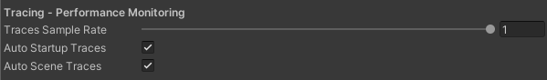
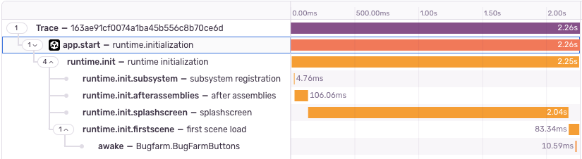

## Automatically Captured Transactions

The Unity SDK automatically creates transactions for the game's startup and scene loading. Additionally, if opted-in, it generates spans for all `Awake` calls during these operations.

You can manage these settings through the Editor Config Window or <Link to="/platforms/unity/configuration/options/#programmatic-configuration">programmatically</Link>.



```csharp
public override void Configure(SentryUnityOptions options)
{
    options.AutoSceneLoadTraces = true;
    options.AutoStartupTraces = true;
}
```

Once automatic instrumentation is configured, the Unity SDK will generate transactions as shown in the image below.


