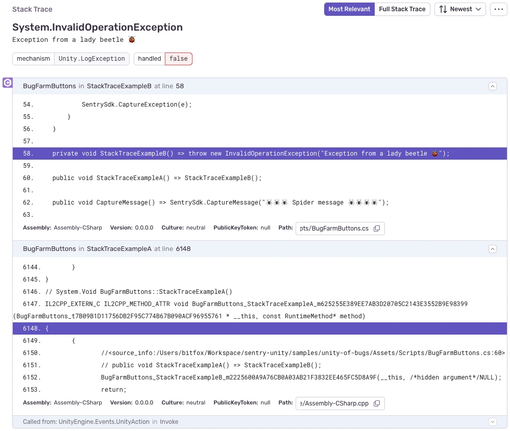

## Stack Traces

### Line Numbers Missing On Button Click Events

Currently, line numbers are missing when programmatically subscribing to button click events via `Button.onClick.AddListener`. However, you can set up callbacks through the editor to work around this.

### Line Numbers Missing in Events Captured Through `Debug.LogError` or `SentrySdk.CaptureMessage`

The SDK is currently limited to resolving IL2CPP line numbers when capturing errors. The SDK relies on an exception being available to extract the stacktrace. That means that either an unhandled exception needs to be caught by the SDK automatically or by calling `SentrySdk.CaptureException` manually.

When logging an error with `Debug.LogError` the logging integration captures this as message.

### Line Numbers Missing in Events Captured Through `Debug.LogException`

The exception provided by Unity that is getting captured by the logging integration does not contain a stacktrace. Use `SentrySdk.CaptureException` instead.

### Events Captured Through `Debug.LogException` Are Marked as `Unhandled`

Currently, it is not possible for the SDK to distinguish between the user calling `Debug.LogException` and the SDK capturing an unhandled exception. To capture an exception and mark it as handled you can call `SentrySDK.CaptureException` instead.

### C++ as Part of the Stack Trace

Your stack traces might contain C++ frames. This might be because:

- The generated C++ code doesn't contain the `<source_info>` annotation to point back to the C# code it was generated from. This can be due to optimization or the IL2CPP compiler generating code to handle C# specific features.
- The C++ exception might return an incorrect line number which makes Sentry miss the `<source_info>` annotation. You can try enabling uploading your source code in the debug symbol options to look at the generated C++ code.

This is also why you might end up with very high line numbers (in the several thousands) even though your C# script is very small; the line numbers relate to the generated C++ code.

## Cysharp

Currently, the SDK fails to provide line numbers and source context in combination with Cysharp. For context, the SDK relies on Unity's IL2CPP backend to provide it with instruction addresses for Sentry generate line numbers in events. When using Cysharp, those instruction addresses default back to `0x0` once the stacktrace goes into the library. There is no known workaround for this.
