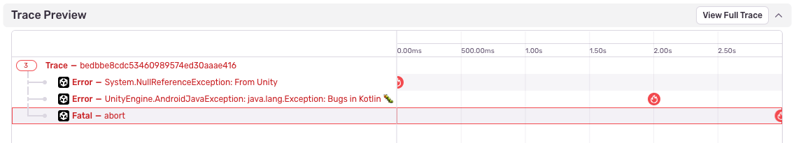

The Sentry SDK for Unity provides both automatic and manual error capturing capabilities on all layers of your application. This page focuses on the **automatic error capture**. For information on manually capturing errors and messages, see the [Usage documentation](/platforms/unity/usage/).

## Automatic Error Capture through Unity's Logging System

The Unity SDK relies on two integrations to automatically capture errors: `UnityLogHandlerIntegration` and `UnityApplicationLoggingIntegration`. While they sound similar, they serve different purposes.

### UnityLogHandlerIntegration

The SDK uses the `UnityLogHandlerIntegration` to hook into Unity's logging system. From there it receives all log messages that are logged via the `Debug.Log`, `Debug.LogWarning`, and `Debug.LogError` methods. By default, the SDK adds these log messages as breadcrumbs to future events. The SDK will also automatically capture messages logged via `Debug.LogError` as error events and send them to Sentry. This behaviour can be disabled by unchecking the automatic capture of `Debug.LogError` on the `Logging` tab in the editor (Tools->Sentry), or programmatically, by setting the `CaptureLogErrorEvents` option to `false` in the [configure callback](/platforms/unity/configuration/options/programmatic-configuration).

#### Stack Trace Support & Line Numbers

If [configured](https://docs.unity3d.com/6000.0/Documentation/Manual/stack-trace.html), Unity will include the stack traces with the log messages as raw strings. The SDK is able to parse and display this stack trace in the issue details page.

If you're using Unity 6 or newer, you have the option to to enable the source code line numbers in the [player settings](https://docs.unity3d.com/6000.0/Documentation/Manual/il2cpp-managed-stack-traces.html). These line numbers are then part of the stringified stack trace and will be parsed by the SDK.

<Alert>
Known Limitation: In versions older than Unity 6, the SDK is unable to provide line numbers for events captured through `Debug.LogError`. The SDK has only the strigified stack trace provided by Unity to work with and since there is no native exception available at the time of logging, Sentry can't symbolicate the stack trace on the server side either.
</Alert>

### UnityApplicationLoggingIntegration

The SDK uses the `UnityApplicationLoggingIntegration` to add its own log handler right before Unity's logging system. It then passes the logs back to Unity. This allows the SDK to capture errors through the `Application.logMessageReceived` method. All handled exceptions - such as those captured via `Log.LogException` calls - and unhandled exceptions end up on that call and are captured by the SDK. These messages contain the actual exception object. This allows the SDK to call into the IL2CPP backend and connect this managed exception to the native exception, allowing for server side symbolication. You can read more about the IL2CPP error integration works [here](/platforms/unity/configuration/il2cpp).

## Automatic Error Capture on the Native Layer

The Unity SDK also supports automatic error capture on the native layer. This is enabled by default and works through the respective native SDKs for each platform.

For more information on how to configure the native SDK, see the [Native SDK documentation](/platforms/unity/native-support/).

## Connecting Errors Captured on Different Layers

The Sentry SDKs already have the ability to connect events in a distributed system through the use of a trace. You can read more about how this works in the [Tracing documentation](/platforms/unity/tracing/).

The Unity SDK adds trace context (including a trace ID) to errors and shares this information with underlying native SDKs. This allows Sentry to automatically connect related events between different layers when errors occur.

On the issues details page, you will see this as errors being connected within the Trace Preview. The example below is taken from an game running on Android and shows a C# error being connected to an exception in Kotlin and a crash in C.

The Sentry SDK regenerates the trace ID whenever the game gains focus or the active scene changes. This creates smaller, more focused trace groups rather than one continuous trace from startup to shutdown, helping you identify truly related errors.
