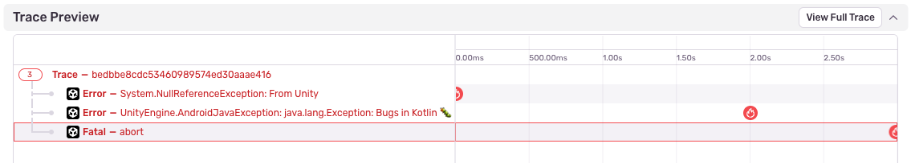

The Sentry SDK for Unity provides both automatic and manual error capturing capabilities on all layers of your application. This page focuses on the **automatic error capture**. For information on manually capturing errors and messages, see the [Usage documentation](/platforms/unity/usage/).

## Automatic Error Capture through Unity's Logging System

The Unity SDK automatically captures errors reported through Unity's logging system. How an event is captured depends on the logging method you use.

### `Debug.LogError`

`Debug.LogError` is captured as an error-level message event. Disable automatic capture in **Tools -> Sentry -> Logging**, or set `CaptureLogErrorEvents` to `false` in the [configure callback](/platforms/unity/configuration/options/programmatic-configuration).

Enable `AttachStacktrace` to include and parse the stack trace Unity provides with the log. On platforms other than WebGL, Unity 6 or later can include source lines in that stack trace when you enable source code line numbers in [Player Settings](https://docs.unity3d.com/6000.0/Documentation/Manual/il2cpp-managed-stack-traces.html).

<Alert>
  In versions older than Unity 6, `Debug.LogError` stack traces do not include
  source line numbers.
</Alert>

### `Debug.LogException`

On platforms other than WebGL, `Debug.LogException` captures the exception as an error event. If the exception was thrown before logging, its stack trace is included. A newly constructed exception has no stack trace, so `Debug.LogException(new Exception("message"))` reports only its type and message.

Events captured through `Debug.LogException` are marked as unhandled. Unity doesn't identify whether an exception was explicitly logged or was unhandled. On WebGL, the SDK captures the stack trace Unity logs; see [known limitations](/platforms/unity/troubleshooting/known-limitations/#webgl-support).

### Caught Exceptions

Use `SentrySdk.CaptureException` for an exception you caught. This preserves its stack trace and reports it as handled:

```csharp
try
{
    ThrowException();
}
catch (Exception e)
{
    SentrySdk.CaptureException(e);
}
```

For IL2CPP line-number requirements, see [IL2CPP Line Numbers](/platforms/unity/configuration/il2cpp/).

## Automatic Error Capture on the Native Layer

The Unity SDK also supports automatic error capture on the native layer. This is enabled by default and works through the respective native SDKs for each platform.

For more information on how to configure the native SDK, see the [Native SDK documentation](/platforms/unity/native-support/).

## Connecting Errors Captured on Different Layers

The Sentry SDKs already have the ability to connect events in a distributed system through the use of a trace. You can read more about how this works in the [Tracing documentation](/platforms/unity/tracing/).

The Unity SDK adds trace context (including a trace ID) to errors and shares this information with underlying native SDKs. This allows Sentry to automatically connect related events between different layers when errors occur.

On the issues details page, you will see this as errors being connected within the Trace Preview. The example below is taken from an game running on Android and shows a C# error being connected to an exception in Kotlin and a crash in C.



The Sentry SDK regenerates the trace ID whenever the game gains focus or the active scene changes. This creates smaller, more focused trace groups rather than one continuous trace from startup to shutdown, helping you identify truly related errors.
