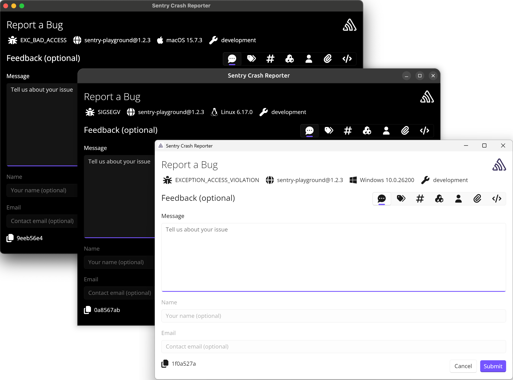

<Alert>

Available starting from Sentry Unreal SDK version 1.8.0. Supported on all desktop platforms — on macOS the [native crash backend](/platforms/unreal/configuration/native-backend/) must be enabled.

</Alert>

The Sentry Unreal plugin ships with an optional **Sentry Crash Reporter** — a standalone application that can be used instead of the default [Crash Reporter Client](../crash-reporter-client/). When enabled, it displays a dialog to users after a crash, allowing them to review crash details and provide feedback before the report is submitted to Sentry.

Unlike the built-in UE Crash Reporter, the Sentry Crash Reporter works through the Sentry SDK pipeline and doesn't require modifying engine configuration files. This also means it requires Sentry's own crash capturing to be enabled (see "Enable automatic crash capturing (Windows, UE 5.2+)" in the plugin settings).



## Enabling the Sentry Crash Reporter

To enable it, navigate to **Project Settings > Plugins > Sentry > Sentry Crash Reporter** and toggle **Enable Sentry Crash Reporter**.

Alternatively, add the following to your project's configuration `.ini` file:

```ini
[/Script/Sentry.SentrySettings]
EnableExternalCrashReporter=True
```

## Customizing the Crash Reporter

You can customize the appearance of the Sentry Crash Reporter directly from the plugin settings. Navigate to **Project Settings > Plugins > Sentry > Sentry Crash Reporter** and expand the **Sentry Crash Reporter appearance** section. Each property has an override toggle — only properties you explicitly enable will be applied:

- **Window title** - Custom title for the crash reporter window.
- **Header text** - Header text shown in the crash reporter dialog.
- **Header description** - Description text shown below the header. Leave empty to hide.
- **Submit button label** - Label for the submit/send button.
- **Cancel button label** - Label for the cancel button. Set to empty string to hide the button.
- **Accent color** - Primary accent color used for the crash reporter UI elements.
- **Window closable** - When disabled, the user cannot close the crash reporter window without submitting the report. The native close button is disabled and the cancel button is hidden. Enabled by default.
- **App logo** - Replace the default crash reporter logo with a custom PNG image. Enable the override toggle, then use the image picker to select a file. The image is copied into your project's `Build/SentryCrashReporter/` folder and staged alongside the plugin during packaging.

These settings are applied each time the SDK initializes. Properties that are not overridden will use the crash reporter's built-in defaults.

### Using a Custom Crash Reporter Build

For more advanced customization beyond what the plugin settings provide, you can fork the [sentry-desktop-crash-reporter](https://github.com/getsentry/sentry-desktop-crash-reporter) project and build a custom version.

To build on Windows:

```powershell
cd sentry-desktop-crash-reporter
dotnet publish -f net9.0-desktop -r win-x64 Sentry.CrashReporter/Sentry.CrashReporter.csproj -o build-output
```

For other platforms, replace the runtime identifier with `win-arm64`, `linux-x64`, `linux-arm64`, or `osx-arm64`.

Copy the output executable into the plugin's ThirdParty binaries directory:

- **Windows (x64)**: `Plugins/sentry-unreal/Source/ThirdParty/Win64/Sentry.CrashReporter.exe`
- **Windows (ARM64)**: `Plugins/sentry-unreal/Source/ThirdParty/WinArm64/Sentry.CrashReporter.exe`
- **Linux (x64)**: `Plugins/sentry-unreal/Source/ThirdParty/Linux/Sentry.CrashReporter`
- **Linux (ARM64)**: `Plugins/sentry-unreal/Source/ThirdParty/LinuxArm64/Sentry.CrashReporter`
- **macOS**: `Plugins/sentry-unreal/Source/ThirdParty/Mac/Sentry.CrashReporter`

After replacing the executable, delete the project's `Build` and `Intermediate` directories and rebuild to ensure the updated binary is picked up.

Refer to the project's [customization guide](https://github.com/getsentry/sentry-desktop-crash-reporter/blob/main/CUSTOMIZATION.md) for details on what can be changed.

## Stacktrace Display

The Sentry Crash Reporter can display a symbolicated stacktrace of the crashed thread, allowing users to review the call stack directly in the crash dialog before submitting the report.

This feature requires client-side stack walking, which is supported through two backend configurations:

- **[Native backend](/platforms/unreal/configuration/native-backend/)**: Performs stack walking and symbolication automatically using the platform's debug APIs. No additional configuration is needed.
- **Crashpad backend**: Requires a custom build of `sentry-native` with the `CRASHPAD_ENABLE_STACKTRACE` CMake flag enabled. See [below](#building-sentry-native-with-stacktrace-support) for instructions.

<Alert>

For **Shipping builds**, the stacktrace can only be symbolicated if debug information is available at runtime. Enable **Include Debug Files in Shipping Builds** in **Project Settings > Packaging** to ensure function names are resolved in the crash reporter dialog.

</Alert>

### Building sentry-native With Stacktrace Support

To enable client-side stacktrace display when using the Crashpad backend, you need to rebuild `sentry-native` with the `CRASHPAD_ENABLE_STACKTRACE` CMake flag. The example below shows a Windows build — for other platforms, refer to the [sentry-native build documentation](https://github.com/getsentry/sentry-native#build-and-installation) and the [CI build scripts](https://github.com/getsentry/sentry-unreal/tree/main/scripts) in the sentry-unreal repository.

Clone [sentry-native](https://github.com/getsentry/sentry-native) and check out the version that matches your plugin (pinned under `modules/sentry-native` in the [sentry-unreal](https://github.com/getsentry/sentry-unreal) repository). Then build:

```powershell
cd D:\projects\sentry-native

cmake -G "Visual Studio 17 2022" -S . -B build `
    -D SENTRY_BACKEND=crashpad `
    -D SENTRY_SDK_NAME=sentry.native.unreal `
    -D SENTRY_BUILD_SHARED_LIBS=OFF `
    -D CRASHPAD_ENABLE_STACKTRACE=ON

cmake --build build --target sentry --config RelWithDebInfo --parallel
cmake --build build --target crashpad_handler --config RelWithDebInfo --parallel
cmake --install build --prefix install --config RelWithDebInfo
```

Copy the build output into your project's plugin directory:

- `install/lib/*` → `Plugins/sentry-unreal/Source/ThirdParty/Win64/Crashpad/lib/`
- `install/bin/crashpad_handler.exe` → `Plugins/sentry-unreal/Source/ThirdParty/Win64/Crashpad/bin/`
- `install/include/sentry.h` → `Plugins/sentry-unreal/Source/ThirdParty/Win64/Crashpad/include/`

After replacing binaries, delete your project's `Build` and `Intermediate` directories and rebuild.

<Alert>

The `CRASHPAD_ENABLE_STACKTRACE` feature is experimental. On Linux, it requires the `libunwind-ptrace` development package.

</Alert>
