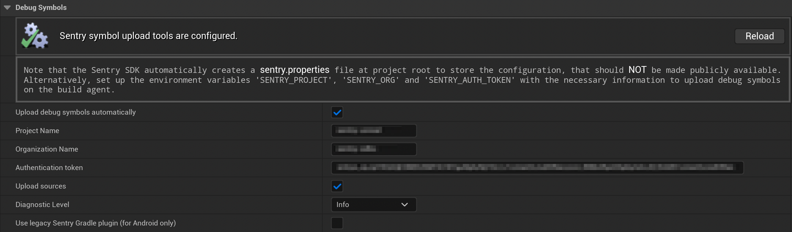

Sentry requires [debug information files](/platforms/unreal/data-management/debug-files/) to symbolicate crashes. The Unreal Engine SDK provides an automated upload functionality for those symbol files that rely on the [sentry-cli](/cli/). This is done automatically, so running the `sentry-cli` manually isn't required. The symbol upload happens during the execution of `PostBuildSteps`, as specified in the `Sentry.uplugin` file. The `sentry-cli` executables for Windows, macOS, and Linux are included as part of the Unreal Engine SDK package. They can also be downloaded manually via the settings menu if the plugin was installed from the UE Marketplace.

<Alert>

For Android, debug symbols upload is handled by [Sentry Android Gradle Plugin](/platforms/android/configuration/gradle). By default, it bumps Gradle version to 7.5 automatically, however one can fallback to using its legacy version in case compatibility issues with other third-party plugins arise.

</Alert>

## Automatic Upload

The automated debug symbols upload is disabled by default and requires configuration. To configure it, navigate to **Project Settings > Plugins > Sentry**, then enable "Upload debug symbols automatically".

Alternatively, debug symbol upload can be enabled by setting the `SENTRY_UPLOAD_SYMBOLS_AUTOMATICALLY` environment variable to `True`. This can be especially helpful in CI/CD environments where manual configuration is impractical.

<Alert>

Sentry will upload debug symbols only for build configurations and target types that are enabled in the "Misc" section of the plugin settings.

</Alert>



The `sentry-cli` require you to specify the organization and project to work with as well as a token to authenticate with Sentry. The Unreal Engine SDK provides two ways to configure these settings - either by using a properties file (default) or environment variables.

### Properties File

To configure the `sentry-cli` using properties file enter the [Auth Token](https://sentry.io/orgredirect/organizations/:orgslug/settings/auth-tokens/), Organization Slug, and Project Name. Note, that the Unreal Engine SDK automatically creates a `sentry.properties` file at the root of your project directory to store the configuration. This configuration file should **never** be made publicly available.

### Environment Variables

The `sentry-cli` can be configured by setting the following environment variables which will be automatically picked up during the debug symbol upload if the properties file is not found:

```bash
export SENTRY_ORG=___ORG_SLUG___
export SENTRY_PROJECT=___PROJECT_SLUG___
export SENTRY_AUTH_TOKEN=___ORG_AUTH_TOKEN___
```

## Manual Upload Using sentry-cli

To upload debug symbols to Sentry manually, run `sentry-cli` through the command line. You can either use the provided executables from within the package, or follow the [sentry-cli documentation](/cli/installation/) to make it available globally. To upload debug symbols run the following command:

<OrgAuthTokenNote />

```bash
sentry-cli --auth-token ___ORG_AUTH_TOKEN___ debug-files upload --org ___ORG_SLUG___ --project ___PROJECT_SLUG___ PATH_TO_SYMBOLS
```

## Debug symbols for macOS and iOS

Sentry requires [_dSYM files_](/platforms/unreal/data-management/debug-files/file-formats/#mach-o-and-dsym) to fully symbolicate your stack traces for macOS/iOS games. To ensure that the debug symbols are generated and can be processed by `sentry-cli` during the execution of `PostBuildSteps`, add the following build settings to your project `.Target.cs` file:

```csharp
// For Mac
MacPlatform.bUseDSYMFiles = true;

// For iOS
IOSPlatform.bGeneratedSYM = true;
```

Alternatively, Unreal Engine 5.3 and newer supports [Modernized Xcode Workflow](https://dev.epicgames.com/documentation/en-us/unreal-engine/using-modern-xcode-in-unreal-engine-5.3-and-newer) which aligns more closely with standard Apple development practices. In this case, symbol upload can be handled during the custom [Xcode Build Phase](https://docs.sentry.io/platforms/apple/guides/macos/dsym/#xcode-build-phase).
