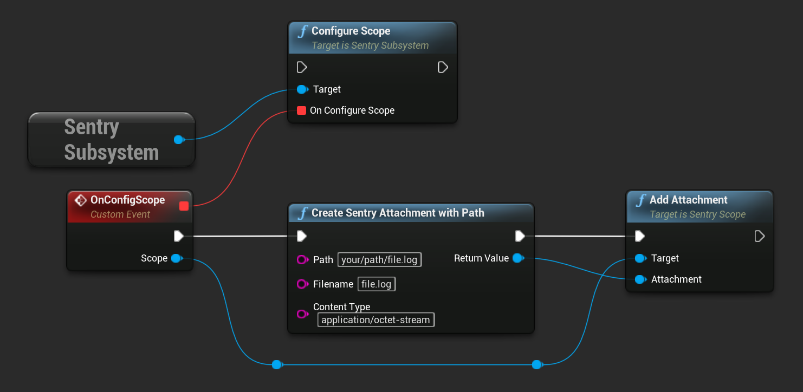

<Note>

This feature is supported for iOS and Android only.

</Note>

Sentry can enrich your events for further investigation by storing additional files, such as config or log files, as attachments.

## Creating Attachments

The simplest way to create an attachment is to use a `path`. The SDK will read the contents of the file each time it prepares an event or transaction, then adds the attachment to the same [envelope](https://develop.sentry.dev/sdk/envelopes/). If the SDK can't read the file, the SDK logs an error message and drops the attachment.

```cpp
#include "SentryAttachment.h"

const FString& Path = "your/path/file.log";
const FString& Filename = "file.log";

USentryAttachment* Attachment = NewObject<USentryAttachment>();
Attachment->InitializeWithPath(Path, Filename);
```

The same result can be achieved by calling the `CreateSentryAttachmentWithPath` function in blueprint.

Alternately, use `bytes` to initialize an attachment. When doing so, you also need to specify a filename.

```cpp
#include "SentryAttachment.h"

const TArray<uint8>& Data = ...

const FString& Filename = "file.log";

USentryAttachment* Attachment = NewObject<USentryAttachment>();
Attachment->InitializeWithData(Data, Filename);
```

The same result can be achieved by calling the `CreateSentryAttachmentWithData` function in blueprint.

If your SDK supports offline caching, which is typical for mobile, each attachment is stored to disk for each event or transaction you capture when the device is offline. When using large attachments, this storage can consume the disk space if the device is offline for a longer time period. You can specify [maximum attachment size](#maximum-attachment-size) to drop large attachments and avoid this issue.

In addition, you can set these parameters:

`filename`

The filename is the name of the file to display in Sentry. When using bytes you have to specify a filename, whereas with a path you don't as the SDK is going to use the last path component.

`contentType`

The type of content stored in this attachment. Any [MIME type](https://www.iana.org/assignments/media-types/media-types.xhtml) may be used; the default is `application/octet-stream`.

## Uploading Attachments

Attachments live on the <PlatformLink to="/enriching-events/scopes/">Scope</PlatformLink>. You can either add an attachment on the global scope to be sent with every event or add it on the <PlatformLink to="/enriching-events/scopes/#local-scopes">local Scope</PlatformLink> to just send the attachment with one specific event.

```cpp
USentrySubsystem* SentrySubsystem = GEngine->GetEngineSubsystem<USentrySubsystem>();

FConfigureScopeDelegate ScopeDelegate;
ScopeDelegate.BindDynamic(this, &USomeClass::HandleScopeDelegate);

SentrySubsystem->ConfigureScope(ScopeDelegate);

// Put scope configuration logic here
void USomeClass::HandleScopeDelegate(USentryScope* Scope)
{
    USentryAttachment* Attachment = NewObject<USentryAttachment>();
    Attachment->InitializeWithPath("your/path/file.log", "file.log");

    Scope->AddAttachment(Attachment);
}
```

The same result can be achieved by calling the corresponding function in blueprint:



<Note>

Sentry allows at most 20MB for a compressed request, and at most 100MB of uncompressed attachments per event, including the crash report file (if applicable). Uploads exceeding this size are rejected with HTTP error `413 Payload Too Large` and the data is dropped immediately. To add larger or more files, consider secondary storage options.

</Note>

Attachments persist for 30 days; if your total storage included in your quota is exceeded, attachments will not be stored. You can delete attachments or their containing events at any time. Deleting an attachment does not affect your quota - Sentry counts an attachment toward your quota as soon as it is stored.

Learn more about how attachments impact your [quota](/product/accounts/quotas/).

### Access to Attachments

To limit access to attachments, navigate to your organization's **General Settings**, then select the _Attachments Access_ dropdown to set appropriate access — any member of your organization, the organization billing owner, member, admin, manager, or owner.

<Include name="common-imgs/attachments-access" />

By default, access is granted to all members when storage is enabled. If a member does not have access to the project, the ability to download an attachment is not available; the button will be greyed out in Sentry. The member may only view that an attachment is stored.

## Viewing Attachments

Attachments display on the bottom of the **Issue Details** page for the event that is shown.

<Include name="common-imgs/attachments-access-denied" />

Alternately, attachments also appear in the _Attachments_ tab on the **Issue Details** page, where you can view the _Type_ of attachment, as well as associated events. Click the Event ID to open the **Issue Details** of that specific event.


## Maximum Attachment Size

The scale is bytes and the default is `20 MiB`. Please also check the
[maximum attachment size of Relay](/product/relay/options/)
to make sure your attachments don't get discarded there.
