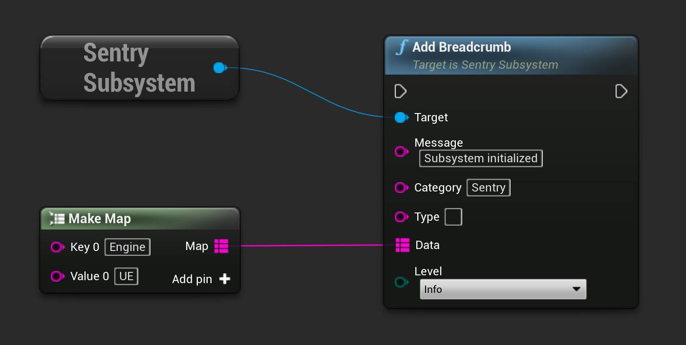
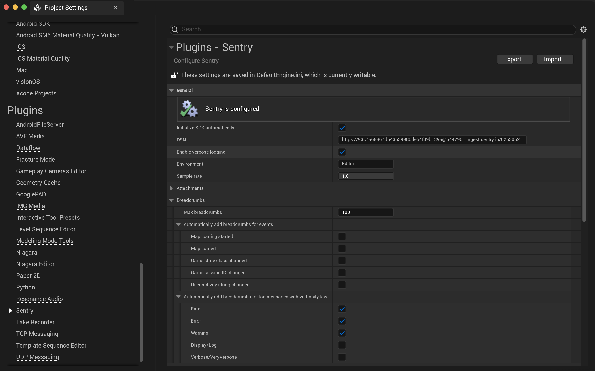

Sentry uses _breadcrumbs_ to create a trail of events that happened prior to an issue. These events are very similar to traditional logs, but can record more rich structured data.

This page provides an overview of manual breadcrumb recording and customization. Learn more about the information that displays on the **Issue Details** page and how you can filter breadcrumbs to quickly resolve issues in [Using Breadcrumbs](/product/error-monitoring/breadcrumbs).

<Alert title="Learn about SDK usage">

Developers who want to modify the breadcrumbs interface can learn more in our [developer documentation about the Breadcrumbs Interface](https://develop.sentry.dev/sdk/event-payloads/breadcrumbs/).

</Alert>

## Manual Breadcrumbs

You can manually add breadcrumbs whenever something interesting happens. For example, you might manually record a breadcrumb if the user authenticates or another state change occurs.

Manually record a breadcrumb:

```cpp
USentrySubsystem* SentrySubsystem = GEngine->GetEngineSubsystem<USentrySubsystem>();

TMap<FString, FString> AdditionalData;
AdditionalData.Add("SomeKey", "SomeValue");

SentrySubsystem->AddBreadcrumb("Message", "Category", "Type", AdditionalData, ESentryLevel::Info);
```

The same result can be achieved by calling corresponding function in blueprint:



## Automatic Breadcrumbs

The Unreal Engine SDK can capture certain types of breadcrumbs automatically. Those can be enabled using the Sentry configuration window at **Project Settings > Plugins > Sentry**.


