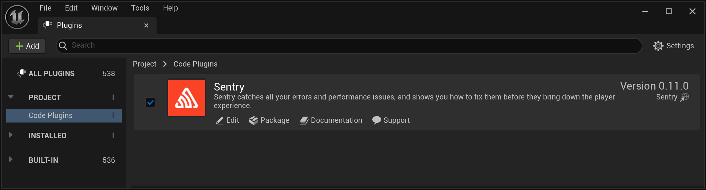
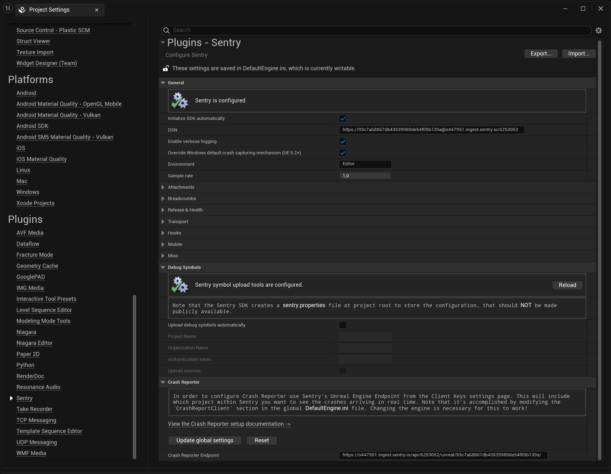
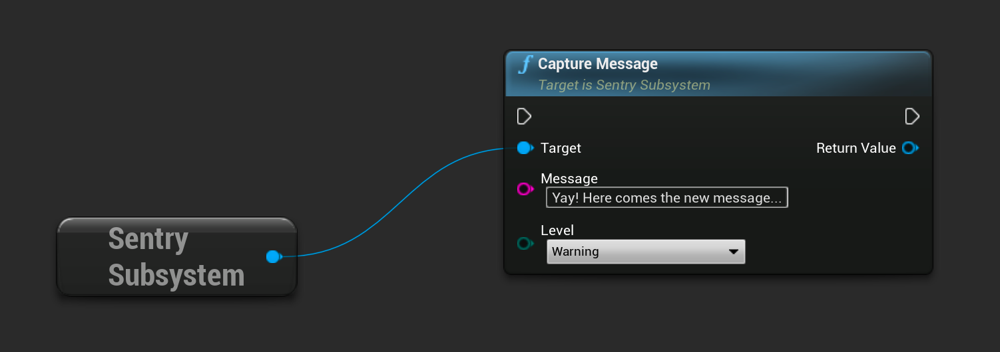

Unreal Engine SDK builds on top of other Sentry SDKs and extends them with Unreal Engine specific features. It gives developers helpful hints for where and why an error or performance issue might have occurred.

**Features:**

- Native support for automatic crash error tracking for
- Android by using the [Android SDK](/platforms/android/) to support Java, Kotlin, C and C++
- iOS by using the [iOS SDK](/platforms/apple/guides/ios/) to support Objective-C, Swift, C and C++
- Windows (UE 5.2+) and Linux by using the [Native SDK](/platforms/native/) to support C and C++ with minidumps
- macOS by using the [macOS SDK](/platforms/apple/guides/macos/) to support Objective-C, Swift, C and C++
- Compatible with [Crash Reporter Client](/platforms/unreal/configuration/setup-crashreporter/) provided along with Unreal Engine
- [Release health](/platforms/unreal/configuration/releases/) to keep track of crash free users and sessions

<Alert level="warning">

To automatically capture crashes on Windows with UE 5.1 or older, you have to configure the [Crash Reporter Client](/platforms/unreal/configuration/setup-crashreporter/). Starting from UE 5.2, the provided API allows you to switch between default (CRC) and third-party (Sentry) crash-handling solutions, so the CRC configuration step isn't required. The two are mutually exclusive and can't be used simultaneously.

</Alert>

On this page, we get you up and running with Sentry's SDK.

Don't already have an account and Sentry project established? Head over to [sentry.io](https://sentry.io/signup/), then return to this page.

## Install

Sentry captures data by using an SDK within your application’s runtime.

The Unreal Engine (UE) SDK is officially supported for the three latest UE versions. However, it is likely to be compatible with older engine versions as well depending on the specific features and functionality that you need.

There are three common ways to install an SDK to use with Unreal Engine:
1. Install from the [Epic Games Fab](https://www.fab.com/) ([formerly known as the marketplace](https://www.unrealengine.com/en-US/blog/fab-epics-new-unified-content-marketplace-launches-today))
2. Download a pre-built SDK that you install (for example, from a [GitHub Releases page](https://github.com/getsentry/sentry-unreal/releases))
3. Clone and build the SDK yourself and install

While you can use any of the three methods to install Sentry, each has its own limitations, as described below.

### Overview of SDK Versions

The table below highlights some key differences between different versions of the SDK:

| Feature                    | __GitHub Releases__* | Fab                 | Build Yourself |
|----------------------------|----------------------|---------------------|----------------|
| Supported engine versions  | 4.27 and newer       | 5.1 and newer       | 4.27 and newer |
| Supported UE project types | C++ only             | Blueprint and C++   | C++ only       |
| Backend (Windows)          | Crashpad             | Breakpad            | Crashpad       |
| `on_crash` hook (Windows)  | Supported            | Not supported       | Supported      |
| Sentry CLI **              | Included             | Manual download     | Included       |

Legend:
`*`: Recommended version of the SDK
`**`: Sentry CLI is a standalone tool that the plugin uses under the hood to automatically upload debug information files upon game build completion.

### Installing from GitHub Releases (Recommended)

The [GitHub Releases page](https://github.com/getsentry/sentry-unreal/releases) provides two plugin packages: `github` and `marketplace`. The key difference between the two is the crash capturing backend, which is used under the hood on Windows.

We recommend using the `github` version, because it uses `Crashpad`, an out-of-proc handler that sends the crash report right away. The `marketplace` version relies on `Breakpad`, an in-proc handler which requires the UE application or game to be relaunched before any crash reports can be sent to Sentry.

To install the SDK, download the most up-to-date sources from the [Releases page](https://github.com/getsentry/sentry-unreal/releases) and add them to your project's `Plugins` directory. On the next project launch, UE will prompt you to build the Sentry and SentryEditor modules.

<Alert>

Currently, this method is available only for C++ UE projects. Blueprint projects can be converted to a C++ one by adding an empty class using the editor.

</Alert>

### Installing from Fab

Sentry SDK can be downloaded via the [standard installation process](https://dev.epicgames.com/documentation/en-us/unreal-engine/working-with-plugins-in-unreal-engine#installingpluginsfromtheunrealenginemarketplace) from its [Epic Games Fab page](https://www.fab.com/listings/eaa89d9d-8d39-450c-b75f-acee010890a2).

This method is recommended only for Blueprint UE projects. If you already have a C++ UE project or don't mind converting an existing Blueprint UE project to a C++ one, consider downloading the plugin from GitHub instead.

### Build Yourself

To get started, we recommend cloning the [Unreal SDK repository](https://github.com/getsentry/sentry-unreal) and running the initialization script:

* `./scripts/init.sh` on macOS/Linux
* `./scripts/init-win.ps1` on Windows

<Alert>
Initialization scripts require [GitHub CLI](https://cli.github.com/) to be installed.
</Alert>

<Alert>
If the initialization script fails due to errors on Windows, check your PowerShell version by printing the built-in variable `$PSVersionTable`. If the version is `5.x`, upgrading to a newer version of [PowerShell](https://github.com/powershell/powershell) may resolve these errors.
</Alert>

This script links the checked out version of the plugin (the [plugin-dev](https://github.com/getsentry/sentry-unreal/tree/b67076ad5dc419d46b4be70a0bd6e64c2357a82d/plugin-dev) directory) to the [sample app](https://github.com/getsentry/sentry-unreal/tree/b67076ad5dc419d46b4be70a0bd6e64c2357a82d/sample) and downloads the latest builds of native SDKs from our GitHub CI.

After successful initialization, copy the contents of the `plugin-dev` directory to `<your_project_root>/Plugins/Sentry`. This will allow you to use Sentry in your Unreal Engine project.

### Confirm Installation
To make sure the Sentry plugin has been enabled after installation has been completed, go to the editor and navigate to the **Settings > Plugins > Code Plugins** menu and check for the installation.



To access the plugin API from within C++,
add `Sentry` support to the build script (`MyProject.build.cs`):

```csharp
PublicDependencyModuleNames.AddRange(new string[] { ..., "Sentry" });
```

## Configure

The minimum configuration required is the [DSN](/product/sentry-basics/dsn-explainer/) of your project:

```json {tabTitle: Public DSN}
{
  "public-dsn": "___PUBLIC_DSN___"
}
```

<Alert>

If you are logged in, you can also go to your project settings and copy its DSN directly from there.

</Alert>

Sentry can be configured using the Sentry configuration window.
The window can be accessed by going to editor's menu: **Project Settings > Plugins > Sentry**.



By default, the SDK is automatically initialized on application startup. Alternatively, the `Initialize SDK automatically` option can be disabled and in this case, explicit SDK initialization is required.

To override SDK settings at runtime, use the `InitializeWithSettings` method of the `SentrySubsystem` class.

## Verify

This snippet includes message capturing, so you can test that everything is working as soon as you set it up:

```cpp
#include "SentrySubsystem.h"

void Verify()
{
    // Capture message
    USentrySubsystem* SentrySubsystem = GEngine->GetEngineSubsystem<USentrySubsystem>();
    SentrySubsystem->CaptureMessage(TEXT("Capture message"));
}
```

The same result can be achieved by calling corresponding function in blueprint:



<Alert>

Learn more about manually capturing an error or message in our <PlatformLink to="/usage/">Usage documentation</PlatformLink>.

</Alert>

To view and resolve the recorded error, log into [sentry.io](https://sentry.io) and select your project. Clicking on the error's title will open a page where you can see detailed information and mark it as resolved.

## Store Minidumps as Attachments

<Include name="store-minidumps-as-attachments-intro" />

<Alert>☝ This feature is supported on Windows, Linux, and Android.</Alert>

<Include name="store-minidumps-as-attachments-configuration" />
