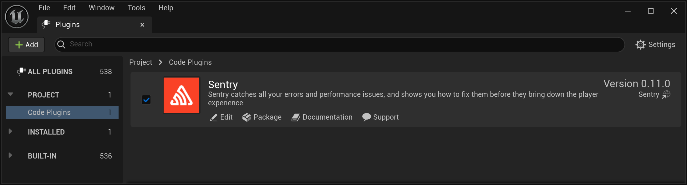

There are three common ways to install an SDK to use with Unreal Engine:
1. Download a pre-built SDK from a [GitHub Releases page](https://github.com/getsentry/sentry-unreal/releases) and install
2. Install from the [Epic Games Fab](https://www.fab.com/) ([formerly known as the marketplace](https://www.unrealengine.com/en-US/blog/fab-epics-new-unified-content-marketplace-launches-today))
3. Clone and build the SDK yourself and install

While you can use any of the three methods to install Sentry, each has its own limitations, as described below.

## Overview of SDK Versions

The table below highlights some key differences between different versions of the SDK:

| Feature                      | __GitHub Releases__* | Fab                  | Build Yourself |
|------------------------------|----------------------|----------------------|----------------|
| Supported engine versions    | 4.27 and newer       | 5.4 and newer        | 4.27 and newer |
| Supported UE project types   | C++ only             | Blueprint and C++    | C++ only       |
| Cross-compiling for Linux ** | Supported            | Manual configuration | Supported      |

Legend:
`*`: Recommended version of the SDK
`**`: To support cross-compilation for Linux on Windows, the Fab version of the SDK includes an editor utility that pre-builds the binaries required by UAT.

## Installing from GitHub Releases (Recommended)

The [GitHub Releases page](https://github.com/getsentry/sentry-unreal/releases) provides plugin packages for all supported engine versions.

To install the SDK, download the most up-to-date sources from the [Releases page](https://github.com/getsentry/sentry-unreal/releases) and add them to your project's `Plugins` directory. On the next project launch, UE will prompt you to build the Sentry and SentryEditor modules.

<Alert>

Currently, this method is available only for C++ UE projects. Blueprint projects can be converted to a C++ one by adding an empty class using the editor.

</Alert>

<Alert>

To avoid warnings during the build for licensee versions of Unreal Engine remove the `EngineVersion` key from the `Sentry.uplugin` file.

</Alert>

## Installing from Fab

Sentry SDK can be downloaded via the [standard installation process](https://dev.epicgames.com/documentation/en-us/unreal-engine/working-with-plugins-in-unreal-engine#installingpluginsfromtheunrealenginemarketplace) from its [Epic Games Fab page](https://www.fab.com/listings/eaa89d9d-8d39-450c-b75f-acee010890a2).

This method is recommended only for Blueprint UE projects. If you already have a C++ UE project or don't mind converting an existing Blueprint UE project to a C++ one, consider downloading the plugin from GitHub instead.

## Build Yourself

To get started, we recommend cloning the [Unreal SDK repository](https://github.com/getsentry/sentry-unreal) and running the initialization script:

* `./scripts/init.sh` on macOS/Linux
* `./scripts/init-win.ps1` on Windows

<Alert>
Initialization scripts require [GitHub CLI](https://cli.github.com/) to be installed.
</Alert>

<Alert>
If the initialization script fails due to errors on Windows, check your PowerShell version by printing the built-in variable `$PSVersionTable`. If the version is `5.x`, upgrading to a newer version of [PowerShell](https://github.com/powershell/powershell) may resolve these errors.
</Alert>

This script links the checked out version of the plugin (the [plugin-dev](https://github.com/getsentry/sentry-unreal/tree/b67076ad5dc419d46b4be70a0bd6e64c2357a82d/plugin-dev) directory) to the [sample app](https://github.com/getsentry/sentry-unreal/tree/b67076ad5dc419d46b4be70a0bd6e64c2357a82d/sample) and downloads the latest builds of native SDKs from our GitHub CI.

After successful initialization, copy the contents of the `plugin-dev` directory to `<your_project_root>/Plugins/Sentry`. This will allow you to use Sentry in your Unreal Engine project.

## Confirm Installation

To make sure the Sentry plugin has been enabled after installation has been completed, go to the editor and navigate to the **Settings > Plugins > Code Plugins** menu and check for the installation.



To access the plugin API from within C++,
add `Sentry` support to the build script (`MyProject.build.cs`):

```csharp
PublicDependencyModuleNames.AddRange(new string[] { ..., "Sentry" });
```
