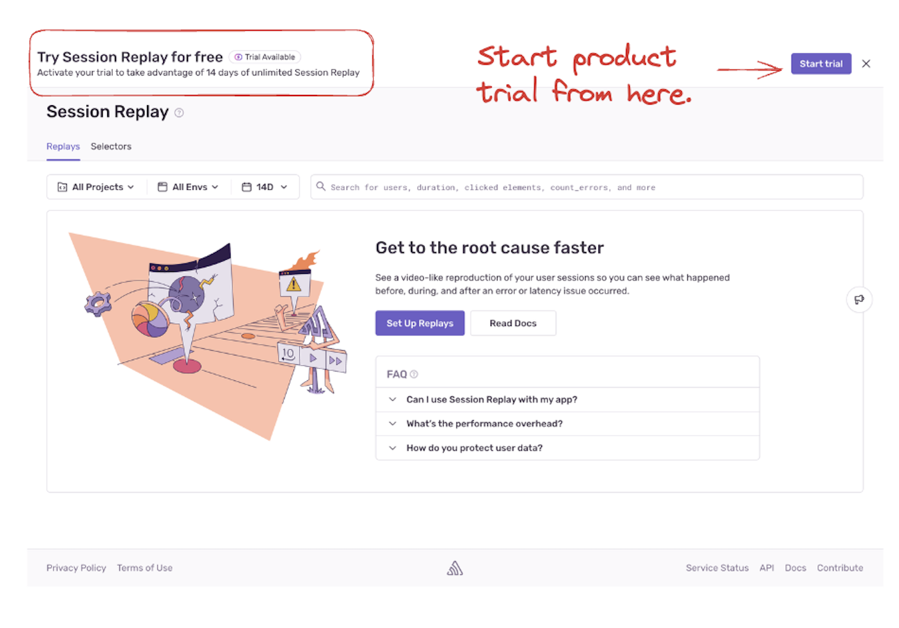

<Alert>
This pricing only applies to free plans or paid plans **started on June 11th, 2024 or later**. For information about older plans, go to your [**Settings**](https://sentry.io/orgredirect/organizations/:orgslug/settings/) page and click on "Subscription" (under the "Usage & Billing" heading).
</Alert>

This page gives you an in-depth understanding of our pricing and billing structure, including:

- [How our pricing works](#pricing-how-it-works) and [per-category-pricing](#pricing-by-product-and-data-category)
- [Billing cycles](#billing-cycles)
- [Taxes](#taxes) and [exemptions](#tax-exemptions)

## Terminology

- **Volume:** Volume refers to the total number of events and attachments — or the total amount of data sent by your organization.

- **Reserved volume:** A predetermined amount of data you pay for in advance at a discount, on a monthly or annual basis. Your base plan includes a set amount of volume for each data category.

- **Pay-as-you-go budget:** Setting a pay-as-you-go (PAYG) budget covers any overages and ensures that you don't lose monitoring after your reserved volume has run out. This is the maximum you'll pay for overages each month.

## Pricing: How It Works

We bill based on the amount of data processed. Each [paid plan](https://sentry.io/pricing/) comes with the below pre-set monthly event volume, which is included in the price:
- 50k errors
- 10M spans
- 50 replays
- 1 uptime monitor
- 1 cron monitor
- 1GB of attachments

On top of that, you can choose to pay for a set, reserved volume of additional data at a discounted price. Any unused reserved volume will expire at the end of each billing month. You can also set aside a pay-as-you-go budget that can be used to cover potential overages in any data category. Your pay-as-you-go budget will only be accessed once the reserved volume has run out and you'll only be billed for what you use (up to the maximum you've set).

Any data sent after you've run through your reserved volume and pay-as-you-go budget will be dropped and you won't be charged for it. This also means that you'll lose monitoring for the remainder of the billing cycle, so make sure your budget matches your usage.

### Pricing by Product and Data Category

Sentry offers several products, each of which have their own pricing structure as listed in the tables below. Paid pricing plans include a standard volume of events for each product or data category and you can buy more either by prepaying for reserved volume and/or setting up a pay-as-you-go (PAYG) budget.

<Alert>

Please note that all per-category prices listed below have been rounded to the nearest millionth.

</Alert>

#### Errors Pricing

| Error Volume | Team Reserved | Team PAYG | Business Reserved | Business PAYG |
| ------------- | ------------ | ---------- | ---------------- | -------------- |
| >50k-100k     | $0.0002900   | $0.0003625 | $0.0008900       | $0.0011125     |
| >100k-500k    | $0.0001750   | $0.0002188 | $0.0005000       | $0.0006250     |
| >500k-10M     | $0.0001500   | $0.0001875 | $0.0003000       | $0.0003750     |
| >10M-20M      | $0.0001300   | $0.0001625 | $0.0002600       | $0.0003250     |
| >20M          | $0.0001200   | $0.0001500 | $0.0002400       | $0.0003000     |

#### Tracing Pricing

Tracing is enabled by and will be billed for in spans.

| Span Volume | Team Reserved | Team PAYG | Business Reserved | Business PAYG |
| ---------------- | ------------ | ---------- | ---------------- | -------------- |
| >10M-100M        | $0.0000016   | $0.0000020 | $0.0000032       | $0.0000040     |
| >100M            | $0.0000014   | $0.0000018 | $0.0000029       | $0.0000036     |

#### Replays Pricing

| Replay Volume | Team Reserved | Team PAYG | Business Reserved | Business PAYG |
| -------------- | ------------ | ---------- | -----------------| -------------- |
| >50-5k         | $0.0030000   | $0.0037500 | $0.0030000       | $0.0037500     |
| >5k-100k       | $0.0028500   | $0.0035630 | $0.0028500       | $0.0035630     |
| >100k-900k     | $0.0025650   | $0.0032060 | $0.0025650       | $0.0032060     |
| >900k-4.5M     | $0.0023090   | $0.0028860 | $0.0023090       | $0.0028860     |
| >4.5M          | $0.0019620   | $0.0024530 | $0.0019620       | $0.0024530     |

#### Cron Monitors Pricing

All Sentry plans include **one cron monitor**. To activate additional cron monitors, set up a **Pay-As-You-Go (PAYG) budget**. Additional cron monitors can't be purchased in advance; they are only available through your PAYG budget, which can be shared across all event types.

**Key Points:**

- **Deactivating or Deleting Cron Monitors**:
  - Deactivated or deleted monitors will **count** towards your billing quota if they were previously active in the current billing period. Otherwise, they won't count towards your billing quota.
  - Their quota becomes **reusable** within the **same billing period**.
- **Activating Cron Monitors**:
  - Sentry first uses any **reusable quota** from cron monitors deactivated or deleted in the current billing period.
  - If none is available, your **reserved quota** or **PAYG budget** is used.

<Alert>

**Important:**

- **Quota Reuse Limitations**:
  - Only available **within the same billing period**.
  - Applies to cron monitors that were previously active and billed.
- **Reusable Quota Does Not Carry Over**:
  - Reusable quota **does not carry over** to new billing periods.

</Alert>

**Cron Monitors Across Billing Periods:**

- Cron monitors remain active across billing periods if you have sufficient **reserved quota** or **PAYG budget**.
- Cron monitors may be automatically deactivated if there's insufficient budget.
- Cron monitors that have been manually deactivated or deleted remain in that state.

| Team PAYG | Business PAYG |
| ---------- | -------------- |
| $0.7800000 | $0.7800000     |

#### Uptime Monitors Pricing

All Sentry plans include **one uptime monitor**. To activate additional uptime monitors, set up a **Pay-As-You-Go (PAYG) budget**. Additional uptime monitors can't be purchased in advance; they are only available through your PAYG budget, which can be shared across all event types.

**Key Points:**

- **Deactivating or Deleting Uptime Monitors**:
  - Deactivated or deleted uptime monitors will **count** towards your billing quota only if they were previously active in the current billing period.
  - Their quota becomes **reusable** within the **same billing period**.
- **Activating Uptime Monitors**:
  - Sentry first uses any **reusable quota** from uptime monitors deactivated or deleted in the current billing period.
  - If none is available, your **reserved quota** or **PAYG budget** is used.

<Alert>

**Important:**

- **Quota Reuse Limitations**:
  - Only available **within the same billing period**.
  - Applies to uptime monitors that were previously active and billed.
- **Reusable Quota Does Not Carry Over**:
  - Reusable quota **does not carry over** to new billing periods.

</Alert>

**Uptime Monitors Across Billing Periods:**

- Uptime monitors remain active across billing periods if you have sufficient **reserved quota** or **PAYG budget**.
- Uptime monitors may be automatically deactivated if there's insufficient budget.
- Uptime monitors that have been manually deactivated or deleted remain in that state.

| Team PAYG | Business PAYG |
| ---------- | -------------- |
| $1.00 | $1.00     |

#### Attachments Pricing (per GB)

| Attachment Size | Team Reserved | Team PAYG | Business Reserved | Business PAYG |
| ------------------ | ------------ | ---------- | ---------------- | -------------- |
| >1GB                | $0.2500   | $0.3125 | $0.2500     | $0.3125    |

#### Consolidated Pricing

Use the [pricing page](https://sentry.io/pricing/) to determine the amount of reserved volume you might need based on your anticipated usage.

For more information on how to manage your monthly spending, check out our [Quota Management documentation](/pricing/quotas/).

## Billing Cycles

<Alert>
  You have to have Billing or Owner-level permissions to make changes to
  information on the Subscription page or access invoices. If you need an
  invoice, but don't have the right permissions, reach out to your
  administrator.
</Alert>

Sentry uses two different billing cycles: one for your paid plan and reserved volume, and another one for your pay-as-you-go usage.

- **Subscription billing cycle:** Billing cycle for your paid plan and reserved volume for which you can elect to be billed on either a monthly or an annual basis.
- **Pay-as-you-go billing cycle:** Billing cycle for your pay-as-you-go usage, for which you'll be billed on a monthly basis.

_If you're on a monthly subscription billing cycle, your pay-as-you-go billing cycle will be aligned to it._

Users with [Billing or Owner-level](/organization/membership/) permissions can find their invoices by going to the [**Settings**](https://sentry.io/orgredirect/organizations/:orgslug/settings/) page and clicking “Subscription” (under the “Usage & Billing” heading.)

### Changing Plans Mid-cycle

If you decide to increase your pay-as-you-go budget in the middle of your billing cycle, Sentry will start processing additional data as soon as the increase becomes effective.\*

If you want to decrease your pay-as-you-go budget in the middle of your billing cycle, but have already consumed more data than the new desired amount allows, your budget will be lowered to match what you've already used. Any new data will be rejected. Your pay-as-you-go budget will be decreased to the desired amount on your next billing date.

If you upgrade from a Team to a Business plan mid-cycle, any existing pay-as-you-go budget will be recalculated based on Business tier pricing. This may mean that your pay-as-you-go budget will be consumed faster than it was before.

\*In most cases, new budgets will take effect within minutes. Otherwise, we guarantee a maximum turnaround time of 24 hours.

## Plans and Free Trials

Sentry has one free Developer plan and three paid plans: Team, Business, and Enterprise. You can find more information about each by going to our [pricing page](https://sentry.io/pricing/).

Plan upgrades take effect immediately. Plan downgrades and cancellations are processed at the end of the current contract cycle and cannot be refunded. If you no longer want to be on a paid plan, you'll revert to the base Developer plan at the end of your current contract.

All new Sentry accounts come with a 14-day free trial period. You'll have the option to upgrade and continue to use Sentry's paid features at any time before your trial ends. Upgrades will be effective immediately. Users who haven't upgraded by the end of their free trial will remain on the free Developer plan with limited features.

## Product Trials

In addition to the free Business trial available to new accounts, Sentry offers a one-time, 14-day product trial as a way to let your organization try out products that aren't part of your billing plan (such as Tracing and Session Replays). Product trials are specific to each product, so you can try one product at a time or multiple products at the same time.

Anyone who's on a Free, Team, or Business plan can initiate a product trial directly from the Sentry UI. Keep in mind that each org can only trial each product once.

During your 14-day product trial, you'll be able to send us an unlimited number of events. If you continue to use the product after your trial period is up, any additional usage will be billed using your available reserved volume or your pay-as-you-go budget. You won't be billed for any data you've used during the 14-day trial period.

### Who's Eligible for a Product Trial and When?

**New accounts**

New accounts will be able to request a one-time product trial on day 15, after the initial 14-day Business trial has ended, or immediately after a plan has been upgraded to a paid plan.

**Free accounts**

Free accounts will be able to request a one-time product trial at any time.

**Existing Team or Business accounts**

- Existing Team or Business accounts will be able to request a one-time product trial for products that aren't already part of their billing plan at any time.

- Existing Team accounts that haven't opted in to a Business trial will have the option to request a Business trial and product trials for products that aren't already part of their billing plan at any time.

## Taxes

The following sections cover taxation for various jurisdictions, business-to-business and business-to-customer taxation differences, and exemptions.

Currently, prices displayed on our [pricing page](http://sentry.io/pricing) don't include sales tax since tax rates and applicability varies across country, state/province, and locality.

### US Taxes

As of December 1, 2020, customers with a US-based billing address may be subject to state and local sales tax. Sales tax will apply to billing addresses located in the following states/localities:

- Arizona
- California
- Colorado
- Connecticut
- District of Columbia
- Florida
- Hawaii
- Illinois
- Iowa
- Maryland
- Massachusetts
- Michigan
- New Jersey
- New Mexico
- New York
- Ohio
- Pennsylvania
- Rhode Island
- South Carolina
- Texas
- Tennessee
- Utah
- Washington

### Canadian Taxes

As of October 1, 2022, customers with a Canadian-based billing address may be subject to provincial and local sales tax, varying according to province. Canadian customers may be subject to one or more of the following taxes depending on their location:

| Province(s)                                                                                   | Tax Type(s)                                                  | Total Tax Rate                                      |
| --------------------------------------------------------------------------------------------- | ------------------------------------------------------------ | --------------------------------------------------- |
| Alberta, Northwest Territories,   Nunavut, Yukon                                       | Goods & Service Tax (5%)                                     | 5%  |
| British Columbia, Manitoba                                                                    | Goods & Service Tax (5%)    Provincial Sales Tax (7%) | 12%  |
| New Brunswick,   Newfoundland and Labrador,   Nova Scotia, Prince Edward Island | Harmonized Sales Tax                                         | 15%  |
| Ontario                                                                                       | Harmonized Sales Tax                                         | 13%  |
| Quebec                                                                                        | Goods & Service Tax (5%)    Quebec Sales Tax (9.975%) | 14.975%|
| Saskatchewan                                                                                  | Goods & Service Tax (5%)    Provincial Sales Tax (6%) | 11%  |

All Canadian federal and provincial taxes will be calculated based on billing address.

### VAT

In the European Union (EU) and United Kingdom (UK), in accordance with EU VAT and UK VAT legislation respectively, VAT will be applied only to orders where exemption documentation or a valid VAT ID has not been supplied prior to or at the time of payment.

### B2B and B2C Taxation - Differences

Internationally, sales tax rules differ based on whether the customer is business-to-business (B2B) or business-to-consumer (B2C). In most countries, B2C sales are taxable, while B2B customers are not charged sales tax at the point of sale, but self-assess when they file their returns.

However, in some countries, both B2C and B2B customers need to be charged sales tax at the point of sale. Sentry will levy tax on your purchase based on your local tax legislation and rate according to your billing address.

### Tax Exemptions

If your company or non-profit organization qualifies for a sales tax exemption, you can reach out to tax@sentry.io with the following information to have sales tax removed from any future invoices:

- Organization name
- Copy of a signed tax exempt certificate

If you've submitted an exemption form, and you're still being charged sales taxes, that's because either:

- The exemption certificate was still in review after the billing period was closed.
- The exemption certificate covers a state that is different from your billing address.

Updating your address or submitting a tax exemption certificate doesn't impact the taxes charged on older invoices. We do not adjust the billing or invoicing of a closed billing period.
