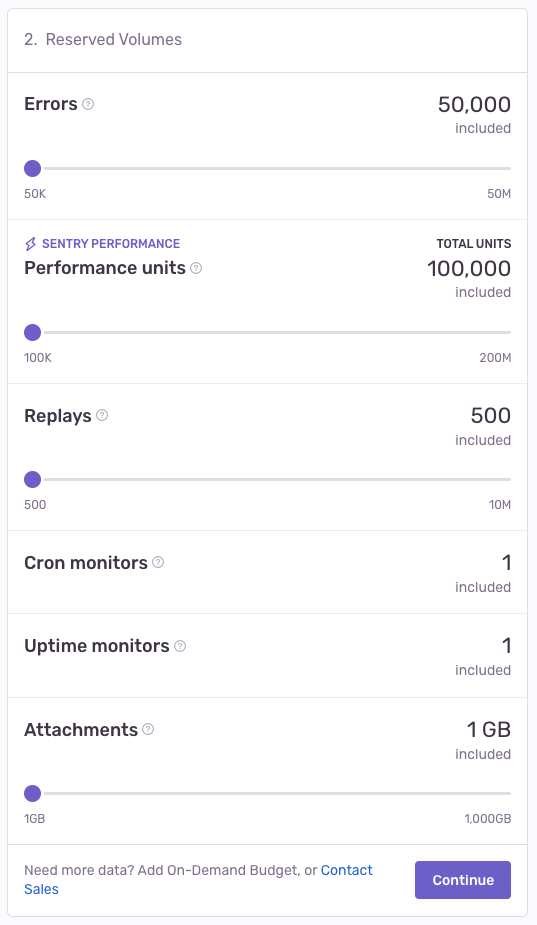
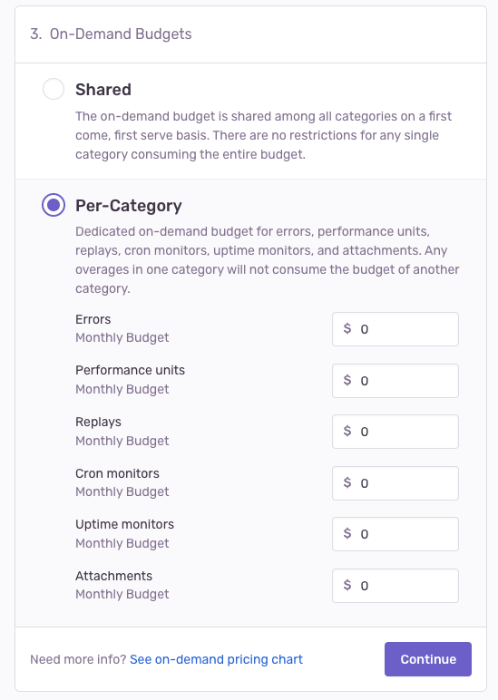

<Alert>
This information only applies to paid plans that were activated **before June 11, 2024** and haven't been upgraded since.

If you're on a free or paid plan that was activated on June 11, 2024 or later, see the [current pricing page](/pricing/).
</Alert>

This page gives you an in-depth understanding of our pricing and billing structure, including:

- [How our pricing works](#pricing-how-it-works) and [per-category-pricing](#per-category-pricing)
- [Reserved (prepaid)](#prepaid-reserved-capacity) and [on-demand](#on-demand-capacity) volume
- [Billing periods](#billing-cycles)
- [Taxes](#taxes) and [exemptions](#tax-exemptions)

## Pricing: How It Works

We bill based on the amount of data you want us to process. Our [Developer, Team, and Business plans](https://sentry.io/pricing/), each come with a pre-set number of events that are included in the price.

On top of that, you can choose to pay for a set, prepaid volume of additional data at a discounted price. You can also set aside an on-demand budget to cover potential overages, which will only be used once the prepaid budget has run out.

- **[Prepaid volume:](#prepaid-reserved-capacity)** A predetermined amount of data you pay for in advance at a discount, on a monthly or annual basis.
- **[On-demand volume:](#on-demand-capacity)** An overage budget that kicks in only if your prepaid volume has been used up. Having this makes it possible to control the maximum amount you will spend for overages each month.

If you run out of **both** your prepaid and on-demand volume, any new data you send will be rejected and you won't be charged for it.

### Per-Category Pricing

If you'd like to buy either prepaid or on-demand data on top of what's included in your plan, you can buy as much as you think you'll need per data category. [Errors](#errors-pricing), [Performance](#performance-pricing), [Replays](#replays-pricing), [Cron Monitors](#cron-monitors-pricing), and [Attachments](#attachments-pricing) each have their own unique pricing structures, as listed in the tables below:

<Alert>

Please note that all per-category prices listed below have been rounded to the nearest millionth.

</Alert>

{/*<!-- prettier-ignore-start -->*/}

#### Errors Pricing

| Volume |  Team Prepaid | Team On-Demand | Business Prepaid | Business On-Demand |
|---|---|---|---|---|
| >50k-100k | $0.000290 | $0.000377 | $0.000890 | $0.001157 |
| >100k-500k | $0.000175 | $0.000228 | $0.000500 | $0.000650 |
| >500k-2M | $0.000150 | $0.000195 | $0.000300 | $0.000390 |
| >2M-10M | $0.000150 | $0.000195 | $0.000300 | $0.000390 |
| >10M-20M | $0.000130 | $0.000169 | $0.000251 | $0.000326 |
| >20M-50M | $0.000120 | $0.000156 | $0.000144 | $0.000187 |

#### Performance Pricing

Performance Units can be used towards multiple Performance event types, depending on what you've enabled:

| Event Type | Unit Value | |
|---|---|---|
| Transactions | 1 Unit | Sent by SDKs with only [Tracing](/product/sentry-basics/tracing/) enabled |
| Transactions with Profiling | 1.3 Units | Sent by SDKs with both [Tracing](/product/sentry-basics/tracing/) & [Profiling](/product/profiling/) enabled |

| Total Performance Unit Volume | Team Prepaid | Team On-Demand | Business Prepaid | Business On-Demand |
|---|---|---|---|---|
| >100k-250k | $0.000100 | $0.000189 | $0.000300 | $0.000579 |
| >250k-500k | $0.000058 | $0.000130 | $0.000178 | $0.000390 |
| >500k-1M | $0.000052 | $0.000075 | $0.000130  | $0.000231 |
| >1M-4.5M | $0.000052 | $0.000068 | $0.000130 | $0.000169 |
| >4.5M-5M | $0.000046 | $0.000068 | $0.000092 | $0.0000169 |
| >5M-5.5M | $0.000039 | $0.000060 | $0.000074 | $0.000120 |
| >5.5M-10M | $0.000039 | $0.000051 | $0.000074 | $0.000096 |
| >10M-15M | $0.000027 | $0.000051 | $0.000040 | $0.000096 |
| >15M-100M | $0.000027 | $0.000036 | $0.000040 | $0.000053 |
| >100M-150M | $0.000019 | $0.000036 | $0.000032 | $0.000053 |
| >150M-200M | $0.000019 | $0.000021 | $0.000032 | $0.000042 |

#### Replays Pricing

| Total Replays Volume | Team/Business Prepaid | Team/Business On-Demand |
|---|---|---|
| >500-5k | n/a: minimum 10k volume required | $0.003900 |
| >5k-10k | n/a: minimum 10k volume required | $0.003705 |
| >10k-100k | $0.002850 | $0.003705 |
| >100k-900k | $0.002565 | $0.003335 |
| >900k-4.5M | $0.002309 | $0.003001 |
| >4.5M-10M | $0.001962 | $0.002551 |

#### Cron Monitors Pricing

Monitors for Crons can't be purchased in advance. Crons are available to use and purchase through a predetermined on-demand budget that can be shared across all event types or defined per category.

| Total Monitors Volume | Team/Business On-Demand |
|---|---|
| >1 | $0.78 |

#### Attachments Pricing

| Total Attachments Volume | Team/Business Prepaid | Team/Business On-Demand |
|---|---|---|
| >25 - 100 (GB) | $0.24 | $0.312 |
| >100 - 200 (GB) | $0.24 | $0.312 |
| >200 - 10k (GB) | $0.23 | $0.299 |

{/*<!-- prettier-ignore-end -->*/}

#### Consolidated Pricing

If the amount of prepaid data you want to buy falls in between increments, you may want to consider setting an on-demand budget instead, since on-demand is set in dollar amounts rather than data volume.

Use the slider on the [pricing](https://sentry.io/pricing/) page to determine the amount of prepaid data you might need based on the volume of event types you send.

For more information on how to manage your monthly spending, check out our [Quota Management documentation](/pricing/quotas/).

## Volume

Your volume is the total number of events and attachments — or the total amount of data— sent by your organization. If you'd like to purchase more than what's included in your [plan](https://sentry.io/pricing/), you can do so in two ways: by buying a **prepaid (or reserved) volume** and/or by setting up an **on-demand volume budget**, which will cover potential overages.

### Prepaid (Reserved) Volume

When you buy reserved volume (or quota), you prepay for data at significant discounts. Your prepaid, reserved volume can be allocated on either a pooled basis between projects, or, if you have [Spend Allocation](/pricing/quotas/spend-allocation/) enabled, it can be set on both a pooled and a per-project basis. Unused reserved volume expires at the end of each billing month.

Each Sentry plan includes different amounts of reserved volume. For example, our Team plan includes a minimum of 50k errors, 100k performance units, 500 replays, 1 cron monitor, and 1GB of attachments per month. To see prepaid pricing for each plan, check out our [per-category-pricing](#per-category-pricing).

### On-Demand Volume

Buying on-demand volume lets you control the maximum amount you’ll pay for overage each month after your reserved volume runs out. If you go over your on-demand volume, you’ll still have access to previous event data, but any new data you send will be rejected and you won’t be charged for it.

With on-demand volume, you pay for any event or attachment processed, (rounded up to the nearest cent), after your reserved volume has run out.

<Alert>

If you've enabled [Spend Allocation](/pricing/quotas/spend-allocation/), and your project has consumed both its dedicated event allocation and your organization's un-allocated pool, any excess event consumption will come from your on-demand budget **even if you have reserved volume still available**.

</Alert>

On-demand volume is billed at the end of each billing month. To see on-demand pricing per plan type, check out our [per-category-pricing](#per-category-pricing).

#### Shared and Per-Category On-Demand

Organizations on all plans have the option to set a shared on-demand strategy. Organizations on plans with [performance monitoring](/product/performance/) features have the ability to choose between a shared or per-category on-demand strategy:

- **Shared:** Your on-demand budget is shared between all categories on a first come, first serve basis. There are no restrictions for any single category consuming the entire budget.

- **Per-category:** Your on-demand budgets for categories such as errors, transactions, and replays, are set up individually so that any overages in one category won't consume the budget of another category.

### Changing Plans Mid-cycle

If you decide to increase your on-demand budget mid-month, Sentry will start processing additional data as soon as the increase becomes effective.

If you want to decrease your on-demand budget mid-month, but have already consumed more data than the new desired amount allows, your budget will be lowered to match what you’ve already used and any new data will be rejected. Your on-demand budget will be decreased to the desired amount on your next billing date.

If you upgrade from a Team to a Business plan mid-cycle, any existing on-demand budget will be recalculated based on Business tier pricing. This may mean that your on-demand budget will be consumed faster than it was before.

In most cases, new budgets will take effect within minutes. Otherwise, we guarantee a maximum turnaround time of 24 hours.

## Billing Cycles

<Alert>
  You have to have Billing or Owner-level permissions to make changes to
  information on the Subscription page or access invoices. If you need an
  invoice, but don't have the right permissions, reach out to your
  administrator.
</Alert>

Sentry uses two different billing cycles: one for your paid plan and reserved volume, and another one for your on-demand volume.

- **Subscription billing cycle:** Billing cycle for your paid plan and reserved volume for which you can elect to be billed on either a monthly or an annual basis.
- **On-demand cycle** - Billing cycle for your on-demand volume. On-demand charges are calculated in a one-month window and billed on a monthly basis.

_If you're on a monthly subscription billing cycle, your on-demand billing cycle will be aligned to it._
Users with [Billing or Owner-level](/organization/membership/) permissions can find their invoices by going to the [**Settings**](https://sentry.io/orgredirect/organizations/:orgslug/settings/) page and clicking “Subscription” (under the “Usage & Billing” heading.)
## Plans & Free Trials

Sentry has one free Developer plan and three paid plans: Team, Business, and Enterprise. You can find more information about each of these plans and what they include on our [pricing page](https://sentry.io/pricing/).

Plan upgrades take effect immediately. Plan downgrades and cancellations are processed as the end of the current contract cycle and cannot be refunded. If you no longer want to be on a paid plan, you'll revert to the base Developer plan at the end of your current contract.

All new Sentry accounts come with a 14-day free trial period. You'll have the option to upgrade and continue to use Sentry's latest features like Performance Monitoring at any time before your trial ends. Upgrades will be effective immediately. Users who haven't upgraded by the end of their free trial will remain on the free Developer plan with limited features.
## Product Trials

In addition to the free Business trial available to new accounts, Sentry offers a one-time, 14-day product trial as a way to let your organization try out products that aren't part of your billing plan (such as Session Replays). Product trials are specific to each product, so you can try one product at a time or multiple products at the same time.

Anyone who's on a Free, Team, or Business plan can initiate a product trial directly from the Sentry UI. Keep in mind that each org can only trial each product once.

During your 14-day product trial, you'll be able to send us an unlimited number of events. If you continue to use the product after your trial period is up, any additional usage will be billed using your available reserved volume or your on-demand budget. You won't be billed for any data you've used during the 14-day trial period.

### Who's Eligible for a Product Trial and When?

**New accounts**

New accounts will be able to request a one-time product trial on day 15, after the initial 14-day Business trial has ended, or immediately after a plan has been upgraded to a paid plan.

**Free accounts**

Free accounts will be able to request a one-time product trial at any time.

**Existing Team or Business accounts**

- Existing Team or Business accounts will be able to request a one-time product trial for products that aren't already part of their billing plan at any time.

- Existing Team accounts that haven't opted in to a Business trial will have the option to request a Business trial and product trials for products that aren't already part of their billing plan at any time.
## Taxes

The following sections cover taxation for various jurisdictions, business-to-business and business-to-customer taxation differences, and exemptions.

Currently, prices displayed on our [pricing page](http://sentry.io/pricing) don't include sales tax since tax rates and applicability varies across country, state/province, and locality.

### US Taxes

As of December 1, 2020, customers with a US-based billing address may be subject to state and local sales tax. Sales tax will apply to billing addresses located in the following states/localities:

- Arizona
- California
- Colorado
- Connecticut
- District of Columbia
- Florida
- Hawaii
- Illinois
- Iowa
- Maryland
- Massachusetts
- Michigan
- New Jersey
- New Mexico
- New York
- Ohio
- Pennsylvania
- Rhode Island
- South Carolina
- Texas
- Tennessee
- Utah
- Washington

### Canadian Taxes

As of October 1, 2022, customers with a Canadian-based billing address may be subject to provincial and local sales tax, varying according to province. Canadian customers may be subject to one or more of the following taxes depending on their location:

{/*<!-- prettier-ignore-start -->*/}

| Province(s) | Tax Type(s) | Total Tax Rate |
|---|---|---|
| Alberta, Northwest Territories,   Nunavut, Yukon | Goods & Service Tax (5%) | 5% |
| British Columbia, Manitoba | Goods & Service Tax (5%)    Provincial Sales Tax (7%) | 12% |
| New Brunswick,   Newfoundland and Labrador,   Nova Scotia, Prince Edward Island | Harmonized Sales Tax | 15% for all provinces   except Ontario (13%) |
| Quebec | Goods & Service Tax (5%)    Quebec Sales Tax (9.975%) | 14.975% |
| Saskatchewan | Goods & Service Tax (5%)    Provincial Sales Tax (6%) | 11% |

{/*<!-- prettier-ignore-end -->*/}

All Canadian federal and provincial taxes will be calculated based on billing address.

### VAT

In the European Union (EU) and United Kingdom (UK), in accordance with EU VAT and UK VAT legislation respectively, VAT will be applied only to orders where exemption documentation or a valid VAT ID has not been supplied prior to or at the time of payment.

The VAT in other countries such as Switzerland, South Africa, and Russia is applicable on all taxable sales where valid exemption documentation has not been provided to Sentry prior to payment.

### B2B and B2C Taxation - Differences

Internationally, sales tax rules differ based on whether the customer is business-to-business (B2B) or business-to-consumer (B2C). In most countries, B2C sales are taxable, while B2B customers are not charged sales tax at the point of sale, but self-assess when they file their returns.

However, in some countries, both B2C and B2B customers need to be charged sales tax at the point of sale. Sentry will levy tax on your purchase based on your local tax legislation and rate according to your billing address.

### Tax Exemptions

If your company or non-profit organization qualifies for a sales tax exemption, you can reach out to tax@sentry.io with the following information to have sales tax removed from any future invoices:

- Organization name
- Copy of a signed tax exempt certificate

If you've submitted an exemption form, and you're still being charged sales taxes, that's because either:

- The exemption certificate was still in review after the billing period was closed.
- The exemption certificate covers a state that is different from your billing address.

Updating your address or submitting a tax exemption certificate doesn't impact the taxes charged on older invoices. We do not adjust the billing or invoicing of a closed billing period.
