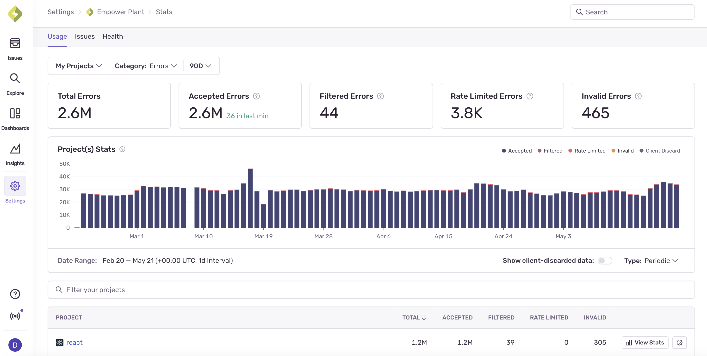

<Alert>
[Application Metrics](/product/explore/metrics/) is currently available on Team, Business, and Developer plans. These plans include a certain amount of Application Metrics data to be processed and stored. Once you exceed your included quota, you'll be charged based on your pay-as-you-go (PAYG) budget.
</Alert>

## Key Terms

- **Application Metrics Quota**: The initial quota your subscription has allocated for processing and storing metric data from your applications.

- **Pay-As-You-Go (PAYG) Budget**: A budget you set to pay for additional metric processing beyond your included quota.

- **Metric Event**: A single counter, gauge, or distribution value sent from your application to Sentry, including metadata like name, kind, value, trace_id, span_id, and custom attributes.

- **Metric Processing**: The ingestion, parsing, indexing, and storage of metric data in Sentry's infrastructure.

## Before You Begin: Check Your Application Metrics Usage

You can look at your Application Metrics usage on the Stats & Usage page to understand the breakdown of your metric events by time window and project. This may help you figure out where you need to further fine-tune your usage.

This page is accessible to all members of your organization, so Owners in your Sentry org will be able to share it with the developers directly responsible for a given project. You'll also be able to use this page to assess whether your changes are working as intended.

### How Can I See a Breakdown of Incoming Metrics?

The Stats & Usage page also displays details about the total amount of Application Metrics data Sentry has received across your entire org for up to 90 days. The page breaks down the events by project into three categories: accepted, dropped, or filtered. Only accepted metric events affect your quota:



### Which Projects Are Consuming My Application Metrics Spend?

The "Projects" table on the Stats page breaks down your data by project, so you can identify the ones that are consuming the most quota. These can be sorted by total metrics, accepted, filtered, rate limited, and invalid.

## Adjusting PAYG Budget

Budgets can only be updated by a Billing- or Owner-level member of your Sentry org.

Once your Application Metrics quota is approaching or has exceeded its included amount, teammates with "Owner" org permissions will start receiving [notification](/product/notifications/#quota-notifications) emails. They'll then be able to choose to increase or decrease the PAYG budget to unlock additional usage.

### Increasing Application Metrics Budget

If you're not able to send new metric events because you've exceeded your Application Metrics quota, you can add to your budget at any time during your billing period by increasing your PAYG budget. This is ideal in situations where you're rolling out a new version of your application or instrumenting additional metrics for a time-bound investigation. To add PAYG budget, set a monthly maximum shared budget in your [Subscriptions Page](https://sentry.io/orgredirect/organizations/:orgslug/settings/billing).

[Learn more about setting your PAYG budget](/pricing/#pricing-how-it-works).

## Managing Spend

### SDK Configuration

For various SDKs, there's the ability to filter or drop metric events before sending to Sentry, so you can avoid sending metrics you don't care about. This is the most effective way to reduce your Application Metrics quota usage; below are a couple of examples:

#### JavaScript SDKs

```js
Sentry.init({
  dsn: "___PUBLIC_DSN___",
  beforeSendMetric: (metric) => {
    if (metric.name === "debug_metric") {
      // Drop noisy debug metrics
      return null;
    }
    return metric;
  },
});
```

#### Python SDK

```python
import sentry_sdk
from sentry_sdk.types import Metric, Hint
from typing import Optional

def before_metric(metric: Metric, _hint: Hint) -> Optional[Metric]:
    # Drop noisy debug metrics
    if metric["name"] == "debug_metric":
        return None
    return metric

sentry_sdk.init(
    dsn="___PUBLIC_DSN___",
    before_send_metric=before_metric,
)
```

### Disabling Metrics

If you want to stop sending Application Metrics from a specific SDK entirely, most SDKs expose an option to disable metrics without removing the rest of your Sentry configuration (for example, `enableMetrics: false` in JavaScript SDKs or `experimental.enableMetrics = false` on Apple platforms). See the [platform-specific metrics docs](/product/explore/metrics/getting-started/) for the option name on your SDK.

### Application Metrics Filtering

You can also use [Inbound Filters](/concepts/data-management/filtering/#application-metrics-filtering) to filter Application Metrics at the server level. While this doesn't prevent data from being sent to Sentry, it does prevent filtered metrics from counting against your quota.

The following inbound filters apply to Application Metrics:

- **Application Metrics** - Filters Application Metrics by metric name (supports glob pattern matching, for example `my_metric.*`)
- **Releases** - Filters Application Metrics from specific release versions

To set up release filtering:

1. Navigate to **[Project] > Project Settings > Inbound Filters**
2. Add release versions to filter out metric events from those releases
3. Globbing rules apply, so you can match prefixes — for example, `my-example@1.*`

### Best Practices for Reducing Application Metrics Quota Usage

1. **Emit metrics with intent**: Track a small number of meaningful signals (`checkout.failed`, `email.sent`, `queue.depth`) rather than instrumenting every code path.
2. **Keep cardinality in check**: High-cardinality custom attributes (user IDs, request IDs, free-form strings) inflate metric volume. Choose only the most valuale for your use case, and pair with bounded attributes like environment, region, or plan tier.
3. **Filter at the source**: Use `beforeSendMetric` / `before_send_metric` callbacks to drop metrics you don't need in production.
4. **Disable in non-critical environments**: Turn off metrics in local development or short-lived preview environments if you don't need that data.
5. **Monitor usage patterns**: Regularly check your Usage Stats to identify projects with high metric consumption.
6. **Set up alerts**: Configure notifications when you approach your quota limits.

### Monitoring Your Application Metrics Usage

Keep track of your Application Metrics quota usage by:

- Checking the [Usage Stats](/product/stats/#usage-stats) page regularly
- Setting up [quota notifications](/product/notifications/#quota-notifications)
- Reviewing project-specific usage in the Stats breakdown
- Monitoring the impact of filtering changes over time

By implementing these strategies, you can effectively manage your Application Metrics quota while maintaining the visibility you need into your application's behavior.
