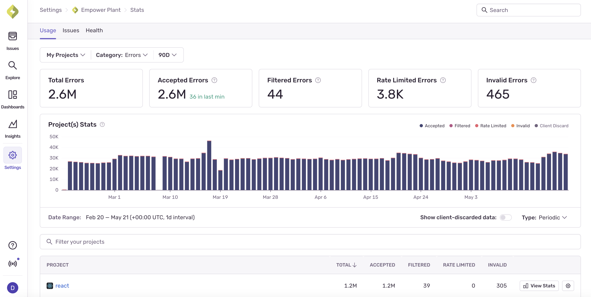

<Alert>
[Logs](/product/explore/logs/) is currently available on Team, Business, and Developer plans. These plans include a certain amount of Logs data to be processed and stored. Once you exceed your included quota, you'll be charged based on your pay-as-you-go (PAYG) budget.
</Alert>

## Key Terms

- **Logs Quota**: The initial quota your subscription has allocated for processing and storing log data from your applications.

- **Pay-As-You-Go (PAYG) Budget**: A budget you set to pay for additional log processing beyond your included quota.

- **Log Entry**: A single log message sent from your application to Sentry, including metadata like timestamp, log level, and custom attributes.

- **Log Processing**: The ingestion, parsing, indexing, and storage of log data in Sentry's infrastructure.

## Before You Begin: Check Your Logs Usage

You can look at your Logs usage on the Stats & Usage page to understand the breakdown of your log entries by time window and project. This may help you figure out where you need to further fine-tune your usage.

This page is accessible to all members of your organization, so Owners in your Sentry org will be able to share it with the developers directly responsible for a given project. You'll also be able to use this page to assess whether your changes are working as intended.

### How Can I See a Breakdown of Incoming Logs?

The Stats & Usage page also displays details about the total amount of log data Sentry has received across your entire org for up to 90 days. The page breaks down the events by project into three categories: accepted, dropped, or filtered. Only accepted logs affect your quota:



### Which Projects Are Consuming My Logs Spend?

The "Projects" table on the Stats page breaks down your data by project, so you can identify the ones that are consuming the most quota. These can be sorted by total logs, accepted logs, filtered logs, and so on.

## Adjusting PAYG Budget

Budgets can only be updated by a Billing- or Owner-level member of your Sentry org.

Once your Logs quota is approaching or has exceeded its included amount, teammates with "Owner" org permissions will start receiving [notification](/product/alerts/notifications/#quota-notifications) emails. They'll then be able to choose to increase or decrease the PAYG budget to unlock additional usage.

### Increasing Logs Budget

If you're not able to send new logs because you've exceeded your Logs quota, you can add to your budget at any time during your billing period by increasing your PAYG budget. This is ideal in situations where you're rolling out a new version of your application or need to increase logging for debugging purposes. To add PAYG budget, set a monthly maximum shared budget in your [Subscriptions Page](https://sentry.io/orgredirect/organizations/:orgslug/settings/billing).

[Learn more about setting your PAYG budget](/pricing/#pricing-how-it-works).

## Managing Spend

### SDK Configuration

For various SDKs, there's the ability to filter out logs before sending to Sentry, so you can avoid sending logs you don't care about. This is the most effective way to reduce your Logs quota usage; below are a couple of examples:

#### JavaScript SDKs

```js
Sentry.init({
  dsn: "___PUBLIC_DSN___",
  enableLogs: true,
  beforeSendLog: (log) => {
    if (log.level === "info") {
      // Filter out all info logs
      return null;
    }
    return log;
  },
});
```

#### Python SDK

```python
import sentry_sdk
from sentry_sdk.types import Log, Hint
from typing import Optional

def before_log(log: Log, _hint: Hint) -> Optional[Log]:
    # Filter out all info level logs
    if log["severity_text"] == "info":
        return None
    return log

sentry_sdk.init(
    dsn="___PUBLIC_DSN___",
    "enable_logs": True,
    "before_send_log": before_log,
)
```

### Logs Filtering

You can also use [Inbound Filters](/concepts/data-management/filtering/#logs-filtering) to filter logs at the server level. While this doesn't prevent data from being sent to Sentry, it does prevent filtered logs from counting against your quota.

The following inbound filters apply to Logs:

- **Log Message** - Filters logs based on the log message match
- **Releases** - Filters logs from specific release versions

To set up log message filtering:

1. Navigate to **[Project] > Project Settings > Inbound Filters**
2. Add patterns to filter out specific log messages
3. Use wildcards for flexible matching, for example, `*Connection timeout*` , to filter all logs containing "Connection timeout")

### Best Practices for Reducing Logs Quota Usage

1. **Set appropriate log levels**: Only log at the level you need for production, for example, WARNING and above.
2. **Use structured logging**: Include relevant context in log attributes rather than verbose messages
4. **Filter at the source**: Use `beforeSendLog` callbacks to filter logs before they're sent
5. **Monitor usage patterns**: Regularly check your Usage Stats to identify projects with high log consumption
6. **Set up alerts**: Configure notifications when you approach your quota limits

### Monitoring Your Logs Usage

Keep track of your Logs quota usage by:

- Checking the [Usage Stats](/product/stats/#usage-stats) page regularly
- Setting up [quota notifications](/product/alerts/notifications/#quota-notifications)
- Reviewing project-specific usage in the Stats breakdown
- Monitoring the impact of filtering changes over time

By implementing these strategies, you can effectively manage your Logs quota while maintaining the visibility you need into your application's behavior.
