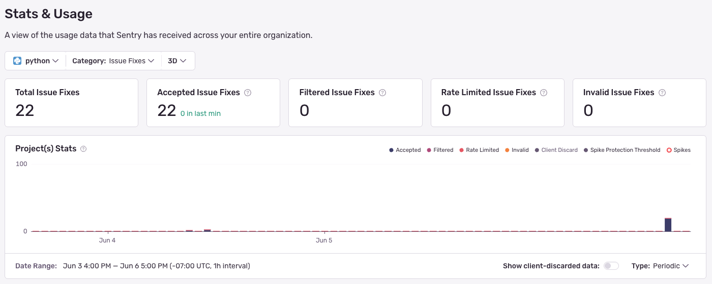

<Alert>
[Seer](/product/ai-in-sentry/seer/) is only available when purchased additionally while on a team or business plan. Once Seer has been purchased, your subscription will have $25 worth of Seer budget to be used across issue scans and issue fixes.
</Alert>

## Key Terms

- **Seer Budget**: The initial budget your subscription has allocated to be used exclusively by Seer products. This includes issue scans and issue fixes.

- **Pay-As-You-Go (PAYG) Budget**: A budget you set to pay for additional issue scans and fixes beyond your Seer budget.

- **Issue Scan**: An analysis of an issue to help determine fixability. These scans are run automatically for every new error and performance issue.

- [**Issue Fix**](/product/ai-in-sentry/seer/issue-fix/): A root cause and solution generated for an issue. You will only be charged one fix per issue, however if you "Start Over" your fix, this will count as a new fix and will be charged accordingly.

## Before You Begin: Check Your Seer Usage

You can look at your Seer usage in the [Usage Stats tab](/product/stats/#usage-stats) to understand the breakdown of your issue fixes and issue scans by time window and project. This may help you figure out where you need to further fine-tune your usage.

This page is accessible to all members of your organization, so Owners in your Sentry org will be able to share it with the developers directly responsible for a given project. You'll also be able to use this page to assess whether your changes are working as intended.

### How Can I See a Breakdown of Incoming Issue Scans and Fixes?

The Usage Stats tab displays details about the total amount of data Sentry has received across your entire org for up to 90 days. The page breaks down the events by project into three categories: accepted, dropped, or filtered. Only accepted scans and fixes affect your budget: 

### Which Projects Are Consuming My Seer Spend?

The "All Projects" table on the Stats page breaks down your data by project, so you can identify the ones that are consuming the most budget. Clicking on the settings icon next to a project name in the table will open that project's settings page, where you can manage its Seer scan and automatic analysis settings.

## Adjusting PAYG Budget

Budgets can only be updated by a Billing- or Owner-level member of your Sentry org.

Once your Seer budget is approaching or has exceeded its included budget, teammates with "Owner" org permissions will start receiving [notification](/product/alerts/notifications/#quota-notifications) emails. They'll then be able to choose to increase or decrease the PAYG budget to unlock additional usage.

### Increasing Seer Budget
If Issue Scans have stopped running or you're not able to initiate new Issue Fixes because you've exceeded your Seer budget, you can add to your budget at any time during your billing period by increasing your PAYG budget. This is ideal in situations where you're rolling out a new version of your application, for example. To add PAYG budget, set a monthly maximum shared budget in your [Subscriptions Page](https://sentry.io/orgredirect/organizations/:orgslug/settings/billing). 

[Learn more about setting your PAYG budget](/pricing/#pricing-how-it-works).

## Managing Spend

### Seer Fix and Scan Automation Settings

If you find that you're running out of your Seer or PAYG budget too quickly, you can double-check your project's Seer automation settings. To ensure new projects are in check, you can also update the default settings for new projects. For more details on choosing the right automation settings for you, visit the Automation Settings docs.