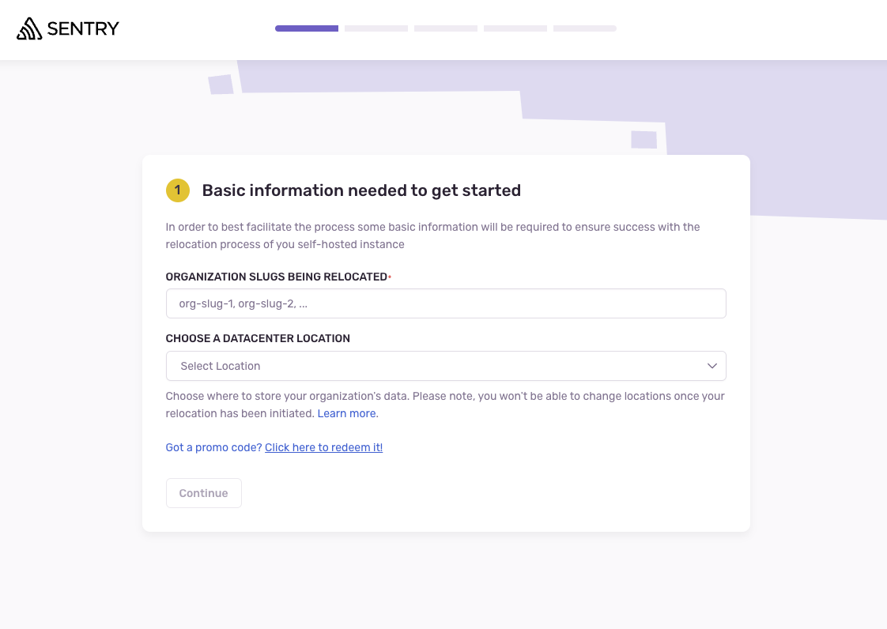
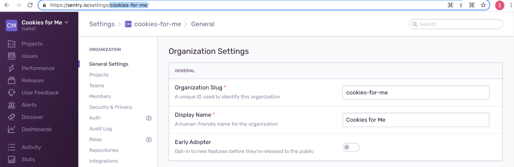

Sentry offers a cloud-hosted, software-as-a-service (SaaS) solution in addition to a self-hosted solution, which are both functionally the same. However, many customers find that self-hosted Sentry can quickly become expensive to maintain, scale, and support, making our SaaS product the better and less costly option. To facilitate moving from self-hosted to SaaS, we provide a self-serve process known as "relocation".

<Alert>
We're hosting a live workshop on **Migrating to Sentry SaaS on April 30th.** [Sign up here](https://sentry.io/resources/migrate-to-sentry-saas-workshop/) to learn about our relocation tooling and get a chance to ask questions live.
</Alert>

For additional reading on considering SaaS, take a look at:

- [Self Hosted or Cloud Sentry?](https://sentry.io/_/resources/about-sentry/self-hosted-vs-cloud/)
- [XS:Code > Open Source is Free - But Expensive](https://dev.to/helad11/open-source-is-free-but-expensive-3h8a)
- [Frequently asked migration questions](https://sentry.io/from/self-hosted/)

## Relocating to Cloud

If your organization started with self-hosted Sentry, you've invested time and effort in configuring and customizing your Sentry org. Your work won't be wasted if you decide to move to a SaaS account because you won't have to start from scratch. You'll be able to relocate a lot of what you've configured into your new account. 

To make this relocation as seamless as possible, Sentry has a workflow that allows you to retain most of your account's settings and configurations as you move to SaaS. All you'll need is owner access to your self-hosted install, and a way to access it via the terminal.

### What you'll keep

All of the configurations, team and project structure, and most metadata will be relocated. Specifically, for every organization you [choose to relocate](#2-choose-which-organizations-to-relocate) this includes:

- All organization settings
- User accounts and options for all organization members
- Projects and their settings
- Teams and their settings
- Alert rules
- Crons
- Dashboards
- Enabled data scrubbers
- Repositories
- Recent and saved searches

### What gets left behind

Any data related to specific issues, events, stack traces, or files like replays and source maps won't be transferred. Additionally, for security reasons, you'll need to reconnect and re-authenticate all of your integrations, and your users will need to re-connect their 2FA and create new API tokens after relocating.

One thing to note is that while we won't be able to transfer over historical event data, new incoming events will populate the projects in your relocated organization as soon as you [update your DSNs](#5-update-your-dsns). All relocated organization members will be automatically notified and re-invited via email once the relocation completes.

### Version support window

Self-serve relocation is only possible from the two most up-to-date minor self-hosted releases. That is, if the latest self-hosted release is version 24.2.3, your self-hosted install must be on at least version 24.1.0 to be successfully relocated.

If you'd like to relocate from an earlier release, we ask that you [update](https://develop.sentry.dev/self-hosted/releases/) your self-hosted install to the latest version first. If there is some reason that this is not possible, please [contact support](https://sentry.io/contact/enterprise/) for more guidance.

### Data security

Your data will be encrypted end-to-end during the relocation process. The only file that will pass over the network will be an encrypted tarball that we'll never store in plaintext, and will delete within 30 days of the start of your relocation.

## How to Relocate

### 1. Sign up with a promo code

Before you begin the relocation process, [sign up](https://sentry.io/signup/relocate/) for a new account on Sentry. If you already have a Sentry account, login and navigate to the [relocation landing page](https://sentry.sentry.io/relocation/). In either case, you should see a page like this:

**To receive a $100 credit, make sure to use the promo code `relocate100` on this page.**

### 2. Choose which organizations to relocate

Your self-hosted installation may have multiple organizations, each identified by a unique slug. You'll need to decide which org slugs to keep. You can always change them post-relocation by going to the **Organization Settings** page.

### 3. Follow the in-app relocation instructions

The rest of the in-app relocation instructions will walk you through the specific details of how to export your self-hosted instance's relocatable data. This will require terminal access to the machine running your self-hosted instance. Here's a quick overview:

- You'll be asked to save a public key that we generate on the SaaS backend to your self-hosted machine
- You'll then use this key to execute a command which will generate an encrypted tarball with all your data
- Lastly, you'll be prompted to upload this tarball

Most relocations complete in under an hour, though certain large or complex cases can take a bit longer. If you don't get an update from us within 24 hours, please [contact support](https://sentry.io/contact/enterprise/) for further assistance.

### 4. Choose a plan

Once your relocation is complete, you can choose the [pricing plan](https://sentry.io/pricing/) that best suits your needs. Note that plan pricing varies based on your [Event Volume](/product/accounts/quotas/).

If you're expecting higher volumes or you're interested in our Enterprise capabilities (priority support and SLAs, and single-tenant options, for example), please [contact us](https://sentry.io/contact/enterprise/) regarding our **Enterprise Plan**.

### 5. Update your DSNs

Though your project data has been fully relocated, the DSNs for all of your projects will have changed, as they are now located at https://sentry.io rather than your prior self-hosted domain name. This means that you'll need to update the [DSN](/product/sentry-basics/dsn-explainer/) you use in each of your SDKs for each relevant project. Once you complete this step, you'll should start to see issues and events (though hopefully not too many!) appearing as before.

