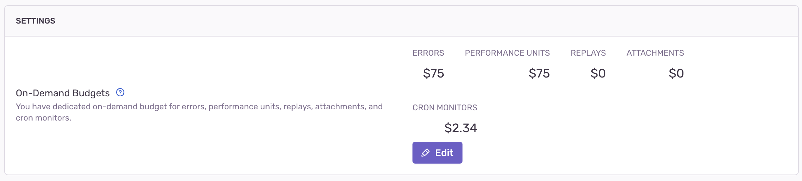

All Sentry plans include 1 cron monitor. To activate additional monitors, you need to add [on-demand](/product/accounts/pricing/#on-demand-capacity) spend.

<Note>

On-demand spend is only available on paid plans.

</Note>

## Check Your On-Demand Budget

To check your monthly on-demand budget for cron monitors, go to the **Organization Settings -> Subscription** page. From here, you can also change your budget as needed.

## Activate Additional Monitors

Any new monitors you add will be activated upon creation by default if there's available on-demand spend. Alternatively, inactive monitors can be manually activated as soon as on-demand spend becomes available.

Active monitors will remain active across billing periods as long as on-demand spend is available.

## Deactivate Monitors

Monitors can be manually deactivated from the **Crons** page at any time.

All active monitors will be automatically deactivated at the start of a new billing period if your on-demand budget doesn't cover all of them. If this occurs, you can manually choose which monitors to activate based on your on-demand budget.
