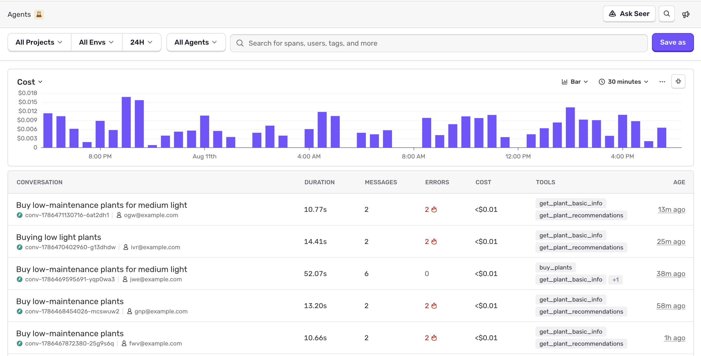
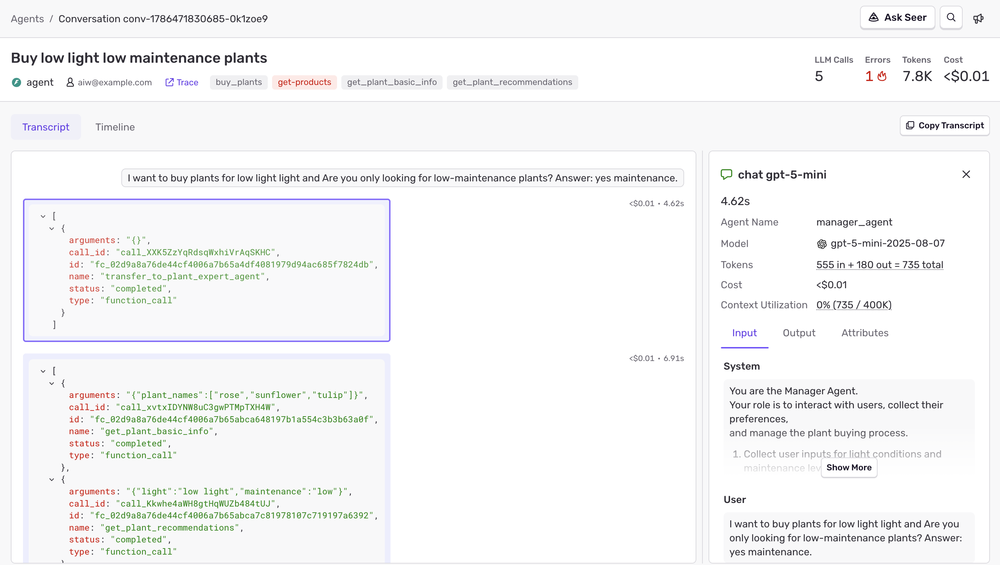

Sentry's Conversations view lets you observe the interactions users have had with your chat-based AI assistants. It provides a user-like view into past conversations, showing the full exchange of messages and tool calls so you can understand exactly what happened during each session.

You can find it in [**Explore > Agents**](https://sentry.io/orgredirect/organizations/:orgslug/explore/agents/) in the Sentry sidebar.

## Prerequisites

Conversations are built on top of [Agent Tracing](/product/agents/). Before you can use them, you need:

1. **Tracing enabled** with the Sentry SDK configured for your AI agent project. Follow the [Agent Tracing getting started guide](/product/agents/getting-started/) if you haven't already.

2. **A conversation ID on your spans.** Sentry groups spans into conversations using the `gen_ai.conversation.id` attribute. You can set this manually, or some SDK integrations infer it automatically.

For list titles, also send OTEL-shaped user input on those spans. See [Conversation Titles](#conversation-titles).

## Conversation ID

A conversation is a collection of spans that share the same `gen_ai.conversation.id`. This is typically the ID of the chat session in your application (for example, the session ID you store in your database).

Some SDK integrations (such as OpenAI Agents SDK for Python and OpenAI SDK for Node) automatically infer the conversation ID. For all other integrations, you need to set it manually. See your platform's Agent tracing guide for setup instructions:

- [JavaScript/Node](/platforms/javascript/guides/node/agent-tracing/#tracking-conversations)
- [Cloudflare](/platforms/javascript/guides/cloudflare/agent-tracing/#tracking-conversations)
- [Cloudflare Agents SDK](/platforms/javascript/guides/cloudflare/agent-tracing/agents-sdk/)
- [Python](/platforms/python/agent-tracing/#tracking-conversations)
- [Laravel](/platforms/php/guides/laravel/agent-tracing/#conversations)

### Choosing a Conversation ID

Use a short, opaque identifier — alphanumeric characters with dashes or underscores only. Don't use a URL, email address, or other free-form text as the conversation ID.

Good examples:

- A UUID: `48e35936-82ab-4f1a-beaf-b2fa4273ac5e`
- A prefixed ID: `conv_5j66UpCpwteGg4YSxUnt7lPYU`, `asst_abc12345`, `sess_987654`

### Conversations and Traces

Conversations and traces are independent concepts. A single conversation can span multiple traces. For example, if a user refreshes the page mid-conversation, the browser starts a new trace, but the conversation continues with the same ID.

The reverse is also true: a single trace can contain spans from different conversations. For example, if a user starts a new chat session without refreshing the page, the new conversation's spans appear in the same trace as the previous one.

## User Attribution

Each conversation in the list shows the user who initiated it alongside the project and conversation ID. To populate the user value, call `setUser` (JavaScript) or `set_user` (Python) once per request or session, before any AI calls:

```javascript
// JavaScript / Node.js
import * as Sentry from "@sentry/node";

Sentry.setUser({ id: "user_123", email: "jane@example.com", username: "jane" });
```

```python
# Python
import sentry_sdk

sentry_sdk.set_user({"id": "user_123", "email": "jane@example.com", "username": "jane"})
```

Sentry displays the first available user value in this order: `email`, `username`, `ip_address`, then `id`. If no user data is available, the list shows an em dash. Hover over it for setup guidance.

## Conversation Titles

Sentry generates a short title for each conversation so you can scan the list in **Explore > Agents**. Titles come from the **first user message** in the conversation — the earliest span that carries both a conversation ID and extractable user input.

If no title has been generated yet, the list shows the first user message text instead. If Sentry cannot find any user messages in the conversation, it shows **Untitled conversation**.

### What You Need for Titles

1. **`gen_ai.conversation.id`** on your AI spans (see [Conversation ID](#conversation-id)).

2. **Input messages that follow the OpenTelemetry GenAI conventions.** Sentry reads `gen_ai.input.messages` (and the deprecated `gen_ai.request.messages` attribute) and takes the **first message with `role: "user"`**. System, assistant, and tool messages are skipped.

   Prefer the OTEL message shape — for example `{role, parts}` with a `"user"` role:

   ```json
   [
     {
       "role": "user",
       "parts": [{ "type": "text", "content": "Help me debug this flaky test" }]
     }
   ]
   ```

   The legacy `{role, content}` format is also accepted. Put system prompts in `gen_ai.system_instructions` when you can, and keep the first **user** turn in the input messages with `role: "user"`. If the only content on the span is a system message, Sentry cannot derive a title.

3. **Message content actually sent to Sentry.** If inputs are omitted (for example `sendDefaultPii: false` without an override that captures gen AI inputs), or scrubbed to filtered values, title generation has nothing to work with. See [Data Privacy](/product/agents/privacy/).

SDK integrations that already emit OTEL-shaped `gen_ai.*` spans typically meet these requirements once conversation IDs and input collection are enabled. For manual instrumentation, set the attributes on your agent or AI client spans — see the [span attribute reference](/platforms/javascript/guides/node/agent-tracing/manual-instrumentation/).

## Conversations List

The [Conversations](https://sentry.io/orgredirect/organizations/:orgslug/explore/agents/) page shows the most recent conversations that match your filters.



Each conversation in the list includes:

- **Conversation** — the title, project, conversation ID, and user. The title comes from the first user message, uses that message text until a generated title is available, or shows **Untitled conversation** when there are no user messages.
- **Duration** — the total time spent in model-generation spans.
- **Messages** — the number of recorded model interactions.
- **Errors** — the number of spans that ended with an error.
- **Cost** — the estimated cost of the conversation.
- **Tools** — the names of tools used during the conversation.
- **Age** — how long ago the conversation was last active.

Use the project, environment, date range, and agent filters to narrow the list. Date ranges are limited to 30 days. The span search field accepts span attributes or an exact conversation ID, and **Save Query** saves the current query for later use.

The chart above the list can show conversation count (**Individual Chats**), **Cost**, or **Total Messages** as a line, area, or bar chart. You can also change the time interval or collapse the chart.

If every listed conversation lacks captured inputs and outputs, a banner explains how to enable message capture in your SDK. When the selected project has no conversation data, the page shows an onboarding flow with integration-specific setup steps.

## Conversation Detail

Select a conversation to open its full-page detail view at `/explore/agents/conversations/:id/`.



The header summarizes the conversation's project, user, tools, LLM calls, errors, token usage, and cost. It also links to the underlying trace. If the conversation spans multiple traces, the **Traces** link opens Explore with results filtered to that conversation.

Use the two tabs to inspect the conversation:

- **Transcript** shows user messages, assistant responses, tool calls, collapsible thinking or reasoning rows, and embedding operations in chronological order. Failed tool calls use error styling so they stand out. Select an assistant response or tool call to inspect its input, output, attributes, duration, and status. Use **Copy Transcript** to copy the conversation as Markdown.
- **Timeline** shows the AI spans in execution order, including spans that don't have content to display in the transcript. Select a span to open the same input, output, and attribute details.

The error count links to the conversation's failed spans, while **Trace** or **Traces** links connect the conversation to the surrounding distributed trace data.
