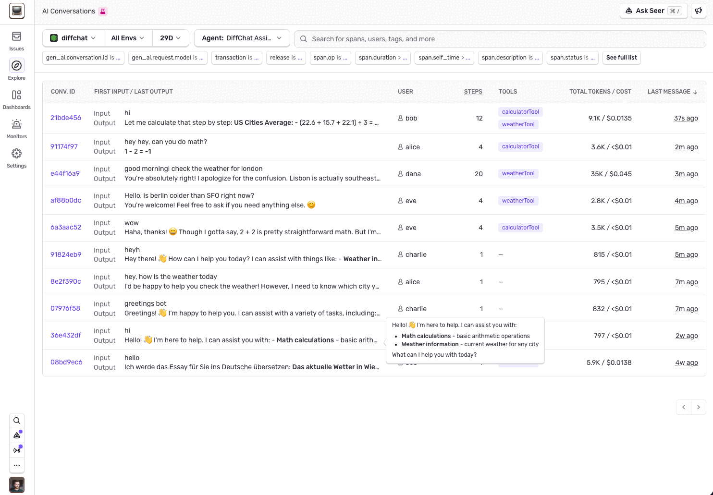
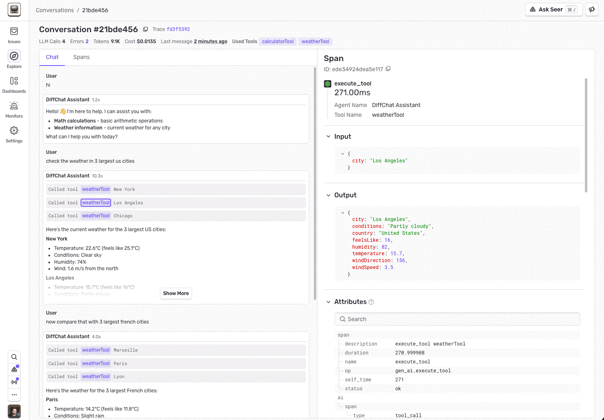

<Alert>

Conversations is currently in beta. Features and user experience are subject to change.

</Alert>

Sentry's Conversations view lets you observe the interactions users have had with your chat-based AI assistants. It provides a user-like view into past conversations, showing the full exchange of messages and tool calls so you can understand exactly what happened during each session.

You can find it in **Explore > Conversations** in the Sentry sidebar.

## Prerequisites

Conversations are built on top of [Agent Tracing](/product/agents/). Before you can use them, you need:

1. **Tracing enabled** with the Sentry SDK configured for your AI agent project. Follow the [Agent Tracing getting started guide](/product/agents/getting-started/) if you haven't already.

2. **A conversation ID on your spans.** Sentry groups spans into conversations using the `gen_ai.conversation.id` attribute. You can set this manually, or some SDK integrations infer it automatically.

For list titles, also send OTEL-shaped user input on those spans. See [Conversation Titles](#conversation-titles).

## Conversation ID

A conversation is a collection of spans that share the same `gen_ai.conversation.id`. This is typically the ID of the chat session in your application (for example, the session ID you store in your database).

Some SDK integrations (such as OpenAI Agents SDK for Python and OpenAI SDK for Node) automatically infer the conversation ID. For all other integrations, you need to set it manually. See your platform's Agent tracing guide for setup instructions:

- [JavaScript/Node](/platforms/javascript/guides/node/agent-tracing/#tracking-conversations)
- [Cloudflare](/platforms/javascript/guides/cloudflare/agent-tracing/#tracking-conversations)
- [Cloudflare Agents SDK](/platforms/javascript/guides/cloudflare/features/agents-sdk/)
- [Python](/platforms/python/agent-tracing/#tracking-conversations)
- [Laravel](/platforms/php/guides/laravel/agent-tracing/#conversations)

### Choosing a Conversation ID

Use a short, opaque identifier — alphanumeric characters with dashes or underscores only. Don't use a URL, email address, or other free-form text as the conversation ID.

Good examples:

- A UUID: `48e35936-82ab-4f1a-beaf-b2fa4273ac5e`
- A prefixed ID: `conv_5j66UpCpwteGg4YSxUnt7lPYU`, `asst_abc12345`, `sess_987654`

### Conversations and Traces

Conversations and traces are independent concepts. A single conversation can span multiple traces. For example, if a user refreshes the page mid-conversation, the browser starts a new trace, but the conversation continues with the same ID.

The reverse is also true: a single trace can contain spans from different conversations. For example, if a user starts a new chat session without refreshing the page, the new conversation's spans appear in the same trace as the previous one.

## User Attribution

The Conversations view includes a **User** column that shows which user initiated each conversation. To populate it, call `setUser` (JavaScript) or `set_user` (Python) once per request or session, before any AI calls:

```javascript
// JavaScript / Node.js
import * as Sentry from "@sentry/node";

Sentry.setUser({ id: "user_123", email: "jane@example.com", username: "jane" });
```

```python
# Python
import sentry_sdk

sentry_sdk.set_user({"id": "user_123", "email": "jane@example.com", "username": "jane"})
```

Any of `id`, `email`, or `username` is sufficient. If no user is set, the column displays "Unknown".

## Conversation Titles

Sentry generates a short title for each conversation so you can scan the list in **Explore > Conversations**. Titles come from the **first user message** in the conversation — the earliest span that carries both a conversation ID and extractable user input.

If no title has been generated yet, the list shows the first user message text instead. If Sentry cannot find any user messages in the conversation, it shows **Untitled conversation**.

### What You Need for Titles

1. **`gen_ai.conversation.id`** on your AI spans (see [Conversation ID](#conversation-id)).

2. **Input messages that follow the OpenTelemetry GenAI conventions.** Sentry reads `gen_ai.input.messages` (and the deprecated `gen_ai.request.messages` attribute) and takes the **first message with `role: "user"`**. System, assistant, and tool messages are skipped.

   Prefer the OTEL message shape — for example `{role, parts}` with a `"user"` role:

   ```json
   [
     {
       "role": "user",
       "parts": [{"type": "text", "content": "Help me debug this flaky test"}]
     }
   ]
   ```

   The legacy `{role, content}` format is also accepted. Put system prompts in `gen_ai.system_instructions` when you can, and keep the first **user** turn in the input messages with `role: "user"`. If the only content on the span is a system message, Sentry cannot derive a title.

3. **Message content actually sent to Sentry.** If inputs are omitted (for example `sendDefaultPii: false` without an override that captures gen AI inputs), or scrubbed to filtered values, title generation has nothing to work with. See [Data Privacy](/product/agents/privacy/).

SDK integrations that already emit OTEL-shaped `gen_ai.*` spans typically meet these requirements once conversation IDs and input collection are enabled. For manual instrumentation, set the attributes on your agent or AI client spans — see the [span attribute tables](/platforms/javascript/guides/node/agent-tracing/manual-instrumentation/).

## Conversations List

The [Conversations](https://sentry.io/orgredirect/organizations/:orgslug/explore/conversations/) page shows the most recent conversations that match your filters.



Each row in the list displays:

- **Title** — generated from the first user message; uses that message text until a title is available, or **Untitled conversation** when there are no user messages
- **User** — the user who initiated the conversation, populated by `setUser` / `set_user`
- **Last output** — the most recent assistant response
- **Cost** — estimated dollar cost and token usage
- **LLM calls** — number of LLM generation requests
- **Tool calls** — number of tool executions

Use the filters at the top of the page to narrow results by project, date range, or agent.

## Conversation Detail

Click any conversation to open the detail view in a drawer.



The detail view shows a chat-like interface with the full message history: user inputs, assistant responses, and tool calls. Click on any message to see the underlying spans, including individual LLM generations and tool executions, with timing and error information.

This makes it straightforward to trace a conversation from start to finish and pinpoint where things went wrong.
