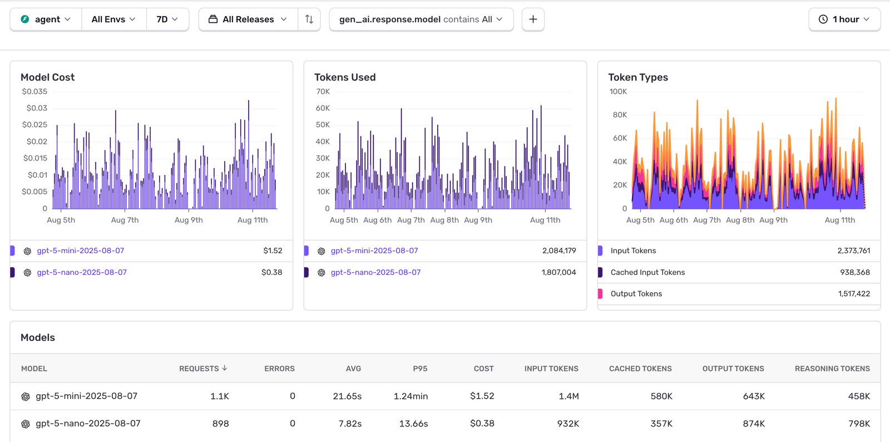
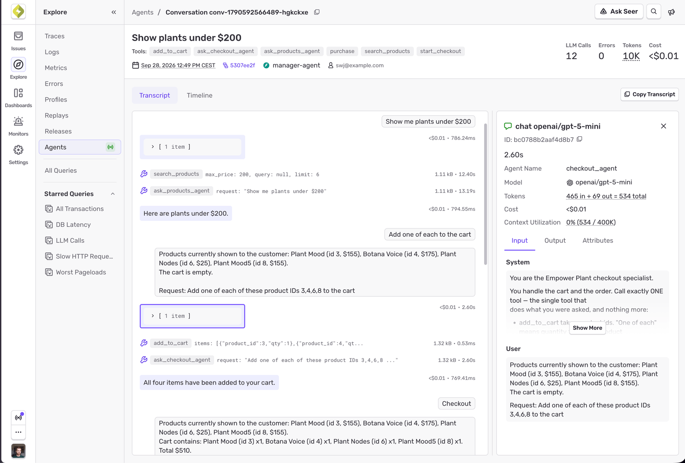

Sentry helps you understand what's happening in your agent workflows. [Agent tracing](/concepts/key-terms/agent-tracing/) automatically collects information about agent runs, tool calls, model interactions, and errors across your entire AI pipeline, from user interaction to final response. You can also replay past conversations. If you're looking for MCP monitoring, see [MCP Servers](/product/mcp-servers/).

Open [**Explore → Agents**](https://sentry.io/orgredirect/organizations/:orgslug/explore/agents/) in Sentry to investigate this data. Choose the tab that matches what you need to debug:

- **Conversations** groups messages and tool calls by conversation ID. Use it to replay a user's multi-turn interaction, inspect its transcript and timeline, and find where a response or tool call went wrong.
- **Traces** shows end-to-end agent runs and the application work around them. Use it to follow execution across model calls, tools, and services or to investigate latency and errors in context.
- **LLM Calls** shows individual model requests. Use it to compare models, prompts, token usage, cost, and response performance without reviewing an entire conversation or trace.

## Get Started

To start debugging agents, you need a Sentry account and project. If you don't have an account, [create one](https://sentry.io/signup/).

[Set up Sentry for Agents](/product/agents/getting-started/) and [name your agents](/product/agents/naming/) so you can identify them in Explore. Then choose a [sampling strategy](/product/agents/sampling/) that keeps complete agent runs without sampling all application traffic.

## Example Use Cases

- Your agent is failing silently during tool execution, and you want to trace the complete agent flow to identify where it's breaking.
- Users report that your agent is returning unexpected or malformed responses, and you need to debug the full context of prompts, model calls, and outputs.
- Your agent workflows are experiencing performance issues, and you want to identify which steps (model calls, tool usage, or custom logic) are causing bottlenecks.

## Related Features

<LinkCardGrid>
  <LinkCard
    href="/product/agents/conversations/"
    iconSrc="/ai/img/IconCompass.svg"
    title="Conversations"
    description="Replay past conversations with your AI assistants. See every message and tool call in a chat-like view."
    className="w-full md:w-[calc(50%-12px)]"
  />
  <LinkCard
    href="/product/agents/dashboards/"
    iconSrc="/ai/img/IconStats.svg"
    title="Agents Dashboards"
    description="View agent executions, model costs, token usage, tool calls, and recent errors in the Agents Dashboards."
    className="w-full md:w-[calc(50%-12px)]"
  />
</LinkCardGrid>
